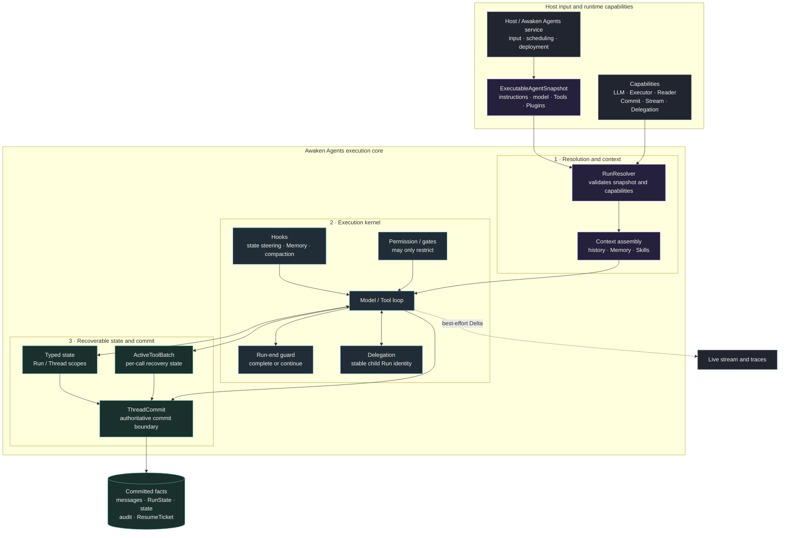
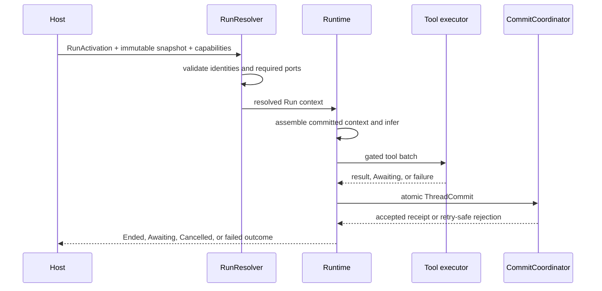
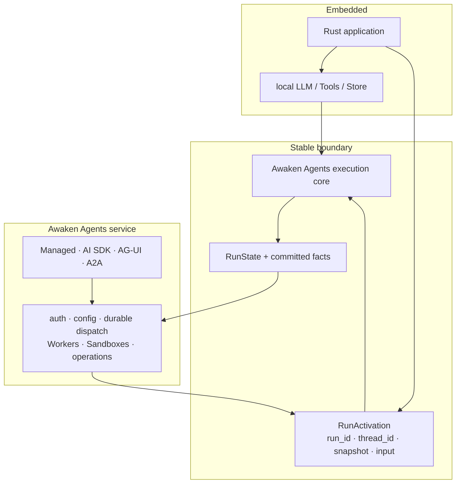

Read this page before changing how an Agent runs. Put model and tool behavior,
context, permissions, typed state, delegation, and commit handling in Runtime.
Put publication, public protocols, IAM, scheduling, Workers, and Sandboxes in
the Awaken Agents service responsibilities. That split keeps embedded and managed Agents on the
same execution path.

## Choose the layer before changing code

| Change you need | Owner | Use this boundary |
| --- | --- | --- |
| Change instructions, model candidates, Tools, Plugins, Memory, or context policy | Published behavior plus Runtime capabilities | Resolve one `ExecutableAgentSnapshot`; do not read mutable Agent configuration during a Run |
| Add a permission check, approval gate, or state constraint | Runtime | Restrict an effect before execution; a Plugin cannot widen host-granted authority |
| Preserve a new recoverable fact | Typed state plus `ThreadCommit` | Stage the fact during a Step and commit it through the existing atomic exit |
| Stream live progress to a UI | `StreamSink` or telemetry | Treat the event as best effort; recovery still reads committed facts |
| Change HTTP, IAM, publication, scheduling, Worker, or Sandbox behavior | Awaken Agents service | Leave the execution core unchanged and use its service-owned port |

For a loop or state-machine change, continue with
[Run, Step, and tool batches](/docs/agents/runtime/explanation/run-lifecycle-and-phases/).
For deployment or service-boundary work, use the
[Agents architecture](/docs/agents/concepts/architecture/).

The rest of this page shows the static structure. The dynamic Run loop and each
checkpoint have one detailed guide:
[Run, Step, and tool batches](/docs/agents/runtime/explanation/run-lifecycle-and-phases/).

## Static structure: one behavior definition, one kernel, one commit exit

Three conclusions matter:

1. `ExecutableAgentSnapshot` is the behavior identity of a Run. A live or awaiting
   Run does not drift when an administrator publishes a later configuration.
2. Tools, hooks, and delegates stage effects; none can bypass `ThreadCommit` and
   mutate authoritative state directly.
3. live Deltas improve interaction latency. Recovery reads committed facts, not
   fragments a client happened to observe.

## Component ownership

| Component | Owns | Does not own |
|---|---|---|
| `ExecutableAgentSnapshot` | resolved model candidates, instructions, tool descriptors, Plugins, context policy, fingerprint | secret material, HTTP DTOs, Worker leases |
| `Runtime` | Step loop, hooks, gates, run-end guards, cancellation, delegation entry | Agent CRUD, tenants, public protocols |
| `ToolExecutor` / `RunDelegationService` | execution ports for tools and child Runs | authoritative Thread storage |
| typed state / `ActiveToolBatch` | recoverable Run/Thread state and per-call tool lifecycle | a separate database or second commit protocol |
| `CommitCoordinator` | validation and atomic `ThreadCommit` application | scheduling and Worker selection |
| `StreamSink` / telemetry | best-effort live progress and observation | recovery authority |

## Dynamic behavior: activation to terminal outcome

The detailed state machine has one owner in
[Run, Step, and tool batches](/docs/agents/runtime/explanation/run-lifecycle-and-phases/).
At system level, every embedded and managed Awaken Agents execution follows the same
causal path:

| When this fails | What you will see | What to do | Last reliable state |
| --- | --- | --- | --- |
| Resolution | activation is rejected because a model, tool, state, or commit capability is missing | correct the capability set and start again with the same snapshot | no Run facts have been committed |
| Model or tool attempt | the Run waits or reports the failed call | follow that Tool's recovery policy; resume with the same call identity | the latest committed batch |
| Commit | the Host receives a version, duplicate, or stale-authority rejection | reread committed facts and continue from the accepted frontier | the last accepted `ThreadCommit` |
| Process loss | live progress may disappear | restart from committed facts and the `ResumeTicket` | the latest committed `RunState` |

Queues, streams, traces, and executor-local memory may improve latency or
diagnosis, but none is a persistence or consistency boundary.

## The embedded and managed-service boundary

The Awaken Agents execution core can be embedded directly in a Rust application or hosted by the Awaken Agents service.
Both use the same kernel; the owner of the surrounding capabilities changes.

The execution core receives neutral, serializable `RunActivation` data and process-local
ports, and returns `RunState`, messages, state commands, and neutral events.
HTTP, tenant, credential records, leases, Workers, and Sandboxes belong to
the Awaken Agents service and do not flow back into the execution domain.

## One Step's responsibility boundary

A Step follows this main path:

1. assemble context from committed Thread history and typed state;
2. load Memory, compaction, or other request-only context at `BeforeInference`;
3. invoke the model and normalize tool identities;
4. apply permission policy and plugin gates before execution;
5. persist a recoverable tool batch, then enter a local, Sandbox, or Remote Hand
   executor;
6. join results, run `AfterTool` reactions and `StepEnd`;
7. write facts the next inference may depend on through `ThreadCommit`.

Ordinary tool calls currently execute sequentially. Only a batch of delegated
calls that declares terminal-only completion runs concurrently. In either case,
the model sees tool results only after the full batch crosses its publication
barrier, in the model's original call order.

## What this gives developers

- Configure models, prompts, tool presentation, Memory, and state constraints
  without rewriting the loop.
- Replace an LLM, Tool executor, or execution location without splitting
  Run/Step/commit semantics.
- Enforce permissions and state constraints before an action instead of relying
  on the model to remember prompt instructions.
- Let a host continue from the last committed Step, tool batch, or Awaiting ticket
  after process failure.
- Build multi-Agent collaboration from ordinary Runs, authority, and commits
  rather than a parallel collaboration kernel.

## Non-goals

The execution core does not own public HTTP protocols, tenant IAM, credential custody,
Worker placement, Sandbox provisioning, or product-level Agent authoring. It
also does not promise that an uncommitted stream can be replayed. Awaken Agents owns
those surrounding responsibilities and enters its execution core through the same
activation and commit ports used by an embedded host.

Continue with [Architecture Invariants](/docs/agents/runtime/explanation/architecture-invariants/),
[Run, Step, and tool batches](/docs/agents/runtime/explanation/run-lifecycle-and-phases/),
and [Agents architecture](/docs/agents/concepts/architecture/).
