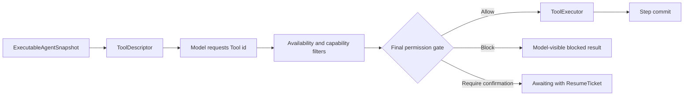
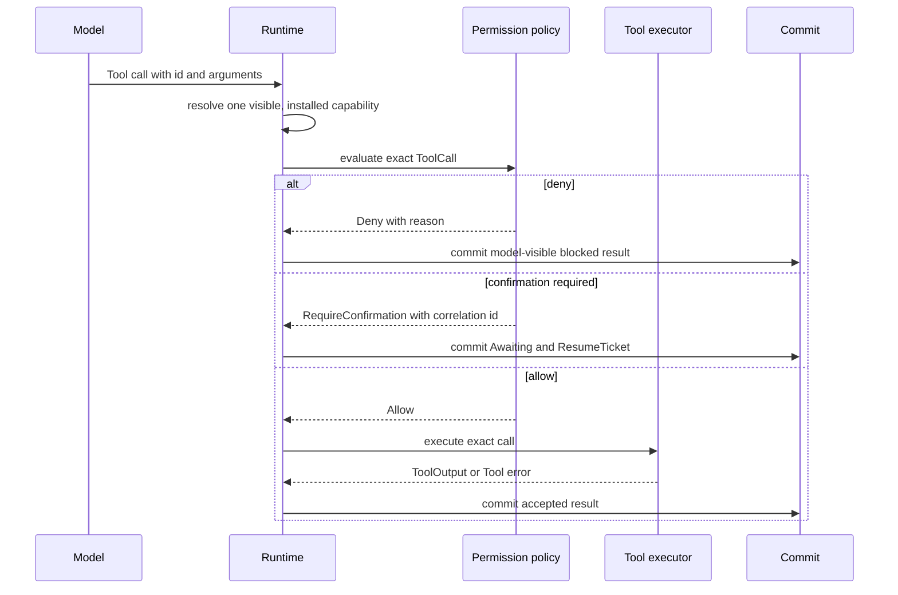

A model may see a Tool without having permission to execute it. A process may
have the implementation installed without presenting it to this Agent. Keep
those facts separate when adding Tools, policy, or execution adapters.

## Four decisions precede an effect

| Decision | Owner | Result |
| --- | --- | --- |
| Model visibility | immutable Agent snapshot | a `ToolDescriptor` may enter the model request |
| Executable availability | Runtime Tool registry or executor | the requested id has one implementation |
| Authorization | `ToolPermissionPolicy` and final gate | allow, block, or require confirmation |
| Effect and durable result | `ToolExecutor` plus commit boundary | execute once, then publish the accepted result |

For a typed Tool, derive model-visible identity and schema with
`ToolDescriptor::for_tool::<T>()`. Register the same `T::ID` through the sole
typed-to-raw adapter. Do not write a second descriptor by hand.

Visibility, selection, capability compatibility, placement, and health may
remove a candidate. None can produce an `Allow` decision. Only
`ToolPermissionVerdict::Allow` projects to an executable gate outcome.

## Permission can only preserve or narrow authority

`ToolCapabilityNarrowing` has two values: `Configured` and `DenyAll`.
Intersecting restrictions keeps `Configured` only when every input is
`Configured`; `DenyAll` is absorbing. A Run, Plugin, or executor can therefore
remove configured Tool authority but cannot add authority that the host did not
grant.

`RequireConfirmation` is a resumable Run state. A blocked call and a Tool error
are returned to the model as results, so the loop may choose another action.
These outcomes need no generic troubleshooting section. External action is
needed only when the system returns an approval request or an explicit
configuration, registration, or executor error.

## Keep neighboring data out of the Tool authority

- A descriptor contains model-visible identity and schema, not an executable
  handle or permission grant.
- Durable Agent and Session data carry credential references, not plaintext.
  Materialization belongs to the final trust boundary.
- Tool state changes return as `Command` data and cross the same Step commit;
  they do not create another store.
- Skills and MCP Tools enter the same descriptor, gate, executor, and result
  path. They do not receive a separate authorization channel.

To implement the contract, use [Implement a typed
Tool](/docs/agents/runtime/how-to/add-a-tool/). To configure approval rules, use
[Enable Tool permission HITL](/docs/agents/runtime/how-to/enable-tool-permission-hitl/).
Execution placement and credential custody remain in the [Awaken Agents execution
boundary](/docs/agents/concepts/brain-and-hand/).
