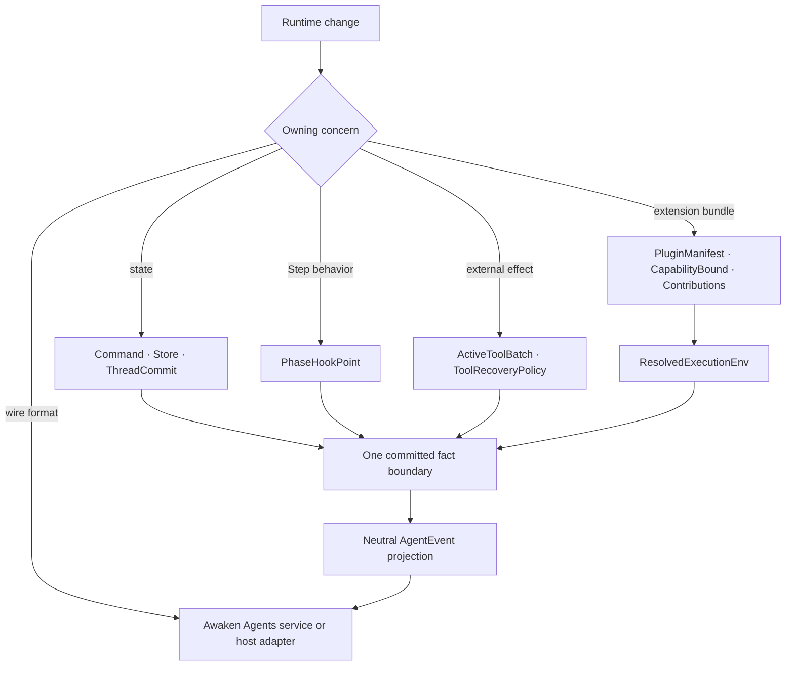
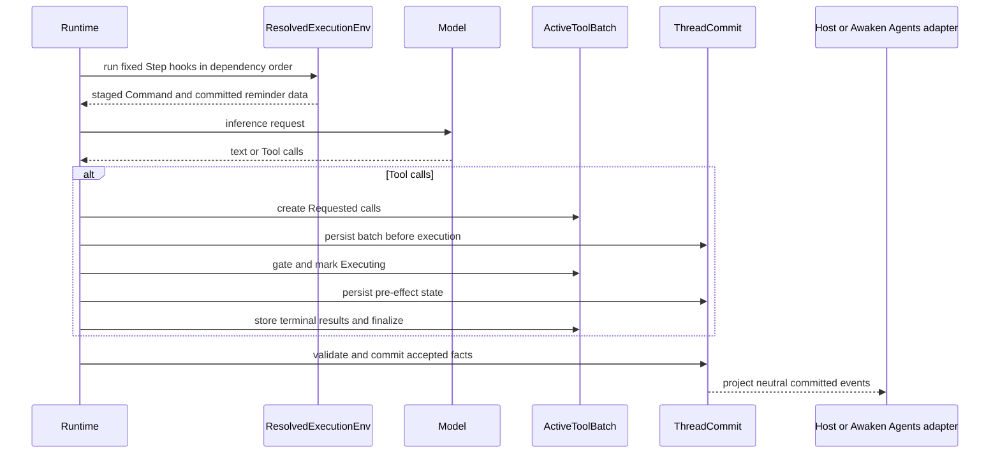

Read this page before adding a Runtime extension or persistence path. Most
changes fit an existing boundary. Choosing that boundary first keeps one owner
for execution, recovery, and authority.

## Start with the change

| You need to change | Preserve this decision | Cost accepted by the design | Owning page |
| --- | --- | --- | --- |
| recoverable state | producers stage data-only `Command`s; one commit validates and applies them | a commit and replay step instead of direct mutation | [State and snapshot model](/docs/agents/runtime/explanation/state-and-snapshot-model/) |
| behavior within one model/Tool Step | use one of five `PhaseHookPoint`s | fewer interception points, with deterministic order | [Plugin internals](/docs/agents/runtime/explanation/plugin-internals/) |
| a group of Runtime contributions | resolve one `Plugin` into bounded `Contributions` | manifest, dependency, and conflict checks before use | [Add a Plugin](/docs/agents/runtime/how-to/add-a-plugin/) |
| an external Tool effect | commit `Requested` and `Executing` before relying on the result | more checkpoints, but recovery does not guess whether execution began | [Run lifecycle](/docs/agents/runtime/explanation/run-lifecycle-and-phases/) |
| a wire protocol or service endpoint | keep `AgentEvent` neutral and adapt it outside the execution core | the edge needs an explicit transcoder | [Awaken Agents protocols](/docs/agents/protocols/) |

## Static ownership

These are not interchangeable abstractions. `CapabilityBound` limits what a
Plugin may contribute; it does not grant permission. `MergePolicy` reconciles
state commands; it does not order Plugins. An `AgentEvent` reports Runtime
behavior; it is not a service protocol.

## How the decisions meet in one Step

## Why these choices remain separate

### Commands instead of mutable shared state

Tools and hooks read a materialized `Store` and return `Command` data. The
commit path applies `MergePolicy` once. Parallel producers cannot silently win
because of lock timing or callback order. The cost is explicit validation and
state reconstruction.

### Fixed hooks instead of a general event bus

`StepStart`, `BeforeInference`, `AfterInference`, `AfterTool`, and `StepEnd`
match the built-in loop. A dependency order determines which hook runs first.
This is less flexible than subscribing to arbitrary events, but a maintainer can
locate every place where behavior may affect one Step.

### Bounded Plugins instead of middleware around the whole loop

A Plugin declares identity, dependencies, and a `CapabilityBound`, then returns
its actual `Contributions`. `ResolvedExecutionEnv` rejects missing dependencies,
cycles, duplicate Tool or action ids, and contributions outside the bound.
Middleware that wraps the whole loop would give each layer more reach than its
declared concern needs.

### Tool checkpoints instead of assumed replay safety

`ToolBatch` distinguishes a durable request from an executor attempt. Recovery
uses the Tool's pinned policy after `Executing`; it does not treat an unknown
external effect as a request that never started. This cannot create universal
exactly-once behavior. Downstream writes still need stable operation identity
and idempotency or transaction support.

### Neutral events instead of a protocol-aware loop

The execution core emits one Runtime vocabulary. A host may map it to a local API, while
Awaken Agents owns maintained service protocols. Adding a protocol changes an edge
adapter, not inference, Tool execution, or recovery.

## Do not add a parallel owner

- Do not add another state store for Plugin or Tool progress; use typed state and
  `ThreadCommit`.
- Do not add a generic lifecycle bus beside the five Step hooks and committed
  events.
- Do not treat Plugin selection, capability bounds, placement, or health as
  permission.
- Do not put HTTP, AG-UI, A2A, or Managed DTOs in the Runtime loop.
- Do not retry an unknown external effect as if no executor had been entered.

The detailed implementation stays on the linked owner pages. This page owns the
choice, not a second copy of each mechanism.
