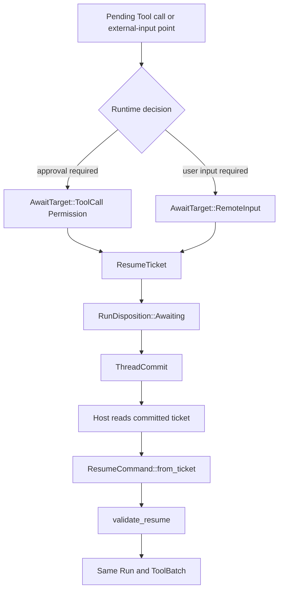
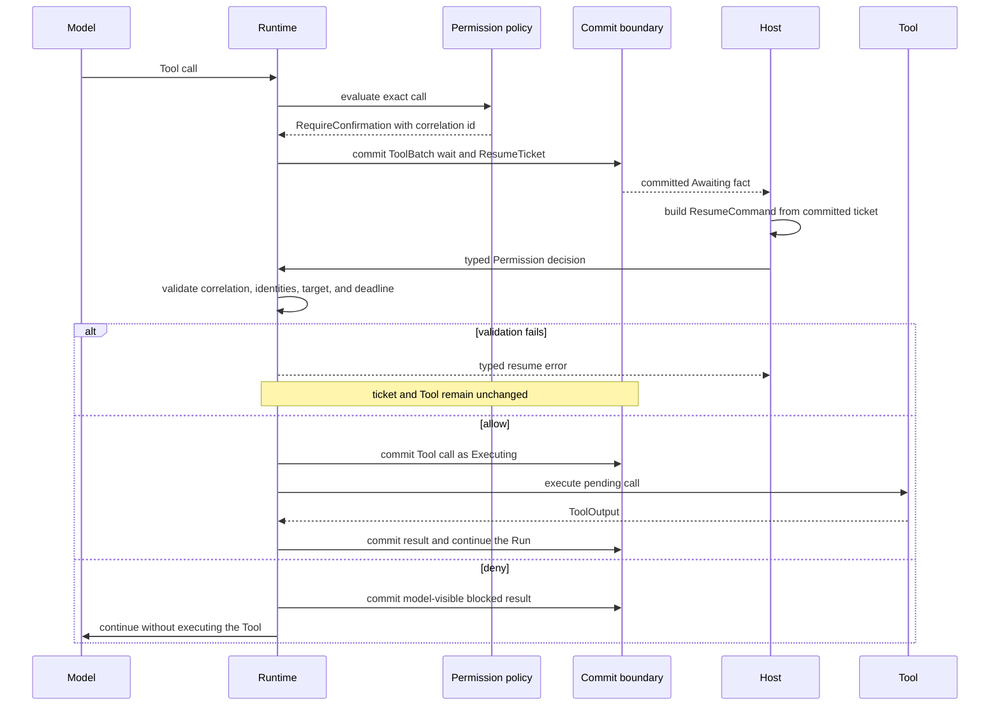

Use this page when a Tool needs approval or a Run needs external input. The
Runtime does not hold a process open while waiting. It commits `RunState::Awaiting`
with one `ResumeTicket`; the host later submits typed data that matches that
ticket and resumes the same Run.

Permission rules are configured in [Enable Tool permission
HITL](/docs/agents/runtime/how-to/enable-tool-permission-hitl/). This page owns the
park, validate, and resume mechanism.

## Static structure

`AwaitTarget` is a closed enum. A Tool wait necessarily contains its reason,
call id, and pending Tool data; a remote-input wait contains its own call id; a
pause contains neither. Callers cannot assemble a ticket whose optional fields
contradict one another.

## What the host must do

1. Read the current committed `ResumeTicket`. Do not reconstruct its ids from a
   UI event, URL, or process memory.
2. Present the pending action or input request using ticket data and the
   application's own display policy.
3. Collect a typed answer. Permission waits accept `PermissionDecision::Allow`
   or `PermissionDecision::Deny`; user-input waits accept input data.
4. Call `ResumeCommand::from_ticket(ticket, result, now_ms)`. Supply the answer
   and the current clock, not replacement identity fields.
5. Submit that command through the owning resume ingress and continue reading
   committed facts for the same Run.

The ticket carries correlation, Run and Thread identity, executable snapshot,
catalog fingerprint, an optional deadline, and the exact awaiting target. A
delegated Run also retains its stable origin. Plaintext credentials and live
executor handles do not belong in the ticket.

## Approval sequence

An allow decision does not bypass the Tool lifecycle. The Runtime first moves
the matching `ActiveToolBatch` call from its permission wait into `Executing`
and commits that pre-effect state. A deny decision never runs the Tool; it gives
the model a blocked result so the same Run can choose another action.

## Validation is the side-effect boundary

`validate_resume` checks all of these before execution:

| Check | Why it matters |
| --- | --- |
| correlation id | binds the answer to one wait |
| Run and Thread ids | prevents cross-Run or cross-Thread input |
| snapshot id and catalog fingerprint | keeps the resumed behavior identical to the parked behavior |
| deadline | rejects an answer whose decision window expired |
| result kind | prevents free-form input or a supplied Tool result from answering a permission wait |
| Tool call id where required | prevents one call's result from completing another call |

A rejected command leaves the ticket intact. A second command after a successful
resume finds no active ticket and is rejected as not awaiting. These are normal
idempotency and stale-input outcomes, not repair procedures.

If a caller receives `Expired`, it should reread committed state and follow the
owning application's cancel or replacement policy. It must not change the clock,
rewrite ticket identity, or convert the answer into a new user message.

## Keep adjacent mechanisms with their owners

- `GateOutcome::Schedule` is system-deferred work, not human approval. See
  [Scheduled actions](/docs/agents/runtime/reference/scheduled-actions/).
- Delegation uses the same Awaiting vocabulary but keeps child continuation in
  the durable parent/child relationship. See [Multi-Agent
  collaboration](/docs/agents/runtime/explanation/multi-agent-patterns/).
- Queue claim, lease, retry, and multi-node delivery belong to Awaken Agents. See
  [Production reliability](/docs/agents/concepts/production-reliability/).
- The full Run and ToolBatch recovery state machines belong to [Run
  lifecycle](/docs/agents/runtime/explanation/run-lifecycle-and-phases/).

Automatic rejection, stale-input protection, and same-Run continuation need no
generic troubleshooting section. External action exists only when an approver
must answer or the owning application must replace an expired wait.
