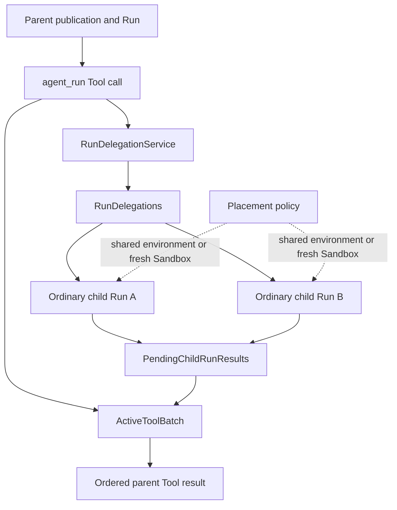
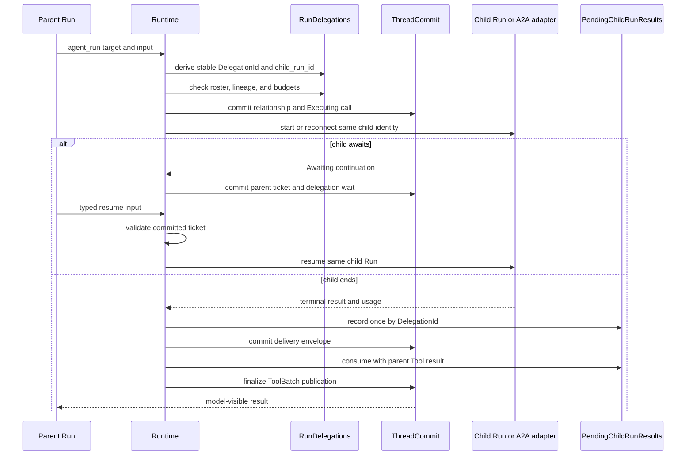
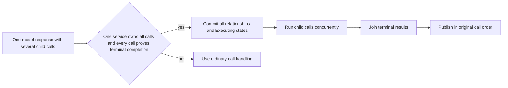

Do not begin with Agent roles. Begin with the lifetime of the work and the result
the caller needs. Awaken Agents has three collaboration boundaries; they reuse ordinary
Runs and do not create a second execution engine.

## Choose the mechanism

| Work to coordinate | Use | The caller receives |
| --- | --- | --- |
| one bounded subtask whose result belongs in the current model turn | `agent_run` through `RunDelegationService` | one Tool result on the parent Run |
| work that runs, awaits, or ends independently | separate ordinary Runs composed by a host, Agents service, or Workforce | committed results joined by the composer |
| an asynchronous message to another Thread | durable `send_message` and outbox delivery | input for the target Thread's next safe boundary |

Use [Awaken Workforce](/docs/workforce/) when the dependency is business work with
responsibility, review, or acceptance beyond one Agent execution.

## Static ownership

The three durable state cells have different owners:

| State | Owns | Does not own |
| --- | --- | --- |
| `RunDelegations` | stable relationship identity, lineage, limits, and cancellation intent | the parent Tool result |
| `ActiveToolBatch` | the parent call's Requested, Executing, Awaiting, and terminal state | child relationship history |
| `PendingChildRunResults` | idempotent delivery after child completion and before parent consumption | another child store or executor |

A child has its own Agent publication and Run identity. Placement decides whether
it shares the Session environment or receives a fresh Sandbox; Sandbox choice
does not define Agent identity.

## One delegated result

Repeated start or recovery addresses the same `DelegationId` and child Run. It
must not create another child. When the parent ends, the terminal commit records
cancellation intent for open relationships. Delivery may retry after commit; a
late result cannot reopen a closed relationship.

## Parallel calls have a narrower contract

Runtime uses concurrent delegation only when every call in the model batch is
owned by the same `RunDelegationService` and each target returns
`supports_parallel_completion`. If a supposedly terminal-only child awaits, the
batch becomes `Indeterminate`; Runtime does not compress several independent
correlations into one ticket.

Long-running children that may await independently should be separate Runs.
Their composer owns the join; the execution core does not add a generic background-work
state or a shared chat buffer.

## Normal recovery behavior

- A retryable child failure reconnects under the same child identity.
- A terminal delegation error becomes a model-visible Tool error; the parent may
  choose another action.
- Duplicate child delivery is idempotent when identity and result match; a
  conflicting result fails closed.
- Parent termination seals unfinished Tool calls and prevents late delivery from
  reopening them.

These paths are automatic and need no generic troubleshooting section. External
repair is relevant only when the selected local or A2A adapter reports a concrete
configuration or connectivity error that remains after its own retry policy.

For implementation, use [Delegate with
`agent_run`](/docs/agents/runtime/how-to/invoke-sub-agent-from-tool/). For the containing
state machine, read [Run lifecycle](/docs/agents/runtime/explanation/run-lifecycle-and-phases/).
