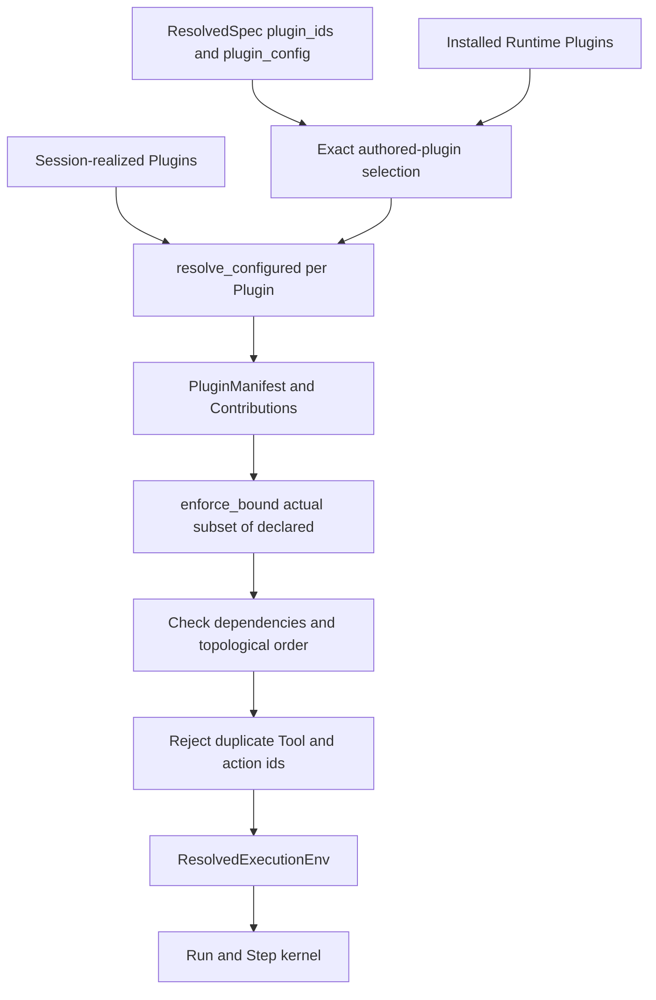
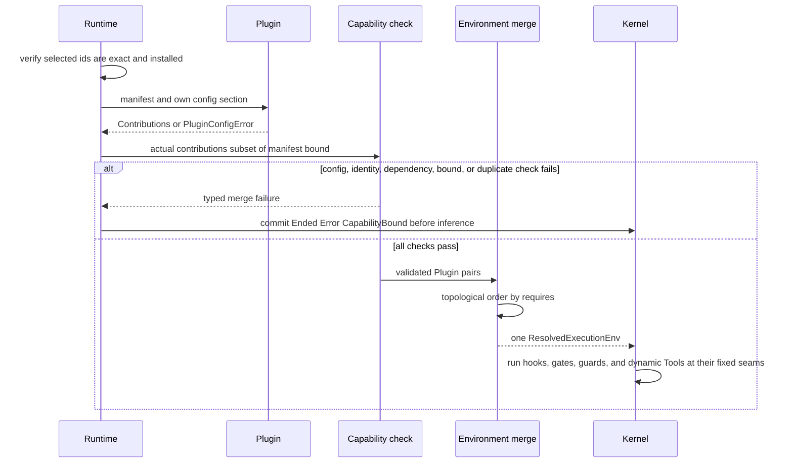

Use this page when changing Plugin activation, configuration, contribution
merging, or live Tool discovery. A Plugin is a factory. It does not register
callbacks into global mutable state; it returns one `Contributions` value, which
the Runtime merges into the Run's sole `ResolvedExecutionEnv`.

For choosing between a Tool and a Plugin, read [Tool and Plugin
boundary](/docs/agents/runtime/explanation/tool-and-plugin-boundary/). For an
implementation example, use [Add a Plugin](/docs/agents/runtime/how-to/add-a-plugin/).

## Static structure

Authored and Session-realized Plugins are two sources of Plugin instances, not
two Plugin systems. Both pass through the same configured resolution, bounds,
dependency order, duplicate checks, and execution environment.

## What a Plugin owns

| Type | Owns | Does not own |
| --- | --- | --- |
| `PluginManifest` | Plugin id, required Plugin ids, config section names, and declared `CapabilityBound` | live hooks or permission grants |
| `Contributions` | the actual Tools, state keys, hooks, action kinds, guards, gates, and dynamic Tools returned by one resolution | serialized Agent truth or a global registry |
| `ResolvedExecutionEnv` | the validated, ordered aggregate used by one Run | configuration publication or protocol serving |

`resolve_configured` receives only the Plugin's configured section. Malformed
data returns `PluginConfigError`. Publication validation can dry-run this same
method, and Runtime calls it again on the actual execution path. The validator
and applier therefore share one implementation.

## Declare the current capability bound

Every identity-bearing axis uses `IdBound`, except the closed
`PhaseHookPoint` enum:

| `CapabilityBound` field | Shape | Covers |
| --- | --- | --- |
| `tools` | `IdBound` | static and dynamic Tool ids |
| `state_keys` | `IdBound` | state keys the Plugin may declare |
| `phase_hooks` | `Vec<PhaseHookPoint>` | the fixed Step points it may observe |
| `action_kinds` | `IdBound` | scheduled-action kinds |
| `run_end_guards` | `IdBound` | natural-end continuation guards |
| `tool_gates` | `IdBound` | pre-execution gates that may only restrict |

`IdBound` is `Any`, `Exact`, `Namespace`, or `NamespacedExact`. Its default is
`Exact([])`, which admits nothing. `NamespacedExact` requires both the namespace
prefix and an explicit discovered id, so a stray id under a valid prefix still
fails closed.

The bound is a structural ceiling, not an inventory and not authorization.
`enforce_bound` checks that actual contributions are a subset. Only the
permission path can grant Tool execution.

## Resolution sequence

Initial resolution rejects these conditions before the first model call:

- an authored Plugin id is unknown or repeated;
- `resolve_configured` cannot decode its section;
- an active dependency is missing or dependencies form a cycle;
- any contribution exceeds its `CapabilityBound`;
- two active Plugins contribute the same Tool id or action kind.

The Runtime commits the accepted input with
`RunState::Ended(EndCause::Error(Failure::CapabilityBound))`. It does not start
with a partial environment.

## Hooks and state keep their own owners

`ResolvedExecutionEnv` exposes phase hooks by `PhaseHookPoint`, Tool gates and
run-end guards in dependency order, and dynamic Tool descriptors with their
identity-bound executors. Hooks read a materialized `Store` and return
`HookReaction` data. The kernel applies and stages those `Command`s for the
ordinary commit path.

A Tool gate may block, supply a result, or request a wait, but it cannot widen
permission. A run-end guard is consulted only at the text-only natural-end
boundary. Cross-Run workflows and committed-terminal observers are separate
extension roles; do not add them to the Plugin aggregate.

## Live refresh is best-effort and non-widening

A Plugin with `live_version()` may signal that its dynamic Tool face changed.
Runtime checks the combined version at the next Step boundary and re-runs the
same resolution pipeline. A valid refresh replaces the live environment. A
failed refresh keeps the prior validated environment until the version changes
again; the Run does not switch to a partial or unbounded Tool set.

That fallback is automatic and needs no generic troubleshooting. If a dynamic
source must expose a corrected Tool set, correct the source and advance its live
version; do not mutate `ResolvedExecutionEnv` or register a second executor path.
