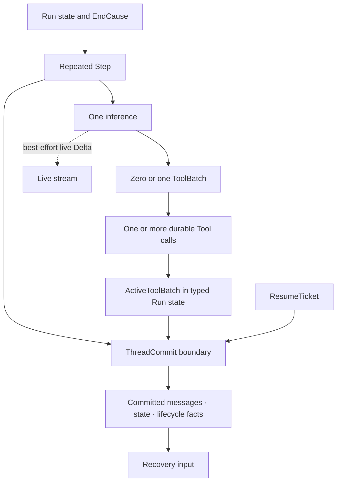
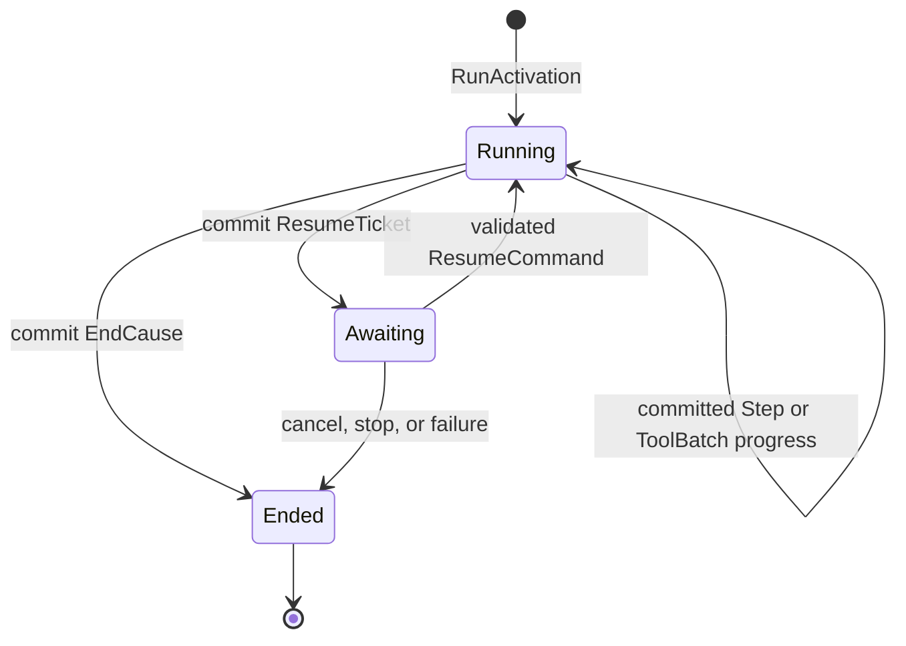
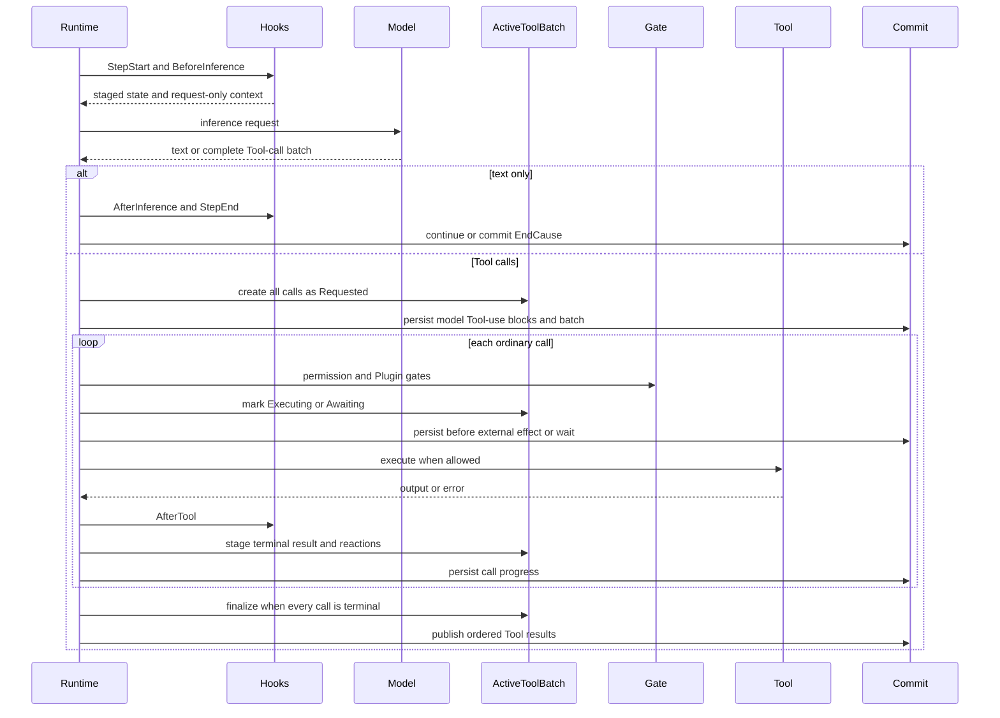
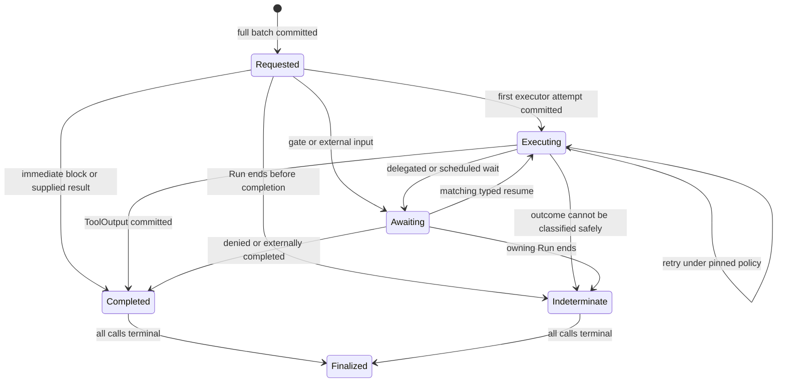

Use this page when changing loop order, commit timing, Tool recovery, or resume
behavior. Read the latest committed facts first. Live output can arrive before a
commit and cannot tell recovery where execution stopped.

## Start with the state you need

| Question | Read | Meaning |
| --- | --- | --- |
| Is the execution active, waiting, or finished? | latest committed `RunState` | `Running`, `Awaiting`, or `Ended(EndCause)` |
| Did the model already request Tools? | Run-scoped `ActiveToolBatch` | exact calls, attempts, waits, and terminal results |
| What may resume an Awaiting Run? | committed `ResumeTicket` | one typed correlation and target |
| Was displayed text accepted as Thread truth? | committed messages and facts | a live `Delta` alone is not authority |

Do not infer these answers from a Worker process, stream connection, local
future, or UI status.

## Static structure

A Run is the resumable execution identity. A Step is one inference and the
complete Tool batch produced by that response. `ActiveToolBatch` is typed
Run-scoped state in the ordinary commit log, not another database.

## Run state machine

`RunActivation` is input, not a durable `Created` state. If execution never
crosses its first commit, there is no committed Created fact to recover. `Ended`
is absorbing and carries one cause: natural completion, step limit,
cancellation, stop, typed failure, or an indeterminate external outcome.

## One Step and its commit points

Ordinary Tool calls currently execute in order. Terminal-only child delegation
may run concurrently under its narrower proof; see [Multi-Agent
collaboration](/docs/agents/runtime/explanation/multi-agent-patterns/). In both cases,
the next inference sees the batch only after every call is terminal.

## Tool-call state machine

`Requested` proves that the call is durable and no executor attempt has been
recorded. `Executing { attempt }` means an external effect may have started.
`Awaiting` owns a typed wait and correlation. `Completed` and `Indeterminate`
are terminal call states. Finalization is a batch publication barrier, not a
separate Run terminus.

## Recovery decision table

| Committed frontier | Runtime action | External action |
| --- | --- | --- |
| `Running`, no open ToolBatch | continue the next Step | none |
| call at `Requested` | run gates, commit `Executing`, then enter the executor | none |
| call at `Executing` | apply the pinned `ToolRecoveryPolicy`: replay, reconnect, or mark indeterminate | none unless reconciliation is required |
| call at `Awaiting` | accept only a command matching the committed ticket and wait kind | provide the requested typed approval or input |
| some calls terminal, batch still open | recover remaining calls; retain terminal calls | none |
| `Ended` | return or redeliver the terminus; never reopen the Run | none |

Recovery starts with an open `ActiveToolBatch` before it asks the model again.
It never silently turns `Executing` back into `Requested`, and it never exposes a
half-finished batch to inference.

## Commit and stream boundaries

`ThreadCommit` carries the legal `RunDisposition` together with new messages,
typed state, and events through one validated write. An Awaiting disposition
contains its ticket; Running and Ended dispositions cannot carry one. The
commit coordinator checks identity and expected version before accepting it.

A stream checkpoint is a best-effort optimization for a retryable inference
interruption. It may hold partial text or Tool arguments, is deleted when
recovery finishes, and is not Thread truth. Failure to write it degrades to no
partial recovery; it does not fail the Run.

## When external reconciliation is required

Only `Indeterminate` means Runtime cannot safely classify an external effect.
Use the batch's stable operation id to query the downstream system, then resolve
the business effect through that system's idempotency or transaction contract.
Do not rerun the Tool merely because no result was observed locally.

The guarantee is continuation from committed facts. It is not universal
exactly-once execution for arbitrary third-party side effects. All other retry,
resume, batch publication, and terminal redelivery behavior is automatic and
needs no generic troubleshooting section.
