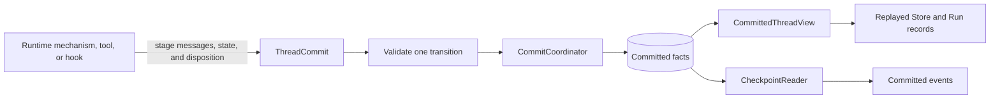
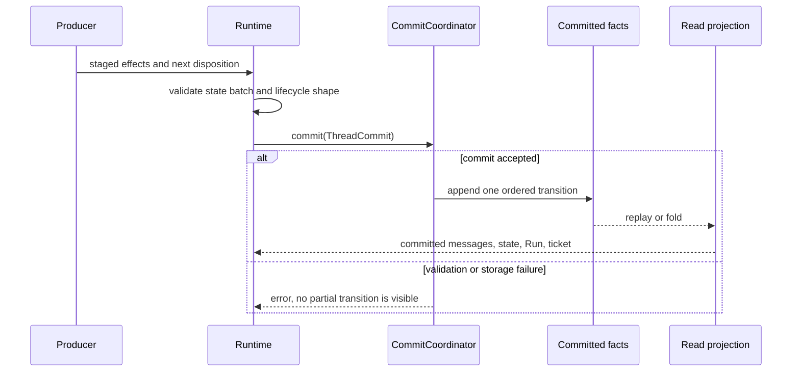

Use this model when a value must still be correct after a process exits, a worker
is replaced, or a Run resumes. Put the change in the Run's commit. Do not treat
an in-memory object, a streamed delta, or a cached record as recovery truth.

This page explains the truth boundary. For the state API, use
[State Keys](/docs/agents/runtime/reference/state-keys/). To choose a key, scope, and
merge policy, use [State Management](/docs/agents/runtime/explanation/state-management/).

## The structure to keep in mind

`ThreadCommit` is the one write boundary for Thread truth. It carries the Run
disposition together with the messages, state commands, and audit drafts produced
by that transition. `CommitCoordinator` either accepts that transition or returns
an error. Readers derive current state from the accepted fact prefix.

The live `Store` and `RunRecord` are useful because they are cheap to query. They
are not allowed to become independent writers. If a cache is empty after restart,
the committed facts still contain enough information to rebuild it.

## What belongs in a commit

Commit a fact when later work must distinguish what happened. Common examples
include:

- a message that changes the Thread transcript;
- a state command needed by a later step or Run;
- a transition to `Awaiting` and its exact `ResumeTicket`;
- a terminal `EndCause`;
- an audit draft that must stay aligned with the transition.

Keep live progress outside this authority. Token deltas, UI typing indicators,
and other best-effort stream data may be lost and reconciled from committed
history. They must not decide whether a tool ran or a Run ended.

## What happens at a boundary

Run-scoped state is bound to the Run at assembly. An awaiting disposition must
contain a ticket for that same Run. A running or ended disposition cannot carry
one. These invalid combinations are rejected before storage.

After a restart, execution reads the committed prefix. An ended Run remains
ended. An awaiting Run can continue only after a matching resume command. A Run
left running can be redelivered or terminalized by the host without inventing a
second state source.

## Snapshot means a stable view, not another truth

A transcript snapshot freezes a reference to an append-only message prefix so a
consumer can verify and slice the same view later. It does not copy authority away
from the Thread. The executable Agent snapshot has a different job: it pins the
configuration a Run executes and later resumes against.

Use the noun with its qualifier:

| Term | What it fixes | What remains authoritative |
| --- | --- | --- |
| transcript snapshot | one verified message prefix | committed Thread facts |
| executable Agent snapshot | one resolved executable configuration | the publication and its pinned identity |
| stream checkpoint | an interrupted inference fragment | the next accepted Thread commit |

## Design rules

1. Author one `ThreadCommit` for one logical transition.
2. Rebuild views from committed facts; never reconcile two writable truths.
3. Persist correlation before waiting for external input.
4. Treat live delivery as an accelerator, not a recovery record.
5. Keep executable configuration identity separate from conversation state.

## Related

- [State Management](/docs/agents/runtime/explanation/state-management/)
- [State Keys](/docs/agents/runtime/reference/state-keys/)
- [Thread Model](/docs/agents/runtime/reference/thread-model/)
- [Run Lifecycle and Phases](/docs/agents/runtime/explanation/run-lifecycle-and-phases/)
- [Human in the Loop](/docs/agents/runtime/explanation/human-in-the-loop/)
