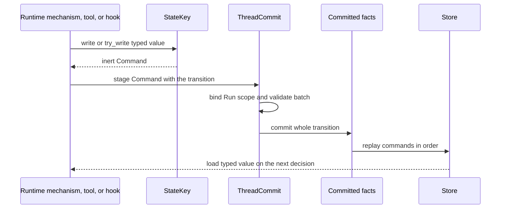

Start with one question: which later decision needs this value? If no later
runtime decision needs it, keep it out of durable state. If the value must guide
a later step, resume, or Run, give it one stable key and stage a command through
the existing commit path.

This page helps you make those choices. Exact types and methods are listed in
[State Keys](/docs/agents/runtime/reference/state-keys/). The fact-log rationale belongs
to [State and Snapshot Model](/docs/agents/runtime/explanation/state-and-snapshot-model/).

## Choose the key before writing code

Write down four facts:

1. **Consumer:** which runtime mechanism, tool gate, hook, or guard reads it?
2. **Lifetime:** does it live for one Run, one Thread, or a wider boundary?
3. **Writers:** can one or several producers stage it in the same commit?
4. **Shape:** what typed value must replay without ambiguity?

If two features answer these questions the same way, reuse the existing key.
Do not create a second key and synchronize the values.

## Choose the narrowest useful scope

| Scope | Use it when | Avoid it when |
| --- | --- | --- |
| `Run` | the value belongs only to the current attempt and its resumes | a later Run on the Thread must read it |
| `Thread` | later Runs in the same conversation need it | unrelated Threads should share it |
| `Shared` | the address must be distinct from other scopes inside the same Thread state | another Thread must read the value |
| `Profile` | the address represents profile-shaped data inside the same Thread state | a profile service must own one value across Threads |

The same key string in two scopes names two cells. Scope supplies ownership;
do not add a Run id to a Run-scoped key or a Thread id to a Thread-scoped key.
`ThreadCommit::assemble` binds Run-scoped commands to the current Run.

Current committed-state readers load commands by `ThreadId`. `Shared` and
`Profile` do not create a cross-Thread repository. Put cross-Thread business
state behind an application-owned Resource and Tool; use the run-ingress Outbox
for cross-Thread message delivery.

## Choose a merge policy from the writer relationship

| Writers in one commit | Policy | Result |
| --- | --- | --- |
| one intended producer | `Disjoint` | a later value replaces the earlier value |
| several independent object contributors | `Commutative` | object values shallow-merge; other values replace |
| exactly one claimant must win | `Exclusive` | a second `Set` for the same scope and key rejects the batch |

`Exclusive` is a guard against two `Set` commands in one batch. A `Remove` does
not count as a second set. `Commutative` is not a generic counter reducer; it only
shallow-merges JSON objects. Use `FoldStateKey` when a typed delta must be folded
deterministically.

## Prefer a typed key

```rust
use awaken_agent_contract::agent::state::{MergePolicy, Scope, StateKey};
use serde::{Deserialize, Serialize};

#[derive(Default, Serialize, Deserialize)]
struct ReviewState {
    approved: bool,
}

struct ReviewStateKey;

impl StateKey for ReviewStateKey {
    const KEY: &'static str = "review_state";
    const SCOPE: Scope = Scope::Thread;
    const MERGE: MergePolicy = MergePolicy::Disjoint;
    type Value = ReviewState;
}

let command = ReviewStateKey::try_write(&ReviewState { approved: true })?;
# Ok::<(), awaken_agent_contract::agent::state::StateError>(())
```

Use `load` for normal reads. It returns the type's default only when the cell is
absent and fails on a present value with the wrong shape. Use `load_or_default`
only when silently accepting schema drift is an intentional compatibility rule.
Use `try_write` when serialization can fail.

## How a change becomes visible



No producer mutates `Store` in place. A validation or storage failure exposes no
partial batch. A restarted process rebuilds the same materialized state by
replaying the committed commands in order.

## Review the change before shipping

- The key has one owner and one stable meaning.
- The scope is no wider than its consumer set.
- Cross-Thread data has an application owner instead of relying on `Shared` or
  `Profile` labels.
- The merge policy describes actual concurrent writers.
- Present schema drift fails closed unless a documented migration handles it.
- State advances through the same `ThreadCommit` as the message or lifecycle
  transition it explains.
- Workflow ordering rules use the existing state-machine plugin instead of a
  second hand-written gate. See
  [Constrain Tool Order with a State Machine](/docs/agents/runtime/how-to/constrain-tool-order-with-a-state-machine/).

## Related

- [State Keys](/docs/agents/runtime/reference/state-keys/)
- [State and Snapshot Model](/docs/agents/runtime/explanation/state-and-snapshot-model/)
- [Run Lifecycle and Phases](/docs/agents/runtime/explanation/run-lifecycle-and-phases/)
- [Constrain Tool Order with a State Machine](/docs/agents/runtime/how-to/constrain-tool-order-with-a-state-machine/)
