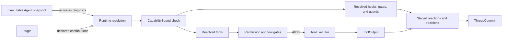
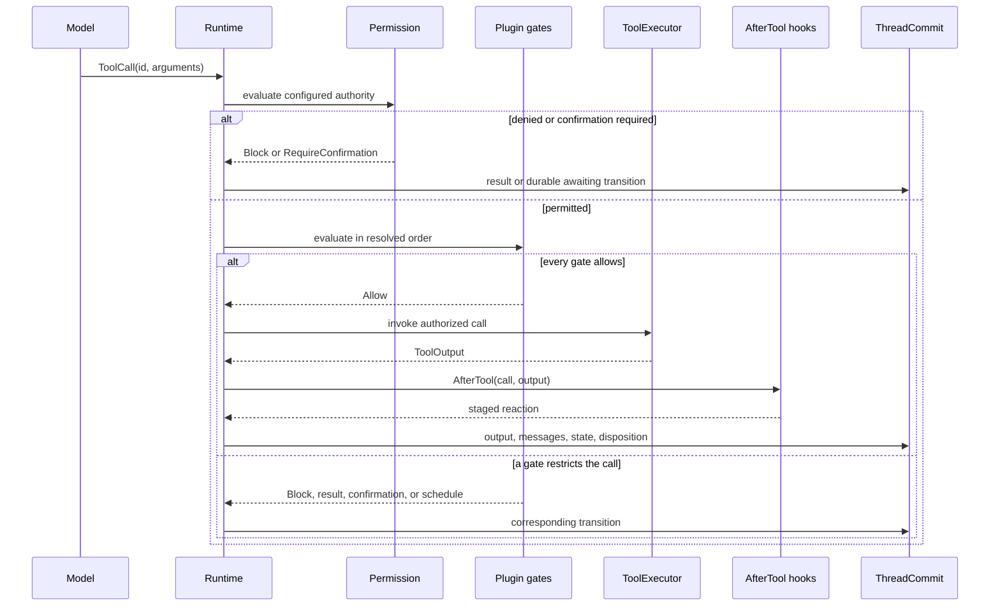

Choose a **Tool** when the model needs to request one named operation. Choose a
**Plugin** when a feature must contribute a bounded set of tools, hooks, gates,
guards, or state keys to the runtime.

Do not wrap a single tool in a plugin unless the feature also needs lifecycle
behavior. Do not put permission, retries, or commit logic inside each tool. Those
concerns already have runtime owners.

## Make the choice from the required behavior

| You need to | Use | Why |
| --- | --- | --- |
| expose one typed operation to the model | `Tool` | one id, argument schema, call, and output |
| change behavior at one or more loop phases | `Plugin` with `PhaseHook` | hooks observe fixed runtime points |
| narrow whether a tool call may proceed | `Plugin` with `ToolGate` | gates can restrict but never grant permission |
| keep a Run active until an invariant holds | `Plugin` with `RunEndGuard` | the guard owns an explicit end decision |
| distribute a cohesive feature with tools and state | `Plugin` | one capability bound covers the contribution set |
| choose where a tool physically executes | `ToolExecutor` implementation | placement belongs above the neutral tool contract |

If the requirement is only logging or telemetry, first use the existing event and
tracing surfaces. A new plugin is justified only when it changes or observes a
defined runtime seam that is not already owned elsewhere.

## Static boundary

A tool implements an operation. A plugin composes contributions. The immutable
Agent snapshot selects which installed plugin ids are active. Runtime resolution
checks the plugin's actual contributions against its `CapabilityBound`; an
undeclared tool, state key, hook point, action kind, gate, or guard fails closed.

Permission remains the sole grant. Plugin gates and per-Run narrowing may reduce
the allowed set, but they cannot make a denied call executable.

## What happens for one tool call

The runtime assigns durable operation identity before invocation. A provider call
id remains protocol correlation and must not become an idempotency key for an
external effect. Tool recovery policy is pinned separately and cannot exceed the
implementation's declared recovery capability.

## Keep each concern with its owner

| Concern | Owner | Do not duplicate it in |
| --- | --- | --- |
| typed arguments, output, and executable capability | `Tool` | plugin configuration |
| dynamic invocation and placement | `RawTool` / `ToolExecutor` | the model-visible schema |
| model-visible descriptor | resolved Agent snapshot | the tool's runtime lookup table |
| permission grant | configured permission policy | a plugin gate or tool body |
| contribution limits and order | Plugin resolution and `CapabilityBound` | each hook implementation |
| durable state and lifecycle | `ThreadCommit` | direct storage writes from tools or plugins |
| crash recovery behavior | `ToolRecoveryCapability` plus pinned policy | generic retries after an unknown effect |

## Next steps

- Implement one operation with [Tool Trait](/docs/agents/runtime/reference/tool-trait/).
- Package several contributions with
  [Plugin Internals](/docs/agents/runtime/explanation/plugin-internals/).
- Declare limits with
  [Capability and Permissions](/docs/agents/runtime/explanation/capability-and-permissions/).
- Follow phase behavior in
  [Run Lifecycle and Phases](/docs/agents/runtime/explanation/run-lifecycle-and-phases/).
