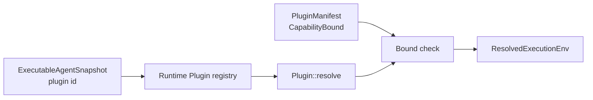
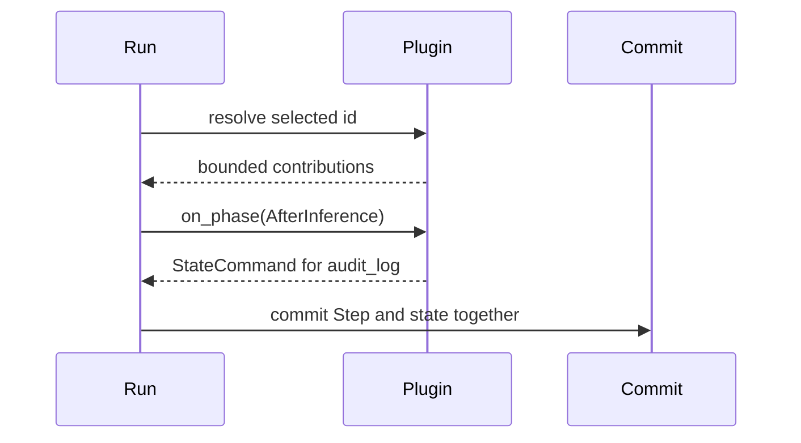

Use a Plugin when one behavior must join the Agent lifecycle. If the work can be
expressed as one model-invoked operation, [add a Tool](/docs/agents/runtime/how-to/add-a-tool/)
instead.

This guide adds an `AfterInference` hook that records an `audit_log` state key.
You are done when a Run that selects the Plugin commits that key.

## Before you start

Work in an Awaken source workspace with `awaken-runtime`,
`awaken-runtime-contract`, `awaken-agent-contract`, `async-trait`, and
`serde_json` available to the crate that composes the Runtime.

## Choose the extension seam

| Need | Use |
| --- | --- |
| Give the model one operation | `Tool` |
| Observe a phase or stage state around inference or Tool execution | `Plugin` phase hook |
| Decide whether a Tool call may execute | runtime permission gate |
| Add a new model or Sandbox backend | the corresponding Runtime port, not a Plugin |

A Plugin declares the seams it may use in `PluginManifest::bound`. Its resolved
contributions must stay inside that bound.



## 1. Implement one hook

Return state commands from the hook. Do not write the store or transcript
directly; the Runtime commits the reaction in the current Step.

```rust
use async_trait::async_trait;
use awaken_agent_contract::agent::message::Message;
use awaken_agent_contract::agent::state::{
    Command as StateCommand, MergePolicy, Scope, Store,
};
use awaken_runtime_contract::plugin::{
    HookReaction, PhaseContext, PhaseHook, PhaseHookPoint,
};

struct AuditHook;

#[async_trait]
impl PhaseHook for AuditHook {
    fn point(&self) -> PhaseHookPoint {
        PhaseHookPoint::AfterInference
    }

    async fn on_phase(
        &self,
        ctx: &PhaseContext,
        _conversation: &[Message],
        _state: &Store,
    ) -> HookReaction {
        HookReaction::state(vec![StateCommand::set(
            Scope::Run,
            MergePolicy::Disjoint,
            "audit_log",
            serde_json::json!({ "last_inference_step": ctx.step }),
        )])
    }
}
```

## 2. Declare and register the contribution

Use the `Contributions` registrar methods. The manifest allows exactly the state
key and hook point installed by `resolve()`.

```rust
use std::sync::Arc;
use awaken_runtime_contract::plugin::{
    CapabilityBound, Contributions, IdBound, Plugin, PluginManifest,
};

struct AuditPlugin;

impl Plugin for AuditPlugin {
    fn manifest(&self) -> PluginManifest {
        PluginManifest {
            id: "audit".into(),
            requires: Vec::new(),
            config_sections: Vec::new(),
            bound: CapabilityBound {
                state_keys: IdBound::Exact(vec!["audit_log".into()]),
                phase_hooks: vec![PhaseHookPoint::AfterInference],
                ..Default::default()
            },
        }
    }

    fn resolve(&self) -> Contributions {
        let mut contributions = Contributions::new("audit");
        contributions
            .declare_state_key("audit_log")
            .register_hook(Arc::new(AuditHook));
        contributions
    }
}
```

## 3. Install and select the Plugin

Installation makes a Plugin available. Selection in the immutable Agent
snapshot activates it for that Run.

```rust
let runtime = Runtime::new()
    .with_llm(llm)
    .with_plugin(Arc::new(AuditPlugin));

let snapshot = ExecutableAgentSnapshot::builder("assistant")
    .instructions("Answer the request.")
    .model(model_binding)
    .plugins(["audit".to_string()])
    .build();
```



## Expected result

Materialize the committed Run state and read `audit_log`. It contains the latest
inference Step recorded by the hook. A missing Plugin id leaves the Plugin
inactive; a contribution outside the declared bound prevents the Run from
starting with that environment.

Configuration, dependency ordering, live refresh, and request-only context
injection belong to [Plugin Internals](/docs/agents/runtime/explanation/plugin-internals/).

## Source examples

- `crates/runtime/awaken-runtime/tests/plugins.rs`
- `crates/runtime/awaken-ext-compact/src/plugin.rs`

## Next

- [Choose between a Tool and Plugin](/docs/agents/runtime/explanation/tool-and-plugin-boundary/)
- [Build an Agent](/docs/agents/runtime/how-to/build-an-agent/)
