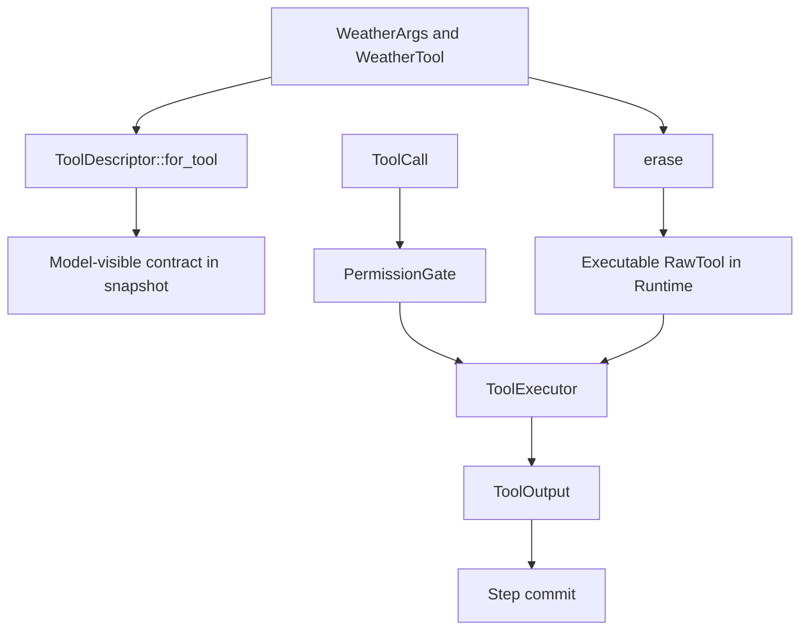

Use this page when the model needs to request an action implemented by your
Rust process. Start with [First Tool](/docs/agents/runtime/tutorials/first-tool/) if you
have not yet run the checked `echo` path.

## Outcome

You will add one `WeatherTool`. Its Rust implementation, argument schema,
model-visible id, and description come from one typed contract. The Runtime
executes it through the existing permission and commit path.

## Prerequisites

- `awaken-runtime-contract`, `awaken-ext-builtin-tools`, `async-trait`, `serde`,
  and `schemars` in the owning crate;
- an existing `Runtime` and `ExecutableAgentSnapshot` assembly;
- a deterministic `LlmExecutor` for the first test.

## 1. Define the action and its arguments

```rust
use std::sync::Arc;
use async_trait::async_trait;
use serde::Deserialize;
use awaken_runtime_contract::tool::{Tool, ToolError};

#[async_trait]
trait WeatherClient: Send + Sync {
    async fn current(&self, city: &str) -> Result<String, ToolError>;
}

#[derive(Deserialize, schemars::JsonSchema)]
#[serde(deny_unknown_fields)]
struct WeatherArgs {
    city: String,
}

struct WeatherTool {
    client: Arc<dyn WeatherClient>,
}

#[async_trait]
impl Tool for WeatherTool {
    type Args = WeatherArgs;
    type Output = String;

    const ID: &'static str = "get_weather";
    const DESCRIPTION: &'static str = "Return the current weather for one city";

    async fn call(&self, args: WeatherArgs) -> Result<String, ToolError> {
        let city = args.city.trim();
        if city.is_empty() {
            return Err(ToolError::InvalidArguments("city must not be empty".into()));
        }
        self.client.current(city).await
    }
}
```

`WeatherArgs` is the argument and JSON Schema authority. Deserialization rejects
the wrong shape before `call`; `call` handles semantic checks such as an empty
city.

## 2. Register the executable implementation

```rust
use awaken_ext_builtin_tools::erase;

let runtime = Runtime::new()
    .with_llm(llm)
    .with_tool(erase(WeatherTool { client: weather_client }));
```

`weather_client` is the application-owned adapter for the external service.
`erase` is the sole adapter from the typed `Tool` to the Runtime's `RawTool`
registry. Do not write another adapter or dispatcher.

## 3. Derive the model-visible descriptor

```rust
use awaken_runtime_contract::resolved::ToolDescriptor;

let snapshot = ExecutableAgentSnapshot::builder("assistant")
    .instructions("Use get_weather for current weather questions.")
    .model(model_binding)
    .tool(ToolDescriptor::for_tool::<WeatherTool>("custom:weather"))
    .max_steps(8)
    .build();
```

`ToolDescriptor::for_tool` reads `WeatherTool::ID`,
`WeatherTool::DESCRIPTION`, and the schema for `WeatherArgs`. Do not repeat those
values in hand-written JSON. The snapshot decides whether the model can see the
Tool; Runtime registration decides whether the implementation can execute.

## 4. Add authorization

Bind the Tool to the existing `PermissionGate`. Choose allow, block, or approval
from the action's consequence, not from whether the model is likely to call it.
The Tool must not bypass this gate or perform a second authorization check with
different semantics.

For an approval path, continue with
[Enable Tool permission HITL](/docs/agents/runtime/how-to/enable-tool-permission-hitl/).

## 5. Verify

Use a scripted model that requests `get_weather` once, then returns text. Assert
all of the following in one test:

1. the snapshot descriptor id is `get_weather`;
2. the permission gate allows the expected arguments;
3. the committed transcript contains the Tool result;
4. the run ends at `NaturalEnd`.

Also test invalid JSON and an empty `city`. The erasure boundary converts a
`ToolError` into a model-visible error result, so the model can correct a later
call without an operator procedure. Add troubleshooting only when a terminal
result survives that behavior and an external maintainer can correct it.

## Static structure



The descriptor and executable implementation meet by the one `Tool::ID`. A
duplicate registered id is ambiguous and fails closed; remove the duplicate
registration instead of relying on insertion order.

## State and external effects

A typed `Tool` returns its output; it does not write a state store directly.
When an action needs staged state, use the `RawTool` and `ToolOutput::with_state`
contract described by [State and snapshot model](/docs/agents/runtime/explanation/state-and-snapshot-model/).
Choose a recovery capability before enabling automatic retries for an external
effect. Do not infer replay safety from a successful local call.

## Next steps

- Add a tested permission decision: [Tool permission HITL](/docs/agents/runtime/how-to/enable-tool-permission-hitl/).
- Choose state semantics: [State and snapshot model](/docs/agents/runtime/explanation/state-and-snapshot-model/).
- Add the Tool to an application assembly: [Build an Agent](/docs/agents/runtime/how-to/build-an-agent/).
