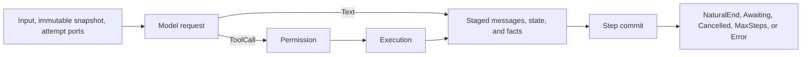

Use this page after the checked examples run locally and the next task is to
embed the Runtime in an application. It does not repeat their full source. Keep
those examples as the executable baseline while replacing one boundary at a
time.

## Outcome

Your application will assemble one `Runtime`, compile or load one
`ExecutableAgentSnapshot`, create one `RuntimeRunContext`, and read the terminal
`RunState` plus committed output.

## Prerequisites

- [Create your first Agent configuration](/docs/agents/runtime/tutorials/first-agent/)
  and [Run your first Tool](/docs/agents/runtime/tutorials/first-tool/) pass unchanged;
- the application has selected its model, Tool, permission, and persistence
  implementations;
- provider credentials are resolved by the application or Awaken Agents service, not read by
  the neutral Runtime.

## 1. Keep three lifetimes separate

| Lifetime | Owner | Values |
| --- | --- | --- |
| Process | `Runtime` | model executor, Tool implementations, permission gate, Plugins, delegation service |
| Agent publication | `ExecutableAgentSnapshot` | instructions, pinned model candidates, Tool descriptors, Plugins, limits |
| One attempt | `RuntimeRunContext` | commit and history ports, streaming, cancellation, execution scope, per-attempt executors |

Do not synchronize copies of the same value across these owners. Resolve a
setting once, then pass it to the boundary whose lifetime matches it.

## 2. Choose the Agent publication path

- Use `AgentConfig` plus `compile_resolved` when the application authors config
  and needs a derived fingerprint. Follow `hello_agent.rs`.
- Use `ExecutableAgentSnapshot::builder` when the application already owns
  resolved, executable values. Follow `direct_runtime.rs`.

Both paths produce the same snapshot contract before `Runtime::run`. Choose one;
do not compile an `AgentConfig` and then rebuild its snapshot by hand.

## 3. Replace process ports one at a time

Start with the checked local model double. Replace only the port needed by the
application:

1. bind an explicitly configured `LlmExecutor`;
2. add typed Tools through [Implement a typed Tool](/docs/agents/runtime/how-to/add-a-tool/);
3. add one `PermissionGate` for every Tool execution path;
4. add Plugins or delegation only when the Agent requires them.

Run the baseline test after each replacement. This keeps a provider error, Tool
contract error, and permission decision distinguishable.

## 4. Choose persistence for the attempt

`RuntimeRunContext::new()` permits an ephemeral run. Add a
`CommitCoordinator` when the application needs a durable transcript or state,
and add the matching read port when later runs must continue committed history.
Use an `awaken-store-*` backend for persistence across process restarts.

Absence of a commit coordinator is not a Runtime fault. It is an explicit
ephemeral choice. Do not tell maintainers to repair it unless the application
requires durable output and failed to supply the port.

## 5. Run and handle the terminal result

Call `Runtime::run` for a fresh single-shot thread. Use the stable-thread
`start_run` and `resume` path, or `run_to_completion`, when approval can place a
run in `Awaiting`.

`Awaiting` is a state to resume, not a failure to restart. Tool invocation
errors become model-visible results. Consecutive inference failures are retried
inside the loop up to the Runtime threshold. Act only when the returned terminal
result or surfaced configuration error requires a change outside that recovery.

## 6. Verify

For the application path, test at least these outcomes:

| Cause | Expected effect |
| --- | --- |
| text-only model response | `NaturalEnd` and committed assistant output |
| allowed Tool request | one Tool result committed before the next model turn |
| approval required | `Awaiting` with a resumable ticket, then one terminal continuation |
| invalid Tool arguments | model-visible error result; no process crash |
| durable output required but commit port absent | application assembly test fails before acceptance |

Attach the cause, expected effect, and covered rule to each test. Use one
decision table in test comments rather than a separate test-design document.

## Next steps

- Persist history: [Use File Store](/docs/agents/runtime/how-to/use-file-store/) or [Use Postgres Store](/docs/agents/runtime/how-to/use-postgres-store/).
- Add approval: [Tool permission HITL](/docs/agents/runtime/how-to/enable-tool-permission-hitl/).
- Expose the application through the owning service plane: [Awaken Agents](/docs/agents/).
