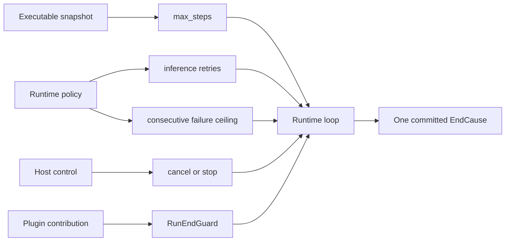
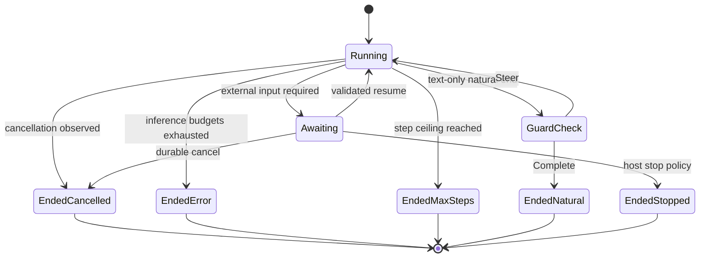

A Run ends through one committed `EndCause`. Choose the control by the reason
the work must end; do not stack several limits that express the same policy.

| Need | Owning control | Committed result |
| --- | --- | --- |
| Bound a model and Tool loop | `ExecutableAgentSnapshot.resolved_spec.max_steps` | `EndCause::MaxSteps` |
| Bound retryable inference work | `with_infer_retries` plus `with_max_consecutive_inference_failures` | `EndCause::Error(Failure::Inference)` after both budgets finish |
| Stop active work on request | `CancellationToken` or `LiveCommand::Cancel` | `EndCause::Cancelled` |
| Cancel queued or awaiting work durably | `Runtime::cancel_run` through the committed control path | `EndCause::Cancelled` |
| End non-running work for an application policy | `Runtime::stop_run(reason)` | `EndCause::Stopped(reason)` |
| Require a condition before natural completion | One bounded `RunEndGuard` | `NaturalEnd` after `Complete`, or another Step after `Steer` |
| Enforce elapsed time | A host timer that cancels the attempt | `Cancelled` |

`RunState::Ended` is absorbing. A UI response, cancellation signal, or timeout is
not the terminal truth until the corresponding state is committed.

## Static structure



## Set the hard loop ceiling

The published default is `16` Steps. Set a smaller or larger value on the
snapshot when the Agent's job needs a different runaway bound.

```rust
let snapshot = ExecutableAgentSnapshot::builder("assistant")
    .instructions("Complete the task and report the result.")
    .model(ModelBinding::new("provider", "model", "backend"))
    .max_steps(25)
    .build();
```

Every absorbed inference failure and every guard-directed continuation consumes
a Step. The hard ceiling remains effective even when another policy continues
the loop.

## Bound inference failures separately

```rust
let runtime = Runtime::new()
    .with_llm(llm)
    .with_infer_retries(2)
    .with_max_consecutive_inference_failures(3);
```

`with_infer_retries(2)` permits two extra attempts inside one failed inference
Step. After that, the consecutive-failure ceiling decides whether the loop may
try another Step. A successful inference resets that second count. Passing zero
to the consecutive ceiling is clamped to one, so failure can never become
non-terminal by accident.

Provider failover is a different decision. It is allowed only after a clean
pre-partial failure whose classification permits another candidate. Once partial
output exists, recovery stays with that model path.

## Cancel active work; terminalize inactive work

Attach a `CancellationToken` to `RuntimeRunContext` when the host owns the active
attempt. The loop checks it before inference, while inference is running, at
Step boundaries, and while a Tool is running. `LiveCommand::Cancel` reaches the
same active-attempt control.

Use `Runtime::cancel_run` for queued or awaiting work through the durable ingress
path. Use `Runtime::stop_run(reason)` only for a non-running Run ended by an
application policy such as an external budget. Both clear an awaiting ticket;
later resume attempts fail closed.

## Guard a natural end

A `RunEndGuard` reads the immutable conversation, materialized state, forced
continuation count, and optional cancellation token. It returns `Complete` or
`Steer`. Register it through one Plugin and include its id in that Plugin's
`CapabilityBound.run_end_guards`.

Use a guard for a predicate over the completed conversation, not for a duplicate
step, time, or inference budget. If it can steer, give the predicate its own
small continuation bound; `max_steps` remains the final backstop.

## Dynamic behavior



## Treat `Indeterminate` as terminal uncertainty

`EndCause::Indeterminate` means external asynchronous execution returned without
a knowable effect. It is terminal and projects to `RunFailed` with code
`indeterminate`; no later Run fact is promised. Inspect the external system by
the Runtime-owned operation identity, reconcile the effect, and only then decide
whether a new Run may issue another request. Never retry from the display message
alone.

## Confirm the selected control

Run one representative task with the chosen limit or control, then read the
committed `RunState`. Treat the configuration as active only when its matching
`EndCause` is present. A live event or UI acknowledgement alone is not enough.

See [Cancellation](/docs/agents/runtime/reference/cancellation/) for exact control
routes and [Run lifecycle](/docs/agents/runtime/explanation/run-lifecycle-and-phases/)
for commit and recovery ordering.
