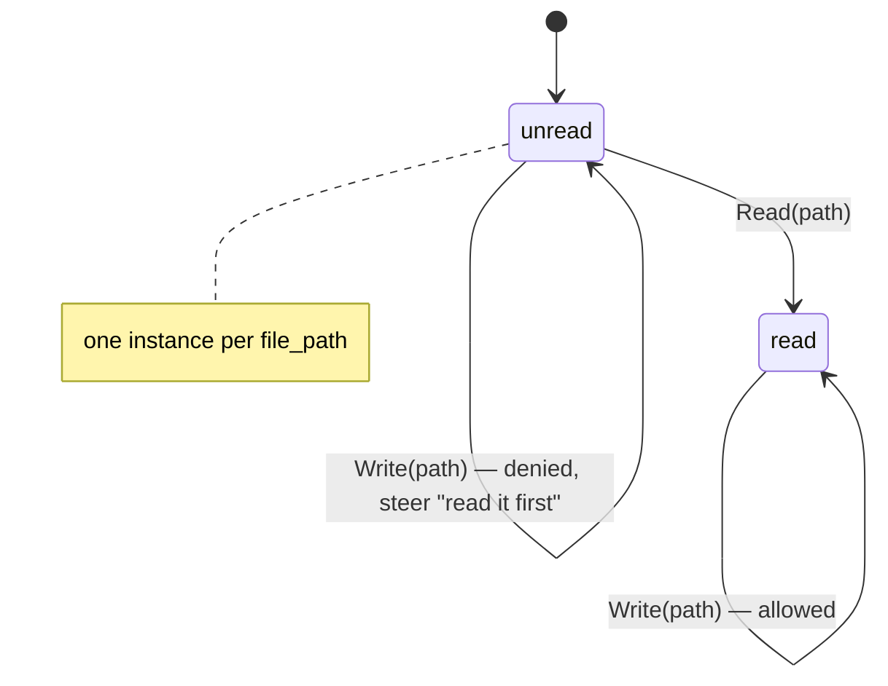

Use this when you want to enforce the order of tool calls — like read-before-write — with a declarative state machine that gates, steers, and reminds.

## The problem

A model can call any exposed tool at any time. Some tasks have an *order* that
must hold regardless of what the model decides: write a file only after reading
it, delete a record only after confirming it, publish only after a dry run
passed. Permission rules can allow or deny a tool, but they cannot say "allow
`Write` only once `Read` has run for *this* file" — they carry no memory of what
happened earlier in the run.

The `awaken-ext-state-machine` plugin closes that gap. It loads a declarative
finite-state machine (JSON or YAML) that watches a family of tool calls, keeps a
small per-instance state (e.g. one state per `file_path`), and at each call
decides whether the call is allowed, denied, or must pause for approval. After a
call runs it advances the instance state and can surface a reminder to the model.
It never grants authorization — permission remains the only path to *allow* a
call; a machine can only *narrow* what a gate already permits.

The machine's `emit` action injects the configured reminder when a transition
fires; reminder behavior stays inside this state-machine implementation.

## Prerequisites

- A working awaken agent runtime (see [First Agent](/docs/agents/runtime/tutorials/first-agent/))
- The `awaken-ext-state-machine` crate added to `Cargo.toml`

```toml
[dependencies]
awaken-runtime = { git = "https://github.com/AwakenWorks/awaken" }
awaken-ext-state-machine = { git = "https://github.com/AwakenWorks/awaken" }
tokio = { version = "1", features = ["full"] }
serde_json = "1"
```

## What the plugin contributes

`StateMachinePlugin` (id `STATE_MACHINE_PLUGIN_ID` = `"state_machine"`) installs
three seams under its `CapabilityBound`, all driven by the same compiled machine
set:

| Seam | Contribution | Effect |
|------|--------------|--------|
| Pre-execution gate | a `ToolGateHook` | A precondition violation maps `deny` → block the call, `ask` → suspend for approval, `warn`/no-violation → allow |
| Post-execution hook | an `AfterTool` phase hook | Advances the instance state on the result, emits reminder messages, records metrics and a violation log |
| Run-end guard | a `RunEndGuard` | Forces continuation while any machine instance is non-terminal, up to a cap |

It also declares four state keys — `tool_fsm_thread_state`,
`tool_fsm_run_state`, `tool_fsm_metrics`, `tool_fsm_violation_log` — so instance
state, metrics, and the violation log are committed and replayable like any other
state.

## The DSL shape

The top-level config is `StateMachineConfig`: a list of `machines` plus shared
`continuation` settings.

```yaml
machines:
  - name: read-before-write     # unique machine name
    scope: thread               # thread (persists across runs) | run (resets each run)
    key: "{file_path}"          # instance key template, extracted from tool args
    key_normalizer: path        # none | trim | lowercase | path | url
    initial: unread             # starting state for a fresh instance
    strict: false               # true => a keyed call matching no transition is a violation
    on_unmatched: null          # fallback target when a call is allowed but no `when` matched
    terminal: [written]         # states that count as "done" for the run-end guard
    transitions:
      - on: 'Read(file_path ~ "*")'   # tool-call pattern
        from: [unread, read, written] # one state or a list
        to: read
      - on: 'Write(file_path ~ "*")'
        from: read
        to: written
        when: { status: success }     # advance only on a successful result
        emit:
          target: system              # system | suffix_system | session | conversation
          content: "Wrote {file_path}"
          cooldown_turns: 2
        on_violation:
          action: deny                # deny | ask | warn
          reason: "Read {file_path} before writing."
continuation:
  max_continuations: 25         # 0 disables the run-end guard
  message: "Finish the protocol work: {summary}"
```

Key pieces:

- **Instance key** — `key` is a `KeyTemplate`. `"{file_path}"` extracts the
  `file_path` argument, `"{target.path}"` walks nested objects,
  `"{items[0].name}"` indexes arrays. An empty template yields one global
  instance. `key_normalizer` canonicalizes the rendered key (`path` collapses
  `.`/`..` and separators; `url` lowercases scheme/host and drops fragments).
- **Transition `on`** — a tool-call pattern parsed by `awaken-tool-pattern`, e.g.
  `Write(file_path ~ "*")` matches a `Write` whose `file_path` glob-matches `*`.
- **`when`** — a `ResultMatcher` evaluated post-execution: `"any"`, `"success"`,
  `"error"`, or a structured `{ status, content }` where `content` is a glob over
  the stringified result. An absent `when` fires on success only.
- **`emit`** — a reminder injected when the transition fires. `target` places it
  (`system` after the base prompt, `suffix_system` after history — the least
  intrusive default, `session`/`conversation` as a turn). `cooldown_turns`
  throttles re-injection of the same reminder; `role` (`user`/`assistant`)
  applies to the positioned targets only.
- **`on_violation`** — what happens when the call matches a transition but the
  instance is not in one of its `from` states: `deny` (reject this one call with
  an error fed back to the model), `ask` (suspend for human-in-the-loop
  approval), or `warn` (allow, then inject a warning after execution). `reason`
  is a template interpolated with the tool args.
- **`continuation`** — `max_continuations` bounds how many times the run-end
  guard steers the model back to finish a non-terminal instance; `message`'s
  `{summary}` is filled with the incomplete instances.

## Steps

1. Author the machine and compile the plugin.

   `StateMachineConfig::from_yaml_str` / `from_json_str` parse the DSL;
   `StateMachinePlugin::from_config` compiles the patterns and templates up front,
   so a bad pattern fails fast at construction rather than mid-run.

```rust
use std::sync::Arc;
use awaken_ext_state_machine::{StateMachineConfig, StateMachinePlugin};

const READ_BEFORE_WRITE: &str = r#"
machines:
  - name: read-before-write
    key: "{file_path}"
    key_normalizer: path
    initial: unread
    terminal: [written]
    transitions:
      - on: 'Read(file_path ~ "*")'
        from: [unread, read, written]
        to: read
      - on: 'Write(file_path ~ "*")'
        from: read
        to: written
        when: { status: success }
        emit: { target: system, content: "Wrote {file_path}", cooldown_turns: 2 }
        on_violation: { action: deny, reason: "Read {file_path} before writing." }
continuation:
  max_continuations: 25
"#;

let config = StateMachineConfig::from_yaml_str(READ_BEFORE_WRITE)?;
let plugin = Arc::new(StateMachinePlugin::from_config(config)?);
# Ok::<(), Box<dyn std::error::Error>>(())
```

2. Install the plugin and activate it on the run.

   As with any plugin, `with_plugin` installs it and the run's `plugins([...])`
   list is what activates it (an installed-but-unlisted plugin is inert). See
   [Add a Plugin](/docs/agents/runtime/how-to/add-a-plugin/).

```rust
use awaken_ext_state_machine::STATE_MACHINE_PLUGIN_ID;
use awaken_runtime::Runtime;
use awaken_runtime_contract::resolved::ModelBinding;
use awaken_runtime_contract::snapshot::ExecutableAgentSnapshot;

let runtime = Runtime::new()
    .with_llm(llm)
    .with_plugin(plugin);

let config = ExecutableAgentSnapshot::builder("assistant")
    .instructions("Read a file before writing it.")
    .model(ModelBinding::new("demo", "stub", "stub"))
    .plugins([STATE_MACHINE_PLUGIN_ID.to_string()]) // activate for this run
    .build();
```

3. (Alternative) Ship base machines and let each agent add its own.

   Register `StateMachinePlugin::empty()` once and give each run its machines
   through the `state_machine` config section. The plugin merges base machines
   with the section's machines (a name declared in both is a config error, failing
   closed). The section is keyed by `STATE_MACHINE_PLUGIN_ID` via `plugin_config`.

```rust
let section = serde_json::json!({
    "machines": [ /* MachineEntry objects, same shape as the YAML above */ ],
    "continuation": { "max_continuations": 25 }
});

let config = ExecutableAgentSnapshot::builder("assistant")
    .instructions("Read a file before writing it.")
    .model(ModelBinding::new("demo", "stub", "stub"))
    .plugins([STATE_MACHINE_PLUGIN_ID.to_string()])
    .plugin_config([(STATE_MACHINE_PLUGIN_ID.to_string(), section)])
    .build();
```

## How the read-before-write machine behaves



- The model calls `Write(file_path = "src/a.rs")` first. The instance for
  `src/a.rs` is in `unread`, which is not a `from` state of the `Write`
  transition — the gate **denies** the call and feeds back "Read src/a.rs before
  writing."
- The model calls `Read(file_path = "src/a.rs")`. It matches the `Read`
  transition from `unread`, so the instance advances to `read`.
- The model retries `Write(file_path = "src/a.rs")`. Now the instance is in
  `read`, the gate allows it, and on a successful result the instance advances to
  `written` and the "Wrote src/a.rs" reminder is emitted (throttled to at most
  once every two steps).
- Because `written` is the only `terminal` state, the run-end guard steers the
  model to finish any instance still stuck in `unread`/`read` — up to
  `max_continuations` times.

Switch `on_violation.action` to `warn` to let the write through but nudge the
model afterward, or to `ask` to suspend the call for external approval (the gate
returns a suspend ticket the host resolves — see
[Enable Tool Permission HITL](/docs/agents/runtime/how-to/enable-tool-permission-hitl/)).

## Verify

1. Drive the agent with a write-then-read sequence. The first `Write` should come
   back as an error result naming your `reason`; the second (after a `Read`)
   should succeed.
2. Inspect committed state: `tool_fsm_thread_state` should hold
   `read-before-write → { "src/a.rs": "written" }` after the successful write, and
   `tool_fsm_metrics` should record the denial and the transition.
3. End the run with an instance left non-terminal and confirm the run-end guard
   re-steers the model with your `continuation.message`.

## Common Errors

| Symptom | Cause | Fix |
|---------|-------|-----|
| `StateMachineConfigError::Pattern` at construction | A malformed tool-call pattern in `on` | Fix the pattern, e.g. `Read(file_path ~ "*")` |
| `StateMachineConfigError::Action` / `::Status` | Unknown `on_violation` action or `when` status | Use `deny`/`ask`/`warn` and `any`/`success`/`error` |
| `StateMachineConfigError::DuplicateMachine` | Two machines share a `name` | Rename one; names must be unique (also across base + config sections) |
| Machine never fires | Plugin id not in the run's `plugins([...])` | Add `STATE_MACHINE_PLUGIN_ID` to the activation |
| Instance never advances | The `key` template did not resolve for the tool's args | Confirm the field exists in the tool arguments; an unresolved key skips the machine |

## Code References

- `crates/runtime/awaken-ext-state-machine/src/config.rs` — the DSL entries and the compile tests (read-before-write in JSON and YAML)
- `crates/runtime/awaken-ext-state-machine/src/plugin.rs` — the gate, `AfterTool` phase hook, and run-end guard wiring under the `CapabilityBound`
- `docs/design/tool-state-machine.md` — the state model, the four runtime seams, and durability guarantees

## Key Files

| Path | Purpose |
|------|---------|
| `crates/runtime/awaken-ext-state-machine/src/lib.rs` | Module root and public re-exports |
| `crates/runtime/awaken-ext-state-machine/src/config.rs` | `StateMachineConfig`, `ContinuationSettings`, DSL parsing |
| `crates/runtime/awaken-ext-state-machine/src/machine.rs` | `Machine`, `Transition`, `Violation`, `ViolationAction`, `Emit`, `EmitTarget`, `KeyTemplate`, `KeyNormalizer`, `MachineScope` |
| `crates/runtime/awaken-ext-state-machine/src/result.rs` | `ResultMatcher`, `StatusMatcher`, `ContentMatcher`, `ToolResultView` |
| `crates/runtime/awaken-ext-state-machine/src/plugin.rs` | `StateMachinePlugin`, `STATE_MACHINE_PLUGIN_ID` |

## Related

- [Add a Plugin](/docs/agents/runtime/how-to/add-a-plugin/)
- [Configure Agent Behavior](/docs/agents/how-to/configure-agent-behavior/)
- [Enable Tool Permission HITL](/docs/agents/runtime/how-to/enable-tool-permission-hitl/)
- [Tool Trait](/docs/agents/runtime/reference/tool-trait/)
