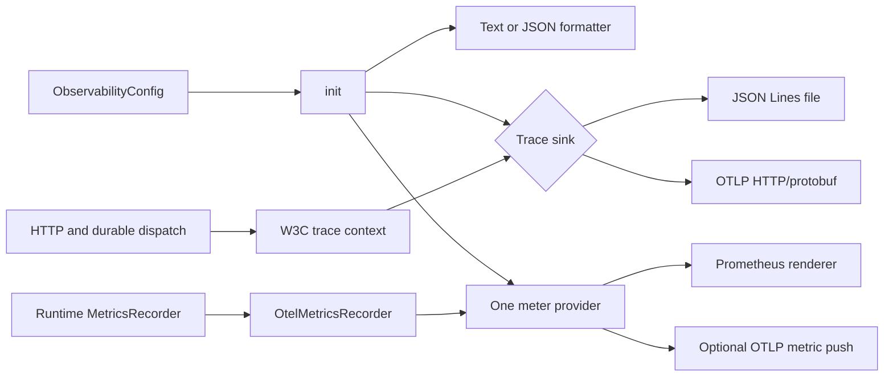
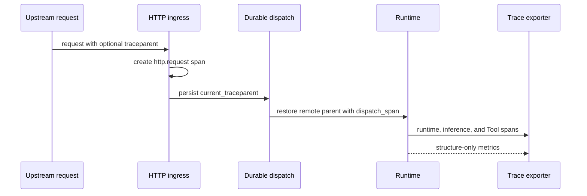

Choose the question first, then enable the smallest signal that answers it.

| Question | Signal | Available sink |
| --- | --- | --- |
| What happened in this process? | Filtered text or JSON logs | Process output |
| Where did one request spend time? | OpenTelemetry spans | JSON Lines trace file or OTLP/HTTP |
| Is behavior changing across Runs? | Counters, histograms, and gauges | Prometheus scrape and optional OTLP push |
| Did one trace cross HTTP or durable dispatch? | W3C `traceparent` | `trace_http`, persisted carrier, and `dispatch_span` |

The library owns process-global plumbing. Runtime, HTTP, dispatch, and Worker
components emit the spans and metrics that describe their own work.

## Static structure



## Initialize an embedded process once

Enter a Tokio runtime, call `init`, then create `OtelMetricsRecorder`. Call
`shutdown` while the runtime can still drive exporters. The final flush waits at
most three seconds for traces and three seconds for metrics.

```rust
use awaken_observability::{
    LogFormat, ObservabilityConfig, OtelConfig, OtelMetricsRecorder,
};

let config = ObservabilityConfig {
    filter: "info,awaken_runtime=debug".into(),
    log_format: LogFormat::Json,
    trace_file: Some("/tmp/awaken-trace.jsonl".into()),
    otel: OtelConfig::default(),
};

awaken_observability::init(&config);
let metrics = OtelMetricsRecorder::new();

// Pass `metrics` to the Runtime or host MetricsRecorder port.

awaken_observability::shutdown();
```

Initialization is process-global and idempotent. A later call does not replace
the subscriber or meter provider with a new policy.

## Configure the `awaken` binary

The binary resolves explicit values from its TOML file; the observability library
does not read ambient deployment variables.

```toml
log_filter = "info,awaken_runtime=debug"
log_format = "json"
trace_file = "/var/log/awaken/traces.jsonl"

# Optional OTLP/HTTP collector for metrics. Remove trace_file if traces should
# also go to this collector.
otlp_endpoint = "http://otel-collector:4318"
otlp_protocol = "http/protobuf"
otel_service_name = "awaken"
otel_service_version = "1.0.0"
otel_metric_export_interval_ms = 60000
```

The resolver rejects an unknown `log_format`, unsupported protocol spelling,
an empty filter, an empty header name, and zero timeout or metric interval. A
non-empty but invalid filter reaches the library and falls back to `info`.

### Current exporter boundary

Use `http/protobuf`. The current build does not include an OTLP/gRPC transport;
selecting `grpc` emits a warning and sends HTTP/protobuf. Although the typed
configuration currently accepts `http/json`, headers, and an export timeout, the
exporter builders do not apply those three settings. Do not depend on them. When
a remote backend requires authentication, send to a reachable local Collector
and let that Collector own authenticated forwarding.

For traces, `trace_file` has priority over the OTLP endpoint. Metrics still use
the same meter provider: they remain available to Prometheus and are also pushed
when an OTLP endpoint is configured. With no trace sink, logs and Prometheus
metrics continue but spans are not exported.

## Continue one trace across boundaries

Mount `trace_http` once on the assembled Axum router. It records a stable route
template when routing succeeds, so opaque ids do not create unbounded
cardinality. Capture `current_traceparent()` when creating a durable dispatch and
pass the persisted value to `dispatch_span()` in the consuming process.



A malformed carrier is ignored and the request receives a fresh trace. No repair
procedure is required for that case.

## Verify from the sink inward

1. Start with `trace_file`, run one deterministic Agent turn, call `shutdown`,
   and confirm that the JSON Lines file contains a parented span tree.
2. Generate one inference or Tool result, then scrape the process's configured
   admin `/metrics` endpoint. Confirm that `gen_ai_client_*` or `awaken_*`
   families appear.
3. Replace the trace file with an OTLP/HTTP endpoint and confirm that the
   Collector receives traces. Wait at least one configured interval for metrics.
4. Send a valid `traceparent`; confirm that HTTP, dispatch, Runtime, inference,
   and Tool spans retain one trace id.

Exporter setup failure and meter setup failure are logged while the process keeps
running. If export is required and remains absent, first repeat the trace-file
check. If it succeeds, correct the Collector endpoint or network path. If it does
not, correct process permissions or initialization order. The Runtime's committed
execution remains authoritative while telemetry is unavailable.

## Content boundary

`OtelMetricsRecorder` uses structural labels such as model id, Tool id, and
outcome. It does not record prompt or Tool-result content. Traces may carry more
detailed attributes from their emitting component; treat every trace sink as
sensitive operational storage and review retention outside the Runtime.

See [Architecture](/docs/agents/runtime/explanation/architecture/) for component
ownership and [Testing strategy](/docs/agents/runtime/how-to/testing-strategy/) for a
deterministic observability check.
