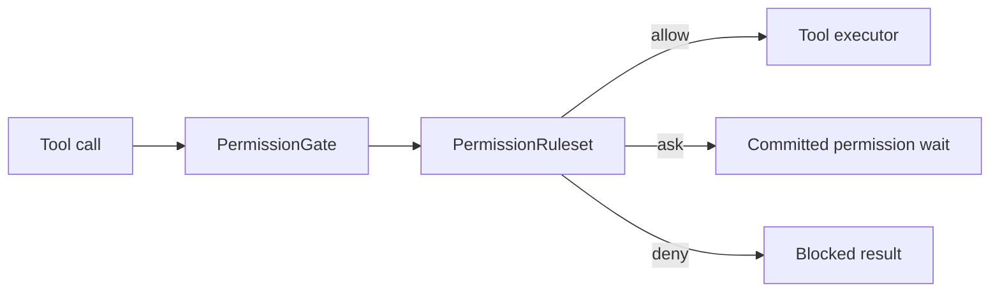
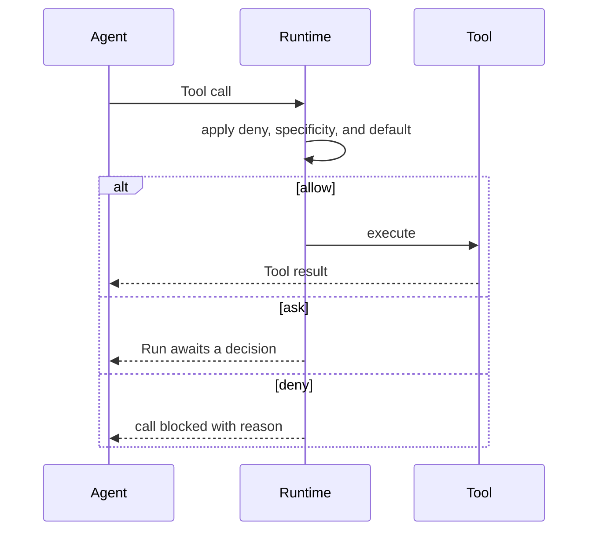

Start with `RequireConfirmation` as the default. Add narrow `Allow` rules for
routine reads and explicit `Deny` rules for operations the Agent must never run.
You are done when the Runtime applies the same policy before every Tool call.

## Before you start

Start from a Runtime that already has its model and Tools installed. Add
`awaken-ext-permission`; its rules are the policy used by the Runtime gate.

## 1. Define the policy

Tool ids and field names are case-sensitive. The built-in Hand uses ids such as
`read`, `write`, `edit`, and `bash`; its public arguments include `file_path`
and `command`. Match the descriptors actually published to the Agent.

```rust
use awaken_ext_permission::{
    Mode, PermissionRule, PermissionRuleset, RuleBasedToolPermissionPolicy,
    ToolCallPattern, ToolPermissionBehavior,
};

let rule = |pattern: &str, behavior| {
    PermissionRule::new(
        ToolCallPattern::parse(pattern).expect("valid glob pattern"),
        behavior,
    )
};

let ruleset = PermissionRuleset {
    default_behavior: ToolPermissionBehavior::RequireConfirmation,
    mode: Mode::Default,
    rules: vec![
        rule("read", ToolPermissionBehavior::Allow),
        rule("bash(command ~ \"cargo test *\")", ToolPermissionBehavior::Allow),
        rule("write(file_path ~ \"src/**\")", ToolPermissionBehavior::RequireConfirmation),
        rule("edit(file_path ~ \"src/**\")", ToolPermissionBehavior::RequireConfirmation),
        rule("bash(command ~ \"*rm *\")", ToolPermissionBehavior::Deny),
    ],
};
```

Rules use glob matching, not regular expressions. A matching deny is absolute.
Otherwise the most specific matching allow or ask rule wins; an unmatched call
uses the mode default.

## 2. Install the gate

`PermissionGate` adapts the rule-based policy to the gate consulted before Tool
execution. It is runtime-wide, not a Plugin selected by `plugin_ids`.

```rust
use std::sync::Arc;
use awaken_runtime::{PermissionGate, Runtime};

let policy = RuleBasedToolPermissionPolicy::new(ruleset);
let gate = PermissionGate::new(Arc::new(policy));
let runtime = Runtime::new()
    .with_llm(llm)
    .with_gate(Arc::new(gate));
```



## What the caller sees



An allow reaches the executor. An ask parks the Run before the Tool executes. A
deny returns a blocked outcome. The ticket validation and allow/deny resume
procedure have one owner: [Human-in-the-Loop](/docs/agents/runtime/explanation/human-in-the-loop/).

## Source examples

- `crates/runtime/awaken-ext-permission/tests/`
- `crates/devtools/awaken-runtime-examples/src/coding_agent/mod.rs`

## Next

- [Capability and Permissions](/docs/agents/runtime/explanation/capability-and-permissions/)
- [Tool Trait Reference](/docs/agents/runtime/reference/tool-trait/)
