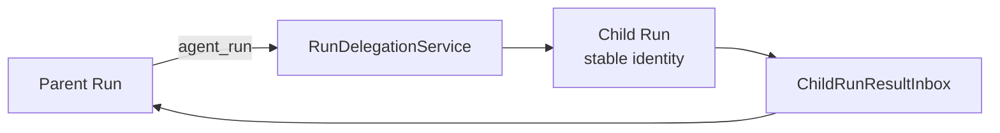
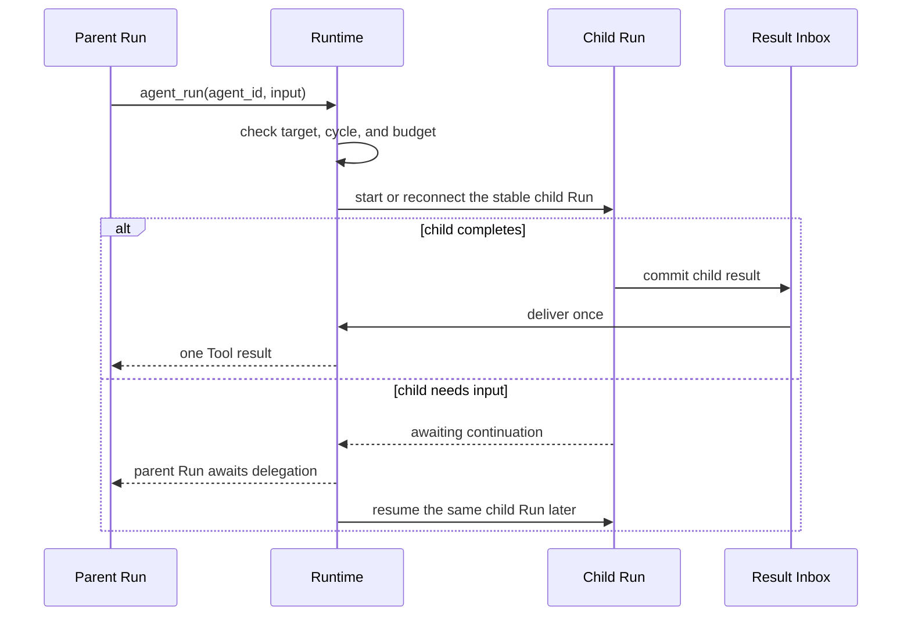

Use `agent_run` when the parent needs one bounded result from a specialist Agent
and should continue after that result returns. Do not start another Agent loop
inside `Tool::call`; that creates a second execution path without the child Run
identity used by recovery, cancellation, and result delivery.

## Before you start

- Publish the target Agent and make it eligible for delegation from the parent.
- Use the Host-provided delegation service for the normal local or A2A path.
- Implement `RunDelegationService` only when adding a new execution backend.

The model-visible input is one typed shape:

```json
{
  "agent_id": "researcher",
  "input": "Summarize the migration risks in these files."
}
```

## Static structure



The Host normally installs this service while composing the Runtime:

```rust
let runtime = Runtime::new()
    .with_llm(llm)
    .with_run_delegation(delegation_service);
```

`agent_run` is handled by the Runtime, not registered as an ordinary executable
Tool. The published Tool descriptor supplies the `{ agent_id, input }` schema;
the service resolves that id to the pinned target publication.

## What happens



## Expected result

The parent receives the child's terminal text as the `agent_run` Tool result and
continues its own Run. If the child pauses, the Runtime resumes the same child
identity; the application does not keep a process-local child handle.

Use a normal Tool for one deterministic operation. Use an external workflow or
Workforce when responsibility must outlive the parent task. The detailed state,
limits, failure, and cancellation contracts remain in
[Multi-Agent Patterns](/docs/agents/runtime/explanation/multi-agent-patterns/).

## Source examples

- `crates/runtime/awaken-runtime/tests/delegation.rs`
- `crates/server/awaken-runtime-host/src/delegate.rs`

## Next

- [Design Agent Handoffs](/docs/agents/runtime/how-to/use-agent-handoff/)
- [Start Background Work from a Tool](/docs/agents/runtime/how-to/start-background-work-from-a-tool/)
