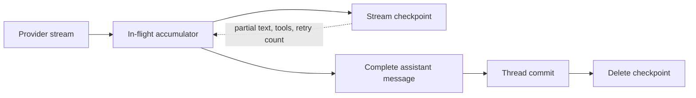
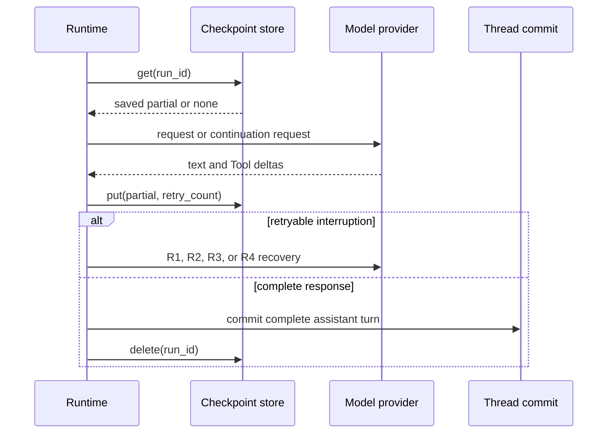

Most applications need no streaming-recovery configuration. The Runtime retries
eligible failures before output begins and continues a retryable interruption
after partial output. Add a `StreamCheckpointStore` only when an in-flight model
turn must also survive process replacement.

| Requirement | What to do |
| --- | --- |
| The same process remains alive | Use the Runtime retry policy; no checkpoint store is required. |
| A restart may happen during one model turn | Attach a durable `StreamCheckpointStore` to `RuntimeRunContext`. |
| Several processes may resume the same Run | Implement the contract on one shared backend and preserve its fencing semantics. |
| The provider error is permanent | Return the classified error; a checkpoint does not make it retryable. |

## Keep the two durable records separate



The Thread commit remains the authority for messages and `RunState`. A stream
checkpoint contains only the unfinished turn: Run and Thread ids, model,
partial text, partial Tool calls, and retry count. It is not another conversation
store.

## Choose a checkpoint backend

```rust
use std::sync::Arc;
use awaken_agent_contract::store::stream_checkpoint::StreamCheckpointStore;
use awaken_store_fs::FsStreamCheckpointStore;

let checkpoints: Arc<dyn StreamCheckpointStore> =
    Arc::new(FsStreamCheckpointStore::open("/var/lib/awaken/stream-checkpoints")?);

let context = context.with_stream_checkpoint(checkpoints);
```

Use the in-memory implementation for deterministic tests. Use the filesystem
implementation only when one process owns the directory. It writes through a
temporary file, sync, and rename. For several processes, provide one shared
implementation of the same contract; do not synchronize a second checkpoint
format beside it.

`get`, `put`, and `delete` return `Result<_, StreamCheckpointError>`. The backend
must report storage and fencing failures. The Runtime decides at the call site to
log the failure and continue best-effort, so telemetry remains visible without
turning a checkpoint outage into a second Run lifecycle authority.

## What happens after an interruption

| Recovery case | Saved partial | Runtime action |
| --- | --- | --- |
| R1 | Text only | Add the text as a request-only assistant prefix and ask the model to continue. |
| R2 | At least one Tool call has complete JSON arguments | Synthesize the completed Tool-use turn without another model call. |
| R3 | Text plus an open or malformed Tool call | Drop the unfinished Tool call and continue from the text. |
| R4 | Nothing can be reused | Start the model request again without a partial prefix. |

Request-only continuation messages are never committed. A Tool call is executed
only when its accumulated arguments parse as complete JSON. After a normal
return, the completed assistant message is committed through the usual Thread
boundary and checkpoint deletion is attempted.



Provider retry hints are honored only when the adapter supplies them and remain
capped at 60 seconds. See [Errors](/docs/agents/runtime/reference/errors/) for the
retryable classification; do not infer it from display text in application code.

## Confirm cross-process recovery

If you attached a durable checkpoint store, interrupt one representative Run
after partial output, replace the process, and read the committed Thread. The
setup is working when the replacement produces one complete assistant turn and
does not execute an incomplete Tool call. Detailed fault-injection coverage
belongs in the store and Runtime tests; see the
[testing strategy](/docs/agents/runtime/how-to/testing-strategy/).

No external repair is needed for a single warning: the Runtime continues or
finishes the turn. If persistent checkpoint warnings violate your restart
requirement, correct the backend's reachability, permissions, or fencing before
claiming cross-process recovery. A completed Thread commit remains valid even if
checkpoint cleanup warned.

## Boundaries

- This mechanism does not retry permanent provider errors.
- It does not execute an incomplete or malformed Tool call.
- It does not promise byte-for-byte continuation; the provider generates the
  continuation from the saved prefix.
- It does not replace committed Thread history or Tool-effect recovery. See
  [Tool recovery](/docs/agents/runtime/reference/tool-trait/) for external effects.
