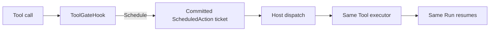
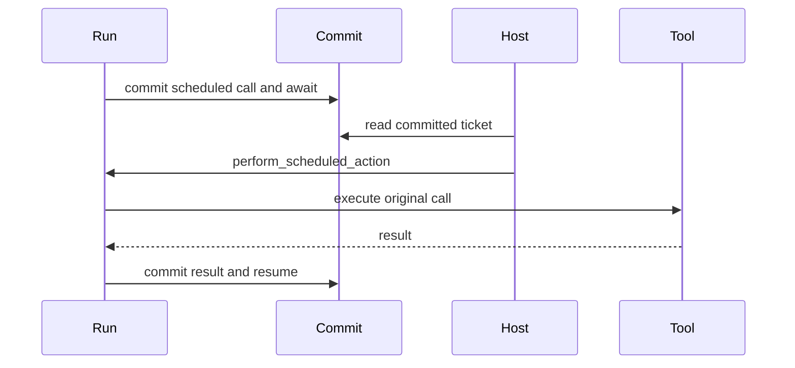

Use a scheduled action when one Tool call should run outside the current Step
and then return its result to the same Run. This is not a cron service or a
general workflow engine.

## Before you start

Use a Runtime with the deferred Tool registered and a durable commit coordinator
available to both the Run and the host process that performs scheduled actions.

## Choose the right lifetime

| Need | Use |
| --- | --- |
| Finish before the current Tool result returns | normal Tool call |
| Defer one Tool call and resume the same Run | scheduled action in this guide |
| Ask another Agent for a bounded result | child Run delegation |
| Coordinate long-lived work, timers, or several services | external workflow or Awaken Workforce |

## Static structure



## 1. Schedule the call at the gate

Use the Tool call id in the correlation id so separate calls do not share an
idempotency key. Leave `action_kind` empty for a plain deferred Tool call.

```rust
use awaken_runtime_contract::permission::{GateOutcome, ToolGateHook};
use awaken_runtime_contract::tool::ToolCall;

struct DeferExports;

#[async_trait::async_trait]
impl ToolGateHook for DeferExports {
    async fn gate(
        &self,
        call: &ToolCall,
        _state: &awaken_agent_contract::agent::state::Store,
    ) -> GateOutcome {
        if call.tool_id == "start_export" {
            GateOutcome::Schedule {
                correlation_id: format!("sched-{}", call.call_id),
                action_kind: None,
            }
        } else {
            GateOutcome::Allow
        }
    }
}
```

## 2. Install the Tool and gate

```rust
let runtime = Runtime::new()
    .with_llm(llm)
    .with_tool(my_export_tool)
    .with_gate(Arc::new(DeferExports));
```

When `start_export` is selected, the gate does not execute it. The Run returns
`RunState::Awaiting` after the scheduled action is committed.

## 3. Perform the committed action

The host reads the waiting Run and asks the Runtime to perform that exact
committed call:

```rust
let ticket = commit
    .resume_ticket_for(&run_id)
    .expect("scheduled action is committed");
assert_eq!(ticket.reason(), AwaitReason::ScheduledAction);

let state = runtime
    .perform_scheduled_action(
        &run_id,
        commit.as_ref(),
        RuntimeRunContext::new().with_commit(commit.clone()),
        now_ms,
    )
    .await?;
```



## Expected result

The Tool has not run when the first execution returns `RunState::Awaiting`. It
runs when `perform_scheduled_action` consumes the committed ticket; its output
then enters the same Run. Repeating delivery or delivering after the Run is no
longer waiting does not execute the Tool again.

Exact ticket matching, contributed `action_kind` behavior, and terminal states
belong to [Scheduled Actions](/docs/agents/runtime/reference/scheduled-actions/).

## Next

- [Add a Tool](/docs/agents/runtime/how-to/add-a-tool/)
- [Delegate a Bounded Task](/docs/agents/runtime/how-to/invoke-sub-agent-from-tool/)
