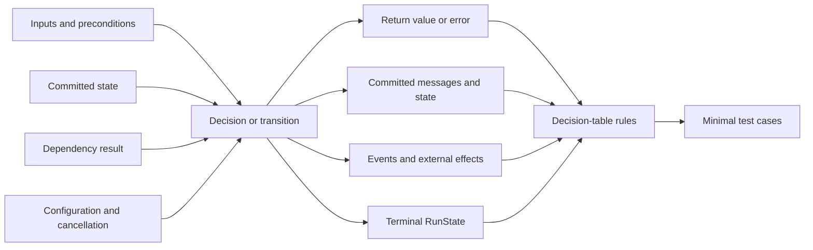
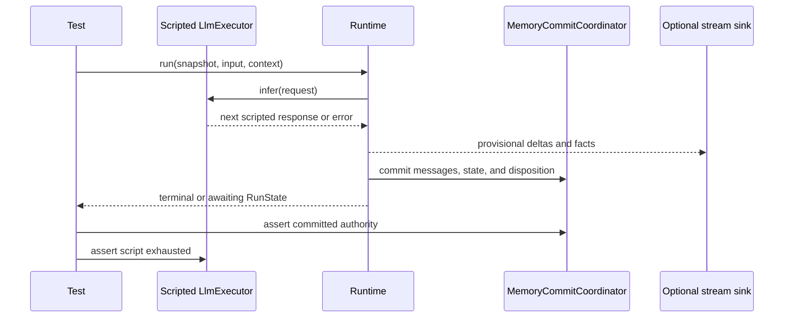

Begin with one behavior claim, not a test count. Inventory the conditions that
can cause it and every observable effect, then choose the lowest boundary that
can make the claim fail.

## Choose the test boundary

| Claim | Smallest useful test | Observable evidence |
| --- | --- | --- |
| A Tool validates input and returns the right value | Direct unit test of the typed `Tool` | `Output` or exact `ToolError` |
| A Plugin contribution stays inside its declared bound | Plugin resolution or hook unit test | Contributions or bound rejection |
| State commands merge correctly | Pure state test | Materialized `Store` or `MergeError` |
| The model and Tool loop commits the right result | `Runtime` integration test with a scripted `LlmExecutor` | Messages, state, facts, and terminal `RunState` |
| Several stores share one contract | Backend conformance suite | The same rules pass for each adapter |
| HTTP, restart, or Worker composition works | Process or protocol E2E | Served response plus committed recovery evidence |
| A finite-state safety property holds for every bounded input | Kani proof over the production transition kernel | Proof result for the stated bound |
| An Agent's language quality or Tool trajectory is acceptable | Versioned evaluation set | Metric, threshold, model, repetitions, and dated result |

Do not use a live model to test a deterministic Runtime rule. Do not use a unit
test to claim process restart, backend durability, or protocol compatibility.

## Derive tests from causes and effects



Write the cause/effect inventory and decision rule in comments attached to the
test cases. The comments are the design authority; do not create a second test
matrix that can drift away from the tests.

For a Runtime change, begin with this decision table and remove rows that are
provably impossible:

| Rule | Model result | Tool or state effect | Cancellation | Expected outcome |
| --- | --- | --- | --- | --- |
| R1 | Final text | none | no | Commit final message and `NaturalEnd` |
| R2 | Tool call | succeeds | no | Commit call/result, then continue |
| R3 | Retryable error | none | no | Retry within policy; commit only the final classified outcome |
| R4 | Any in-flight work | unknown | yes | Drop work and commit `Cancelled` |
| R5 | Final text | state conflict | no | Reject the batch and commit `Failure::StateConflict` |

Add another condition only when it changes an effect. Pairwise combinations are
not enough when three conditions interact; preserve every reachable rule.

## Reuse the current API owners

Do not copy the `Tool`, Plugin, state, or event APIs into a test guide. Build the
implementation from its owning page, then test its public effect:

- [Add a Tool](/docs/agents/runtime/how-to/add-a-tool/) owns the typed `Tool` contract,
  schema derivation, registration, and authorization path.
- [Add a Plugin](/docs/agents/runtime/how-to/add-a-plugin/) owns Plugin manifests,
  contributions, hooks, and capability bounds.
- [State keys](/docs/agents/runtime/reference/state-keys/) owns typed state access and
  merge choices.
- [Events](/docs/agents/runtime/reference/events/) owns live and committed event shapes.

This keeps test examples from becoming a retired second API reference.

## Test one real Runtime path without a provider

Use the repository's scripted executor pattern in
`crates/runtime/awaken-runtime/tests/run.rs`:

1. Implement `LlmExecutor` with an ordered queue of `ChatResponse` values or
   classified errors.
2. Build one `ExecutableAgentSnapshot` and one `RuntimeRunContext` with the
   in-memory commit coordinator.
3. Call `Runtime::run`.
4. Assert the returned `RunState` and the committed transcript. Add a
   `MemoryStreamSink` only when live event order is part of the claim.
5. Assert that the script was consumed exactly once. An unused response or an
   unexpected extra inference call is a workflow regression.



The stream sink is best-effort progress. Assert recovery and terminal behavior
against the commit coordinator, not the live sink.

## Expand only when the claim crosses a boundary

From the Awaken source root, run the smallest focused suite first:

```bash
cargo test -p awaken-runtime --test run
cargo test -p awaken-runtime --test tools
cargo test -p awaken-store-fs --test conformance
cargo test -p awaken-observability
```

Then run the repository's required wider checks for the changed crates. A store
adapter is not complete until it passes the shared conformance rules. A protocol
or restart claim needs the corresponding served-binary or multi-process test;
compilation alone is not that evidence.

Keep real-provider tests ignored in ordinary CI and invoke them deliberately:

```bash
AWAKEN_GENAI_MODEL=gpt-4o-mini \
  cargo test -p awaken-provider-genai --test live -- --ignored
```

Record the provider, model, date, source revision, inputs, repetitions, and
threshold. A passing live sample is provider reachability evidence, not a general
Agent quality result.

## Separate tests from evaluations

Tests make binary claims about owned behavior: a permission gate blocks, a
commit is fenced, or a terminal state is absorbing. Evaluations measure variable
behavior: response quality, groundedness, Tool trajectory, latency, or cost.

Promote an evaluation to a release gate only after its dataset, metric,
threshold, repetition count, and acceptable variance are reviewed. Keep
production failures as dated inputs to that dataset; do not present internal
fixtures or one successful run as customer evidence.

## Completion gate

A change is ready only when its test comments preserve the causes, effects,
constraints, and selected decision rules; the focused and required wider suites
pass; the final diff contains only the intended behavior; and the commit records
the result. Coverage percentage can support this review, but it does not replace
the cause/effect inventory or cross-boundary evidence.
