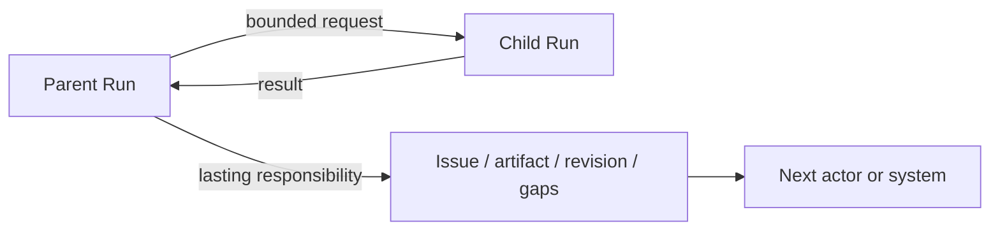
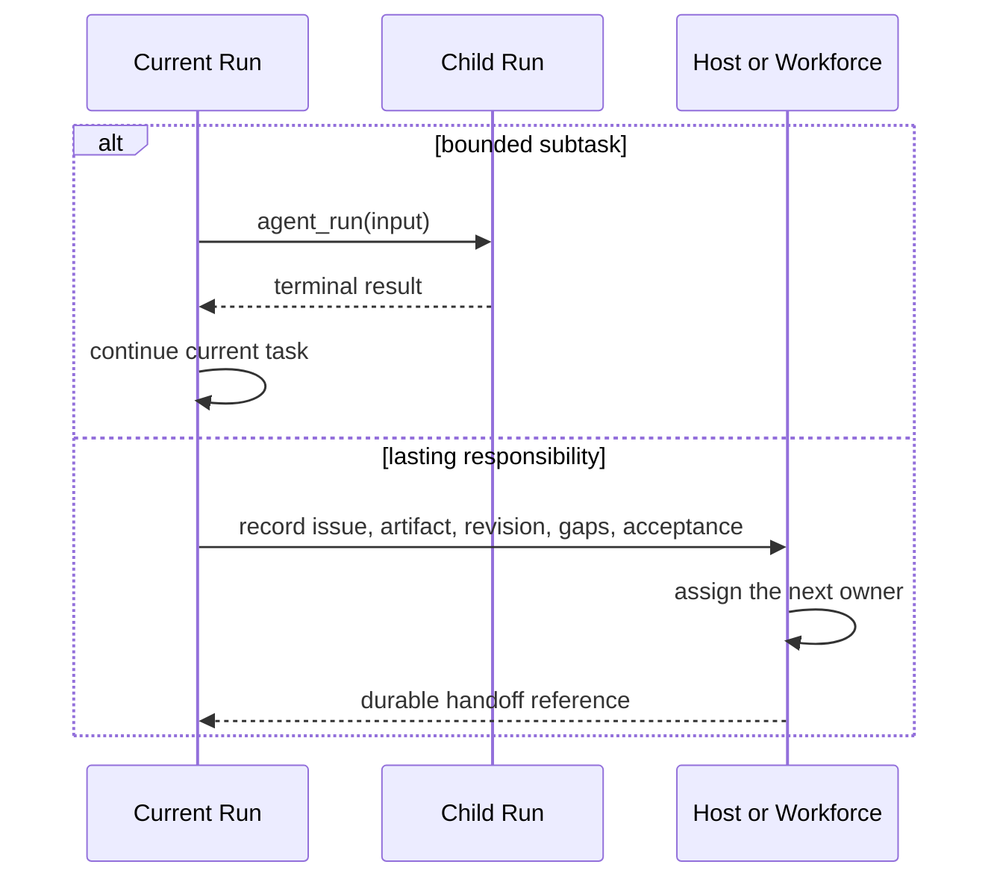

Awaken Agents does not define an in-place `Handoff { target_agent_id }` that
replaces the active Agent inside one Run. Choose the mechanism by what must
remain after the current task ends.

| Need | Use | Result owner |
| --- | --- | --- |
| Another Agent returns one bounded result to the parent | `agent_run` child Run | parent Run commit |
| A child pauses and later continues | delegation wait and resume | child committed state |
| Work, evidence, gaps, and acceptance continue beyond this Run | Host or Awaken Workforce | product control plane |

## Static boundary

Delegation keeps the parent active and gives the child an independent Run
identity. A responsibility handoff preserves a product-level work object rather
than pretending that a Runtime Agent switch owns the business process.

## Prepare a responsibility handoff

Carry only information the next actor can use:

- the work or issue identifier;
- the current artifact and immutable revision;
- accepted results and unresolved gaps;
- the condition that will count as complete;
- the next actor or system that now owns progress.

Do not use Sandbox placement as the handoff record. A delegated child may share
the parent Session environment or receive another Sandbox; that choice does not
preserve responsibility after the Run ends.

## Dynamic behavior

## Next

- [Delegate a Bounded Task](/docs/agents/runtime/how-to/invoke-sub-agent-from-tool/)
- [Multi-Agent Patterns](/docs/agents/runtime/explanation/multi-agent-patterns/)
- [Awaken Workforce](/docs/workforce/)
