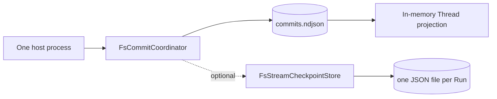
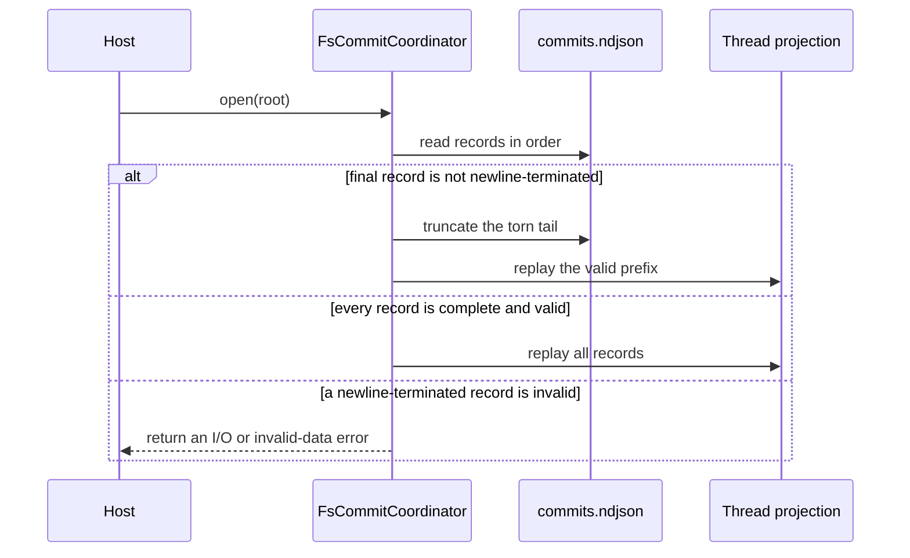

Use the file adapter when one process owns Runtime persistence and state must
survive a restart. Do not let two processes open the same store directory. The
adapter serializes writers inside one process but does not provide a filesystem
fence between processes.

One store root may contain commits for many Threads. The root is a storage
authority, not a per-Thread directory.

## Open the commit store

```toml
[dependencies]
awaken-store-fs = { git = "https://github.com/AwakenWorks/awaken" }
```

```rust
use awaken_store_fs::FsCommitCoordinator;

let store = FsCommitCoordinator::open("./data/runtime").await?;
```

`open` creates the directory when needed and replays `commits.ndjson`. Each
accepted commit is one newline-terminated JSON record. The adapter flushes the
file before acknowledging the commit.



## Add stream checkpoints only when needed

Use `FsStreamCheckpointStore` when an interrupted model stream must continue
after process restart.

```rust
use awaken_store_fs::FsStreamCheckpointStore;

let checkpoints =
    FsStreamCheckpointStore::open("./data/runtime/stream-checkpoints")?;
```

It writes a temporary file, flushes it, renames it over the previous Run
checkpoint, and flushes the directory. Stream checkpoints are best-effort
inference progress. The next accepted Thread commit remains authoritative.

## Understand restart recovery



A torn final append is removed automatically. Do not repair it by hand. A corrupt
record that ends with a newline is different: recovery fails closed because the
adapter cannot know whether later records depend on it.

## Verify the boundary

1. Commit work for at least two Thread IDs.
2. Stop the process after the commit call returns.
3. Reopen the same absolute root.
4. Read each Thread and confirm that their messages, state, Runs, and tickets are
   isolated and present.

Inspecting `commits.ndjson` can confirm that the selected root is receiving
records. Do not edit the file while the process is running.

## Act only on surfaced failures

| Surfaced result | What remains unresolved | External action |
| --- | --- | --- |
| `io::Error` from `open` | the process cannot create, read, or write the root | correct the absolute path, ownership, or mount permissions, then reopen |
| `Coordinator` error containing `append commit` | the record was not acknowledged durably | restore writable disk capacity or permissions, then retry through the caller's normal commit policy |
| invalid-data error on a complete record | automatic torn-tail recovery does not apply | stop the writer, preserve the directory, and restore a known-good copy or investigate the exact record before reopening |

No action is needed for a torn final line that `open` truncates successfully.

## Related

- [Choose Awaken Agents execution state and storage](/docs/agents/runtime/state-and-storage/)
- [Persist Awaken Agents execution state in PostgreSQL](/docs/agents/runtime/how-to/use-postgres-store/)
- [State and Snapshot Model](/docs/agents/runtime/explanation/state-and-snapshot-model/)
