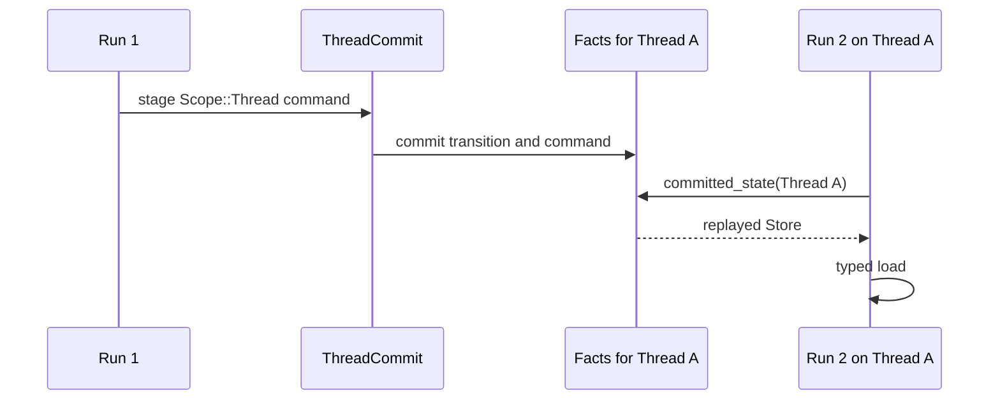
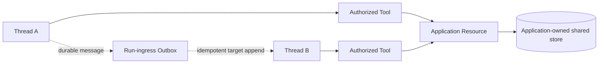

Use `Scope::Thread` when a later Run on the same Thread needs a value. Do not use
`Scope::Shared` or `Scope::Profile` to share values between Threads. Current
committed-state readers always rebuild commands for one `ThreadId`; those scope
variants only distinguish addresses inside that Thread's state.

Choose the owner before writing code:

| Need | Owner |
| --- | --- |
| scratch state for one Run and its resumes | Runtime `Scope::Run` |
| state needed by later Runs on one Thread | Runtime `Scope::Thread` |
| business data shared by users, Agents, or Threads | application store exposed through a Resource and Tool |
| a durable message delivered to another Thread | run-ingress Outbox |

## Keep a value on one Thread

Prefer a typed key so schema drift fails closed.

```rust
use awaken_agent_contract::agent::state::{MergePolicy, Scope, StateKey};
use serde::{Deserialize, Serialize};

#[derive(Default, Serialize, Deserialize)]
struct ReviewState { approved: bool }

struct ReviewStateKey;

impl StateKey for ReviewStateKey {
    const KEY: &'static str = "review_state";
    const SCOPE: Scope = Scope::Thread;
    const MERGE: MergePolicy = MergePolicy::Disjoint;
    type Value = ReviewState;
}

let command = ReviewStateKey::try_write(&ReviewState { approved: true })?;
```

Attach the command to the Tool output or hook reaction that caused the change.
The Runtime commits it with the same transition. On the next Run, rebuild the
Thread `Store` from `CommittedThreadView::committed_state(thread_id)` and call
`ReviewStateKey::load`.



## Put cross-Thread data outside Runtime state

If Thread A and Thread B must read the same customer record, task board, or
profile, make that record application-owned. Inject a Resource that holds the
client or repository and expose bounded read/write operations through a Tool.
The Tool's permission policy remains the execution grant.



This separation gives the shared record one owner, one concurrency policy, and
one migration path. It also avoids copying customer data into every Thread fact
log. Use the Outbox when the requirement is delivery, not shared querying.

## Choose merge behavior inside one commit

| Policy | Use when |
| --- | --- |
| `Disjoint` | one intended producer owns the key; a later value replaces |
| `Commutative` | independent JSON object fields may shallow-merge |
| `Exclusive` | a second `Set` in the same batch must reject the batch |

These policies do not coordinate writers across Threads or processes. The
application-owned shared store must define its own transaction or optimistic
concurrency rule.

## Act only when state cannot be interpreted

If `StateKey::load` returns `StateError`, migrate the persisted value to the
declared schema before resuming the Thread. If an `Exclusive` batch is rejected,
remove the duplicate producer or choose the policy that matches the actual
writers. Normal replay, an absent key, and Outbox retry do not require repair.

## Related

- [Choose a State Key](/docs/agents/runtime/reference/state-keys/)
- [State Management](/docs/agents/runtime/explanation/state-management/)
- [Awaken Agents execution architecture](/docs/agents/runtime/explanation/architecture/)
- [Multi-Agent Patterns](/docs/agents/runtime/explanation/multi-agent-patterns/)
