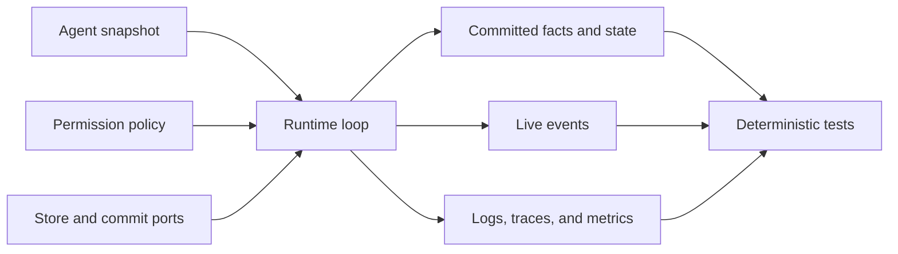
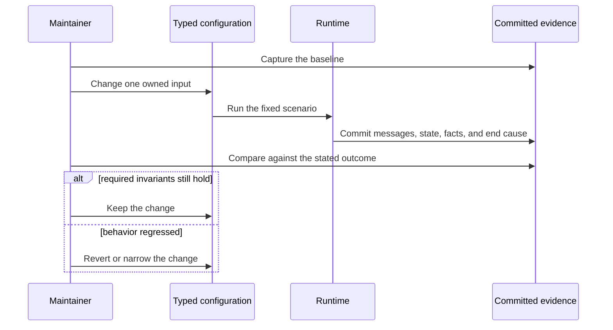

Start with the change you need to make. This page is a task router; the linked
guide owns the detailed contract and procedure.

| Need | Change or inspect | Go to |
| --- | --- | --- |
| Understand why a Run ended | Committed `RunState`, `EndCause`, and facts | [Run lifecycle](/docs/agents/runtime/explanation/run-lifecycle-and-phases/) |
| Keep an interrupted model stream | Retry policy and optional in-flight checkpoint | [Recover streaming LLMs](/docs/agents/runtime/how-to/recover-streaming-llms/) |
| Bound work or stop it | Step ceiling, inference-failure ceiling, cancellation, or end guard | [Configure run termination](/docs/agents/runtime/how-to/configure-stop-policies/) |
| See latency, failures, and execution paths | Logs, traces, metrics, and trace propagation | [Enable observability](/docs/agents/runtime/how-to/enable-observability/) |
| Compare a behavior change | Deterministic tests at the lowest useful boundary | [Testing strategy](/docs/agents/runtime/how-to/testing-strategy/) |
| Change Tool authorization | Permission policy and durable approval | [Human in the loop](/docs/agents/runtime/explanation/human-in-the-loop/) |
| Change durability or sharing | Commit store, read model, and application-owned state | [State and storage](/docs/agents/runtime/state-and-storage/) |

## Know which boundary you are changing

The Agent snapshot owns instructions, model binding, Tools, Plugins, and the
step ceiling. The host owns stores, cancellation, model and Tool executors, and
process observability. Committed facts own recovery truth; live events and
telemetry help explain the path but do not replace it.

## Change one cause at a time

1. Record the Run id, snapshot fingerprint, model binding, Tool inventory, and
   terminal `RunState` for a fixed scenario.
2. Name the outcome that should change and the outcomes that must remain stable.
3. Change one typed input at its owning boundary.
4. Replay the scenario with a scripted model. Compare committed messages,
   state commands, facts, usage, and terminal cause.
5. Run the wider conformance or process test only when the claim crosses storage,
   protocol, restart, or process boundaries.

The Runtime already retries eligible model failures, recovers supported partial
streams, rejects stale commits, and makes terminal states absorbing. Do not add
an operating procedure for those normal paths. Act only when a surfaced error
persists after the built-in policy finishes and the linked guide names an
external correction.

## When the embedded boundary is too small

Use Awaken Agents when configuration, credentials, durable dispatch, or
operational HTTP endpoints must be shared across processes. The execution core remains
inside Awaken Agents rather than creating another execution authority. See the
[Awaken Agents management task](/docs/agents/how-to/configure-providers-models-credentials/).
