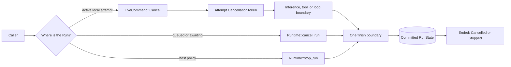
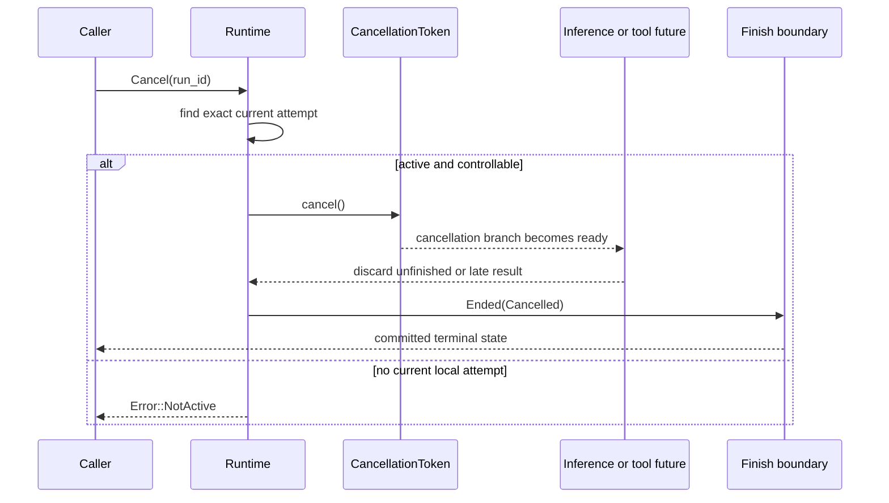

First determine where the Run is:

| Run condition | Call | Result |
| --- | --- | --- |
| executing in this process under the current attempt | deliver `LiveCommand::Cancel` | signals cooperative cancellation; the loop commits `Ended(Cancelled)` |
| queued or awaiting, so no attempt is executing | `Runtime::cancel_run` | commits `Ended(Cancelled)` and clears any resume ticket |
| ended by a host policy such as a budget decision | `Runtime::stop_run` | commits `Ended(Stopped(reason))` |

Cancellation and stop are terminal. Pause is not cancellation; it commits an
`Awaiting` ticket and can resume later.

## Static control paths



The active-attempt registry is the single process-local source for cancel, pause,
wake, and live inbox discovery. Registration is generation-aware, so an old
attempt cannot deregister a replacement attempt for the same Run. Durable hosts
also check claim ownership before delivering to the registered attempt.

The signal is not durable truth. The accepted terminal commit is.

## Embed cooperative cancellation

Bind one `tokio_util::sync::CancellationToken` to the attempt context:

```rust
use awaken_runtime_contract::runtime_context::RuntimeRunContext;
use tokio_util::sync::CancellationToken;

let token = CancellationToken::new();
let context = RuntimeRunContext::new().with_cancellation(token.clone());

// Execute the Run with `context`, then request cancellation when needed.
token.cancel();
```

`RuntimeRunContext::is_cancelled()` reports the current signal. In-process child
Runs receive a child token: cancelling the parent propagates to the child, while
cancelling the child does not cancel its parent. Live stream, inbox, and pause
handles are not inherited because they address a specific Run.

For a Run already registered by `Runtime::execute`, deliver by Run id:

```rust
use awaken_runtime_contract::control::{LiveCommand, LiveRunControl};

runtime.deliver(LiveCommand::Cancel {
    run_id: run_id.clone(),
})?;
```

Use `deliver_to_current_attempt` when durable dispatch ownership must be checked
immediately before delivery.

## What happens after a live cancel



The runtime observes cancellation before work starts, at loop boundaries, and
while waiting for ordinary inference and tool futures. A provider or tool future
that never returns can therefore be dropped when the cancellation branch wins.
No partial late result is committed after the terminal decision.

## Cancel queued or awaiting work

Use the committed path when there is no active attempt:

```rust
let state = runtime
    .cancel_run(run_id, thread_id, context)
    .await?;

assert_eq!(state, RunState::Ended(EndCause::Cancelled));
```

This path uses the same finish boundary as live execution. If the Run was
awaiting, the terminal transition removes its resume ticket. A late resume or
scheduled result then fails closed instead of reviving cancelled work.

In a durable deployment, persist and claim the cancellation intent before using
the Runtime API. Live delivery may shorten the wait, but it must not become a
second cancellation authority.

## Stop is a different terminal cause

```rust
let state = runtime
    .stop_run(run_id, thread_id, "budget exhausted".into(), context)
    .await?;
```

Use `Stopped(reason)` when the host owns the reason: budget, policy, or another
explicit ceiling. Use `Cancelled` for an external request to stop the work. Keep
the distinction so callers can explain the outcome without parsing text.

## Caller decisions

`Error::NotActive` from live delivery means the named Run is not controllable in
this process at that moment. Do not retry the same live command blindly.

1. Read the committed Run state.
2. If it is queued or awaiting, route through the durable cancellation path.
3. If another worker owns an active attempt, send the request through that
   deployment's durable control service.
4. If it is already ended, return the committed terminal result.

The runtime automatically handles cancellation already observed by its token,
late inference/tool completion, awaiting-ticket removal, and late resume
rejection. Those conditions require no separate repair procedure.

## Related

- [Thread Model](/docs/agents/runtime/reference/thread-model/)
- [Run Lifecycle and Phases](/docs/agents/runtime/explanation/run-lifecycle-and-phases/)
- [Human in the Loop](/docs/agents/runtime/explanation/human-in-the-loop/)
- [Live Inbox](/docs/agents/protocols/live-inbox/)
