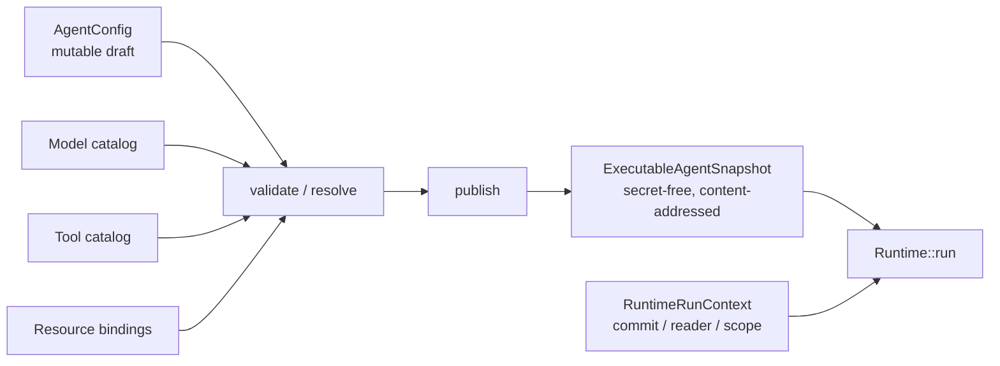
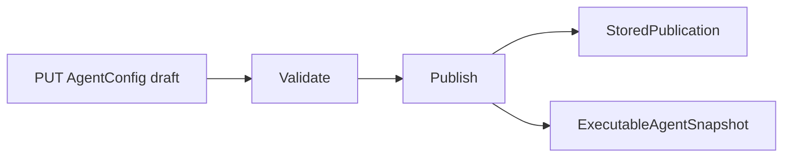

Use `AgentConfig` to change what future Runs should do. Publish it to create an
immutable `ExecutableAgentSnapshot`. Pass per-Run readers, committers, scope, and
cancellation through `RuntimeRunContext`; do not put those live capabilities in
Agent configuration.

| You need to change | Change this | Effect |
|---|---|---|
| instructions, model choice, Tool visibility, Plugin config, limits, or context policy | `AgentConfig` | takes effect only after a new publication |
| the exact behavior of a new Run | select its published `ExecutableAgentSnapshot` | the Run keeps that snapshot through waiting and recovery |
| commit, history, execution scope, or cancellation for one call | `RuntimeRunContext` | affects that Run call without creating another configuration revision |
| a running Run's published behavior | do not mutate it | publish a new revision for future Runs |

This is the one configuration path. Runtime does not read a parallel mutable
execution-config model.



## AgentConfig: authoring authority

`awaken_agent_config::AgentConfig` is the mutable control-plane aggregate. Its
fields group by responsibility:

| Responsibility | Current fields |
|---|---|
| Identity and lifecycle | `id`, `name`, `description`, `metadata`, `disabled_at`, `archived_at` |
| Behavior and loop | `instructions`, `max_steps`, `delegation_limits`, `context_policy`, `compaction` |
| Model | `model_binding: ModelSelection`, `inference`, `model_fallbacks` (wire name `model_candidates`) |
| Tools and plugins | `tool_ids`, `toolsets`, `client_tools`, `tool_patterns`, `tool_overrides`, `recovery_policies`, `plugin_ids`, `plugin_config` |
| Collaboration and external capability | `multiagent`, `mcp_servers`, `skills` |

`ModelSelection` is one closed authoring vocabulary: `Auto`, `Profile`,
`Target`, `BackendDefault`, `BackendExact`, or `Pinned(ModelBinding)`. The
publication boundary resolves every non-pinned choice to exact execution facts.
Runtime never re-selects provider, route, or credential during execution.

Default File, Memory, and Repository inputs are not copied into a second Agent
config type. `AgentInputBindingRepository` owns them, and publication/Session
resolution adds their exact coordinates to the resource manifest.

## ExecutableAgentSnapshot: execution authority

`awaken_runtime_contract::snapshot::ExecutableAgentSnapshot` is a persistable,
replayable, secret-free value:

```rust
pub struct ExecutableAgentSnapshot {
    pub id: ExecutableAgentSnapshotId,
    pub metadata: AgentSnapshotMetadata,
    pub root_agent_id: AgentId,
    pub resolved_spec: ResolvedSpec,
    pub fingerprint: CatalogFingerprint,
}
```

`metadata` separately records the source `AgentConfig` revision, external
publication version, complete `ResolutionManifest`, and content fingerprint;
none substitutes for another. `ResolvedSpec` fixes instructions, step and
delegation limits, complete ordered model candidates, model-visible tools,
plugin config, context policy, and tool presentation. Each
`ResolvedModelCandidate` fixes both a `ModelBinding` and secret-free
`ModelProvisioning`; credentials remain access references, never plaintext.

`CatalogFingerprint` is a derived content address of canonical configuration,
not a caller-chosen label. Before execution, Runtime checks the envelope and
`ResolvedSpec` fingerprints agree and fails closed otherwise.

## Two construction paths, one execution entry

The platform path uses `ConfigService`:



An embedded application may call `compile_resolved(&config, catalog, metadata)`
or use `ExecutableAgentSnapshot::builder(id)` for a local/test snapshot. Both
paths converge on:

```rust
runtime.run(&snapshot, input, RuntimeRunContext::new()).await?;
```

`RuntimeRunContext` carries dynamic Run ports and trusted scope, such as the
commit coordinator, history reader, and execution scope. Those runtime
capabilities do not belong back in Agent configuration.

## Lifecycle boundary

```mermaid
sequenceDiagram
  participant Author as Authoring client
  participant Config as ConfigService
  participant Catalog as Catalog + resources
  participant Runtime
  participant Commit as CommitCoordinator

  Author->>Config: Save AgentConfig draft
  Author->>Config: validate / publish
  Config->>Catalog: Resolve model, tool, and resource references once
  Catalog-->>Config: Exact versions and secret-free access coordinates
  Config->>Config: Compile and calculate fingerprint
  Config-->>Runtime: ExecutableAgentSnapshot
  Runtime->>Runtime: Verify fingerprint; create RunActivation
  Runtime->>Commit: Commit messages, state, events, and result
```

Draft changes affect only the next publication. Running or awaiting Runs keep
their original snapshot. Credential revocation, permission, and lease checks
still happen at action time, but cannot drift execution to an unpublished
candidate.

## Code coordinates

- `crates/control/awaken-agent-config/src/config.rs`: `AgentConfig`, `ModelSelection`
- `crates/control/awaken-config-service/src/config_plane.rs`: validate / publish
- `crates/runtime/awaken-runtime-contract/src/snapshot.rs`: snapshot and publication metadata
- `crates/runtime/awaken-runtime-contract/src/resolved.rs`: `ResolvedSpec` and model candidates
- `crates/runtime/awaken-runtime-contract/src/snapshot_builder.rs`: embedded builder
- `crates/runtime/awaken-runtime/src/run.rs`: the single execution entry

## Related

- [Configuration Resolution and Agent Delegation](/docs/agents/runtime/explanation/agent-resolution)
- [Model publication and credential execution boundary](/docs/agents/reference/provider-model-config)
- [A Session binds an Agent, resources, and recoverable Runs](/docs/agents/concepts/sessions-and-events)
