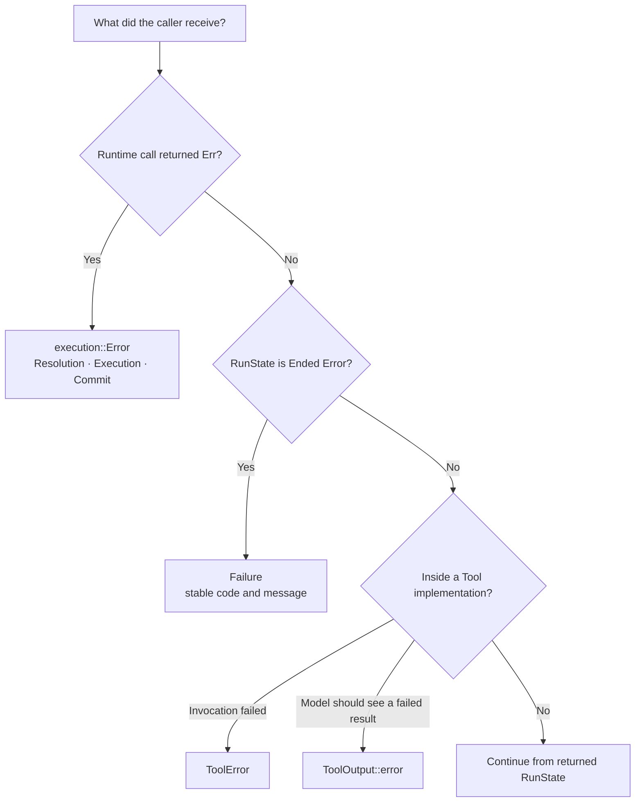
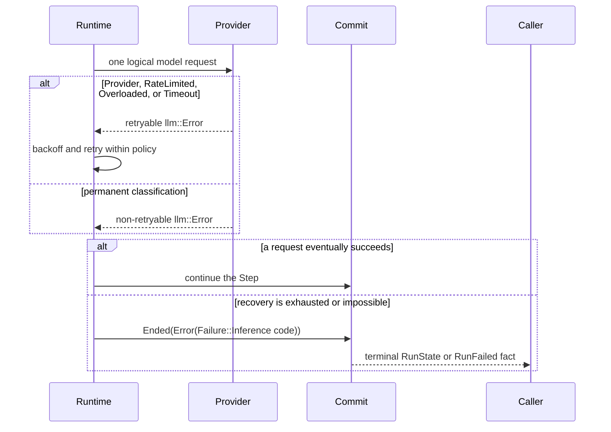

First identify where the error was returned. A failed Runtime call, a terminal
Run, a failed Tool invocation, and a model-visible Tool result have different
owners. Branch on the enum variant or stable failure code. Error messages are
diagnostic text, not a compatibility contract.

## Choose by surface



| Surface | Meaning | Caller decision |
|---|---|---|
| `Result<RunState, execution::Error>` | the run or resume call could not complete its contract | handle `Resolution`, `Execution`, or `Commit`; reread committed state before repeating work |
| `RunState::Ended(EndCause::Error(Failure))` | Runtime reached a committed terminal fault after its own recovery policy | branch on `Failure::code()`; do not reopen the same Run |
| `Fact::RunFailed { code, message }` | protocol projection of the same terminal failure | make the same code-based decision as for `Failure` |
| `ToolError` | a Tool invocation could not return a `ToolOutput` | apply the Tool/executor recovery contract |
| `ToolOutput::error(...)` | the Tool completed with a model-visible failed result | let the model loop consume it; it is not a failed Runtime call |

## Runtime call errors

The direct embedding surface is:

```rust
pub enum awaken_runtime_contract::execution::Error {
    Resolution(String),
    Execution(String),
    Commit(String),
    StateConflict, // internal; converted to a terminal Failure
}
```

| Variant | Boundary | Safe next action |
|---|---|---|
| `Resolution` | the immutable snapshot or required runtime capability could not be resolved | correct the exact snapshot, backend registration, or required port before starting again |
| `Execution` | the current run/resume command could not continue | read the latest committed `RunState`, messages, ToolBatch, and ticket; follow the typed state rather than replaying the call blindly |
| `Commit` | the proposed frontier was not accepted | reread the accepted frontier and retry only through the owning commit/resume path |
| `StateConflict` | internal signal from an exclusive-key batch conflict | it should be converted to `Failure::StateConflict`, not escape `RunExecutor` |

The strings explain the concrete failure but are not stable error subtypes. A
host that needs finer public errors maps these neutral variants at its adapter
boundary.

## Model failures and retry ownership

`awaken_runtime_contract::llm::Error` classifies one model request. Runtime owns
the retry decision for that request.



| `llm::Error` group | Runtime behavior | Action if it becomes terminal |
|---|---|---|
| `Provider`, `RateLimited`, `Overloaded`, `Timeout` | retries with the configured backoff; rate/overload hints may shape the delay | treat the returned `Failure::Inference` as exhausted recovery; retry later only under the host policy |
| `Binding`, `ModelNotFound`, `InvalidRequest`, `ContextOverflow` | no identical-request retry | correct the published model binding or request/context shape |
| `Unauthorized`, `LoginRequired` | no automatic retry or credential refresh in Runtime | repair the credential at its owning boundary, then start or resume through the normal host path |
| `UsageLimit` | records the reset hint but does not schedule work | wait for capacity or change the owning quota/model decision |
| `ContentFiltered` | no identical-request retry | change the content or policy decision; do not loop on the same request |

If a model failure cannot recover, Runtime commits
`Failure::Inference { code, message }`. The stable code comes from
`llm::Error::code()`.

## Tool invocation versus Tool result

```rust
pub enum ToolError {
    Unknown(String),
    InvalidArguments(String),
    UnavailableBeforeDispatch(String),
    Execution(String),
}
```

`UnavailableBeforeDispatch` is the only variant that proves the request did not
cross the executor dispatch boundary. A recovery policy may replay it. An
`Execution` error does not prove whether an external effect occurred; inspect
the committed ToolBatch and use its recovery policy or downstream reconciliation
contract.

When failure is an ordinary domain result the model can respond to, return
`ToolOutput::error(call_id, content)`. Do not turn that result into `ToolError`.

## Terminal and composition failures

`Failure` is the committed Run-level classification:

```rust
pub enum Failure {
    Inference { code: String, message: String },
    CapabilityBound,
    StateConflict,
}
```

`CapabilityBound` means a Plugin attempted to contribute or schedule outside its
published bound. `StateConflict` means one commit batch wrote an `Exclusive`
`(Scope, Key)` more than once. Both fail closed; correct the Plugin contribution
or state-command construction before creating a new Run.

Plugin authors may receive `PluginConfigError`, `BoundViolation`, or `MergeError`
while resolving one `ResolvedExecutionEnv`. Fix malformed config, missing
dependencies, cycles, `MergeError::DuplicatePlugin`, other duplicate ids, or
out-of-bound contributions at that boundary. Runtime does not silently drop a
contribution to make the Run start.

```rust
pub enum MergeError {
    Bound(BoundViolation),
    DuplicateTool { id: String, first: String, second: String },
    DuplicateActionKind { id: String, first: String, second: String },
    MissingDependency { plugin: String, missing: String },
    DependencyCycle,
    DuplicatePlugin { id: String },
    Config(PluginConfigError),
}
```

## Related

- [Tool Trait](/docs/agents/runtime/reference/tool-trait/)
- [State Keys](/docs/agents/runtime/reference/state-keys/)
- [Run, Step, and ToolBatch state](/docs/agents/runtime/explanation/run-lifecycle-and-phases/)
