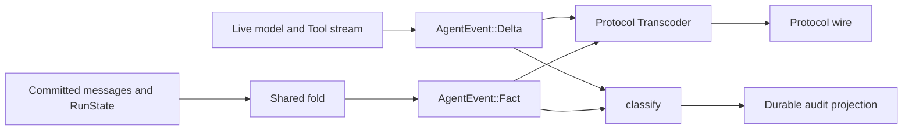
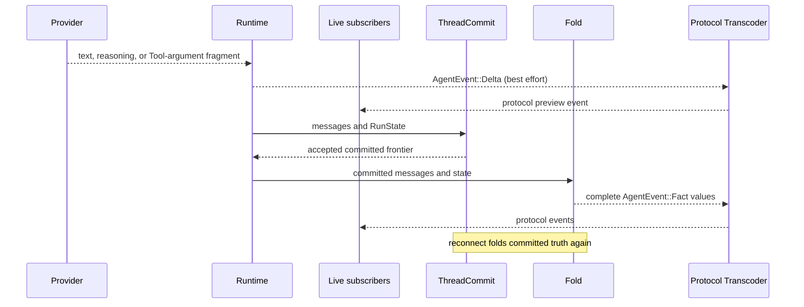

Use `Fact` when the application needs a complete event derived from committed
Thread state. Use `Delta` only to render progress while a model or Tool is still
producing content. Reconnect and recovery must read committed messages and
`RunState`, not replay the fragments a client happened to receive.

```rust
pub enum AgentEvent {
    Fact(Fact),
    Delta(Delta),
}
```

## Static ownership



The fold is the only producer of complete `Fact` values. The live stream is the
only producer of `Delta` values. A protocol implements one `Transcoder`: `fact`
is exhaustive, while `delta` may ignore fragment types the protocol does not
render.

## Event vocabulary

| Tier | Variants | Consumer rule |
|---|---|---|
| `Fact` | `RunStarted`, `AssistantMessage`, `AssistantThinking`, `ToolCall`, `ToolResult`, `Awaiting`, `Continuation`, `RunFinished`, `RunFailed` | handle every variant and use it as a complete projection |
| `Delta` | `TextDelta`, `ReasoningDelta`, `ToolCallDelta` | render supported fragments; tolerate loss and duplication at the transport boundary |

`ToolCallDelta.args_delta` is always a suffix fragment. The provider adapter
normalizes cumulative provider formats before emitting it. A complete Tool input
appears later in `Fact::ToolCall.input`.

## From live progress to a committed fact



## Terminal mapping

| Committed `RunState` | Derived `Fact` |
|---|---|
| `Awaiting` | `Awaiting { pending_tool_use_id }` |
| `Ended(MaxSteps)` | `RunFinished { exhausted: true }` |
| `Ended(Error(failure))` | `RunFailed { code: failure.code(), message: failure.message() }` |
| `Ended(Indeterminate)` | `RunFailed { code: "indeterminate", ... }` |
| every other `Ended` cause | `RunFinished { exhausted: false }` |

`Indeterminate` is never projected as success. A caller that needs to continue
after a disconnect reads committed Thread facts; no event-stream repair step is
required.

## Audit is a projection, not truth

`classify` is the single routing decision. Deltas are live-only. `RunStarted` is
both live and auditable. Content facts are reconstructed from canonical messages
and are not copied into the audit log. Awaiting, continuation, finish, and failure
facts may be routed to audit.

Audit records support observation and read-side views. They do not replace the
message log, reconstruct a Run, or form a second public event API.

## Related

- [Thread Model](/docs/agents/runtime/reference/thread-model/)
- [Run, Step, and ToolBatch state](/docs/agents/runtime/explanation/run-lifecycle-and-phases/)
- [Cancellation](/docs/agents/runtime/reference/cancellation/)
