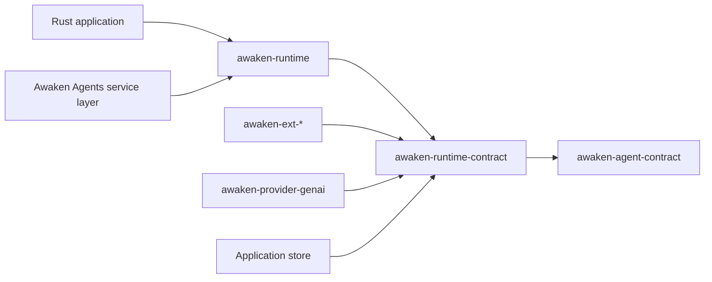

Use this page to find the contract that owns the change you need. Start with the
narrowest crate. Move to the Awaken Agents service path only when the change concerns a service,
deployment, public protocol, or durable work delivery.

## Choose by task

| You need to change | Start with | Continue with |
|---|---|---|
| message, content, Run state, waiting, typed state, or neutral events | `awaken-agent-contract` | the matching Reference page |
| Tool, Plugin, hook, gate, guard, snapshot, execution, or control port | `awaken-runtime-contract` | [Tool Trait](/docs/agents/runtime/reference/tool-trait/) or [Plugin internals](/docs/agents/runtime/explanation/plugin-internals/) |
| model/Tool loop, run, resume, cancel, or commit orchestration | `awaken-runtime` | [Runtime architecture](/docs/agents/runtime/explanation/architecture/) |
| model-provider mapping | `awaken-provider-genai` behind `LlmExecutor` | [Errors](/docs/agents/runtime/reference/errors/) |
| permission, compaction, memory, skills, MCP, goals, or state-machine behavior | the relevant `awaken-ext-*` crate | [Tool and Plugin boundary](/docs/agents/runtime/explanation/tool-and-plugin-boundary/) |
| process-local persistence for an embedded application | `awaken-store-inmem` or your implementation of the same ports | [State and snapshot model](/docs/agents/runtime/explanation/state-and-snapshot-model/) |
| HTTP/SSE, Managed Sessions, IAM, publication, Workers, leases, Sandboxes, or operations | [Awaken Agents](/docs/agents/) | the owning Agents guide |

## Dependency direction

`awaken-agent-contract` owns durable domain values. `awaken-runtime-contract`
owns ports and executable contracts. `awaken-runtime` drives the loop. Extensions,
providers, stores, and Awaken Agents services depend on those contracts; they do not redefine
Run state or create another commit path.

Awaken Agents has no facade crate. That is intentional: an embedded application
depends only on the contracts and implementations it uses. For the complete
component map and one run from activation to terminal outcome, read
[Runtime architecture](/docs/agents/runtime/explanation/architecture/).
