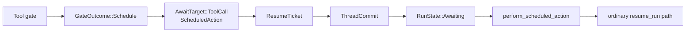
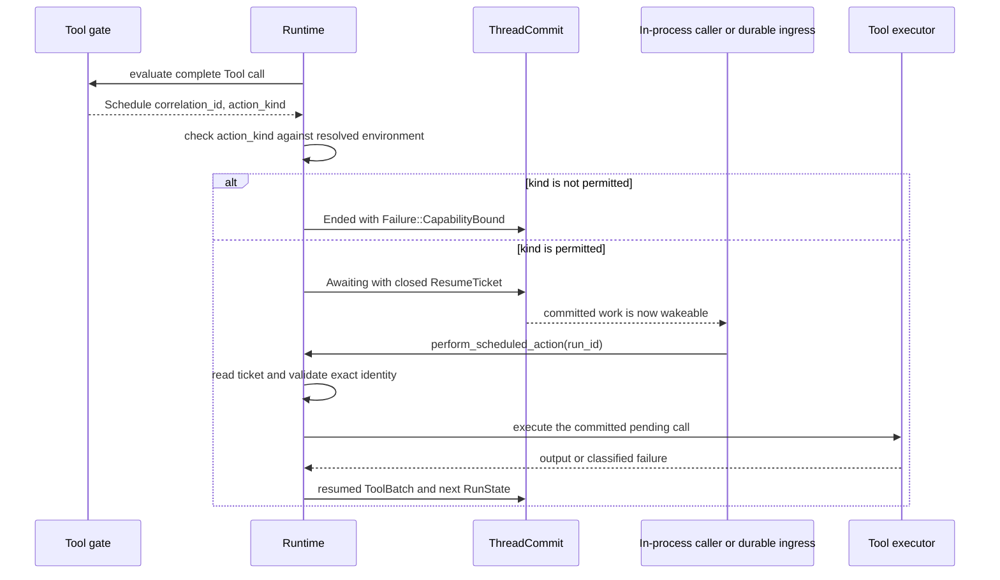

Use a scheduled action when a Tool call must run later, but still belongs to the
same Run. The gate commits the exact pending call, the Run becomes `Awaiting`,
and the system later resumes that committed request. Do not use this contract for
cron, a general timer service, or a second background-task registry.

## Choose the gate outcome

| Needed behavior | `GateOutcome` | What happens next |
|---|---|---|
| execute now | `Allow` | Runtime enters the Tool executor |
| skip and explain | `Block` | the model receives a blocked result |
| use a result already known by the gate | `SetResult` | Runtime commits that Tool result |
| wait for a person | `RequireConfirmation` | a permission ticket is committed |
| let the system execute the same call later | `Schedule` | a scheduled-action ticket is committed |

```rust
GateOutcome::Schedule {
    correlation_id: String,
    action_kind: Option<String>,
}
```

## Static structure



The scheduled action reuses the existing closed waiting model. `ResumeTicket`
stores an `AwaitTarget::ToolCall` privately. Read it through `reason()`,
`call_id()`, `pending_tool()`, `target()`, or `tool_call()`; do not construct a
ticket from independent reason and pending-Tool fields.

No scheduled-action state machine or commit field is added. The committed target
records who supplies the next result: the system for `ScheduledAction`, or an
external decision for other wait kinds.

## Commit, perform, resume



`Runtime::perform_scheduled_action` reads the current committed ticket. It accepts
only `AwaitReason::ScheduledAction`, copies the committed correlation, Run,
Thread, snapshot, and catalog fingerprint into a `ResumeCommand`, and enters the
ordinary `resume_run` path. A candidate that never committed is not wakeable.

The embedded path may call this method in process. Awaken Agents durability is owned
by run ingress and dispatch, which can rediscover the same committed ticket after
process loss. Runtime does not own a separate durable scheduler.

## Action-kind boundary

`action_kind: None` schedules the ordinary resolved Tool call. When a Plugin sets
an action kind, that id must be present in the run's `ResolvedExecutionEnv`.
Plugins declare allowed ids through `CapabilityBound.action_kinds`; merge rejects
duplicates, and a Plugin that was not selected contributes nothing. Absence is
denial.

An unpermitted kind ends the Run with `Failure::CapabilityBound`. It commits no
ticket and executes no Tool.

## Delivery and side-effect guarantees

The contract makes these narrower guarantees:

- execution starts only from a committed scheduled-action ticket;
- mismatched identity, wrong wait kind, expired ticket, and uncommitted candidates
  are rejected before Tool execution;
- cancel or stop clears the ticket, so a late perform is rejected;
- after a successful resumed outcome is committed, another perform finds no
  waiting ticket and is rejected before executing the Tool again.

This is not a universal guarantee for an arbitrary third-party side effect. A
process can fail after an external system accepts work but before the resumed
result commits. Use the Tool's pinned recovery policy, stable operation identity,
and the downstream system's idempotency or reconciliation contract for that
case. The Runtime recovery rules are documented in
[Run, Step, and ToolBatch state](/docs/agents/runtime/explanation/run-lifecycle-and-phases/).

## Related

- [Start background work from a Tool](/docs/agents/runtime/how-to/start-background-work-from-a-tool/)
- [Run, Step, and ToolBatch state](/docs/agents/runtime/explanation/run-lifecycle-and-phases/)
- [Errors](/docs/agents/runtime/reference/errors/)
