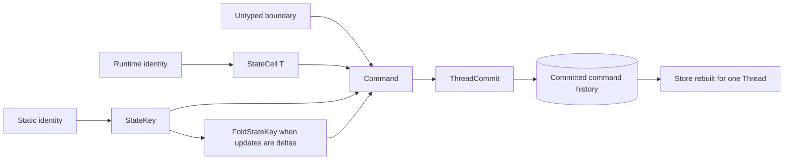
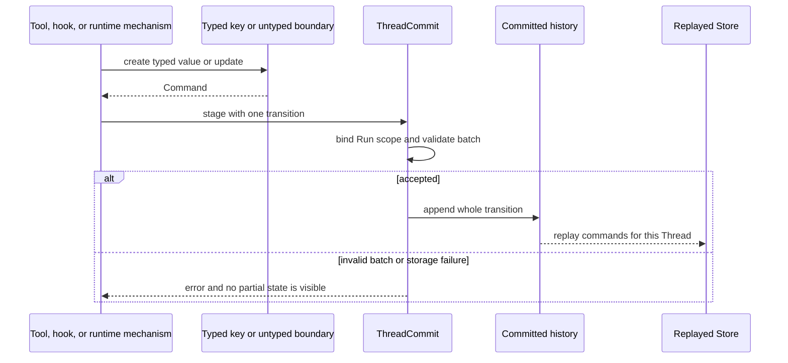

Choose the address from how your program knows the key. Use `StateCell<T>` when
the address contains a runtime identity. Use `StateKey` for one static address.
Use `FoldStateKey` when callers submit typed deltas. Drop to `Command` only at an
untyped integration boundary.

All four choices produce the same persisted `Command` and read the same replayed
`Store`. None of them creates another registry or storage path.

## Choose the smallest interface

| You know | Use | Read result | Write result |
| --- | --- | --- | --- |
| a runtime address such as `outcome/{id}/state` | `StateCell<T>` | `Result<Option<T>, StateError>` | `Result<Command, StateError>` |
| one static address and a whole typed value | `StateKey` | absent becomes `Default`; malformed data fails | one whole-value `Command` |
| one static address and a typed delta | `FoldStateKey` | fail-closed typed load | fold, then one whole-value `Command` |
| JSON already defines the boundary | `Command` and `Store` | `Option<&Value>` | untyped `Set` or `Remove` |



## Use `StateCell<T>` for a dynamic address

```rust
use awaken_agent_contract::agent::state::{MergePolicy, Scope, StateCell};

let cell = StateCell::<ReviewState>::new(
    Scope::Thread,
    MergePolicy::Disjoint,
    format!("review/{review_id}/state"),
);

let command = cell.write(&ReviewState { approved: true })?;
let current = cell.load(&store)?; // None when the cell is absent
```

`StateCell<T>` owns serialization for an address chosen at runtime. A present
value with the wrong shape returns `StateError`. `remove` produces a command; it
does not mutate `Store` directly.

## Use `StateKey` for a static address

```rust
use awaken_agent_contract::agent::state::{MergePolicy, Scope, StateKey};
use serde::{Deserialize, Serialize};

#[derive(Default, Serialize, Deserialize)]
struct ReviewState { approved: bool }

struct ReviewStateKey;

impl StateKey for ReviewStateKey {
    const KEY: &'static str = "review_state";
    const SCOPE: Scope = Scope::Thread;
    const MERGE: MergePolicy = MergePolicy::Disjoint;
    type Value = ReviewState;
}

let command = ReviewStateKey::try_write(&ReviewState { approved: true })?;
let current = ReviewStateKey::load(&store)?;
```

`load` returns `Default` only when the cell is absent. It returns `StateError`
when committed JSON no longer matches the declared type. Use `load_or_default`
only when discarding malformed persisted data is a deliberate compatibility
rule. Use `try_write` at fallible boundaries; `write` treats serialization
failure as a broken type contract.

## Use `FoldStateKey` for typed deltas

```rust
pub trait FoldStateKey: StateKey {
    type Update;
    fn apply(value: &mut Self::Value, update: Self::Update);
    fn commit(store: &Store, update: Self::Update) -> Result<Command, StateError>;
}
```

`commit` loads the current typed value, applies one deterministic update, and
returns a whole-value command. Keep `apply` total and deterministic so replaying
accepted history cannot panic or produce another result.

## Understand the persisted core

```rust
pub struct Key(pub String);
pub enum Scope { Run, Thread, Shared, Profile }
pub enum MergePolicy { Disjoint, Commutative, Exclusive }
pub struct Command {
    pub key: Key,
    pub scope: Scope,
    pub merge: MergePolicy,
    pub run_id: Option<RunId>,
    pub action: Action,
}
pub enum Action { Set(serde_json::Value), Remove }
```

`ThreadCommit::assemble` stamps `run_id` on `Scope::Run` commands. Do not supply
that owner yourself. `Scope::Shared` and `Scope::Profile` distinguish addresses
inside a Thread's state; current committed-state readers do not make either
scope visible across Threads.

Merge policies are checked within one commit batch:

| Policy | Repeated writes to the same `(scope, key)` |
| --- | --- |
| `Disjoint` | a later value replaces the earlier value |
| `Commutative` | JSON objects shallow-merge; other values replace |
| `Exclusive` | a second `Set` rejects the batch; `Remove` is not a second set |



If typed loading reports `StateError`, inspect the persisted value and migrate
it to the declared schema before resuming. An absent value and automatic replay
do not require repair.

## Key files

- `crates/contract/awaken-agent-contract/src/agent/state.rs`
- `crates/contract/awaken-agent-contract/src/thread/commit/staged.rs`

## Related

- [State Management](/docs/agents/runtime/explanation/state-management/)
- [Keep State Across Runs](/docs/agents/runtime/how-to/use-shared-state/)
- [State and Snapshot Model](/docs/agents/runtime/explanation/state-and-snapshot-model/)
