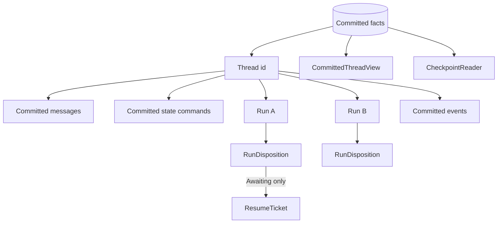

Use a **Thread** to address committed conversation continuity. Create a **Run**
for one bounded execution on that Thread. A second user turn is normally a new
Run on the same Thread; resuming an `Awaiting` Run continues that same Run.

Do not use a Run id as conversation identity, and do not create a new Run to
resolve an existing resume ticket.

## Aggregate structure



### Identity records

```rust
pub struct thread::Id(pub String);

pub struct thread::Record {
    pub id: thread::Id,
    pub latest_run_id: Option<run::Id>,
}

pub struct run::Id(pub String);

pub struct run::Record {
    pub id: run::Id,
    pub thread_id: thread::Id,
    pub state: RunState,
}
```

`latest_run_id` identifies the aggregate head. It does not replace lookup by a
specific Run id. The read contract exposes both questions explicitly.

## The one stored lifecycle authority

```rust
pub enum RunState {
    Running,
    Awaiting,
    Ended(EndCause),
}
```

`Running` and `Awaiting` may accept another lifecycle commit. `Ended` is
absorbing. Do not store a second `is_complete`, retry status, or outcome flag
beside this value.

```rust
pub enum EndCause {
    NaturalEnd,
    MaxSteps,
    Cancelled,
    Stopped(String),
    Error(Failure),
    Indeterminate,
}

pub enum Failure {
    Inference { code: String, message: String },
    CapabilityBound,
    StateConflict,
}
```

`Cancelled` records an external cancel. `Stopped(reason)` records a host policy
decision such as a budget ceiling. `Indeterminate` means an asynchronously
dispatched outcome cannot yet be known; it must not be projected as success.
For an inference failure, branch on its stable `code`, not its message.

## `RunDisposition` keeps each commit coherent

`ThreadCommit` does not accept an independent `RunState` and optional ticket. It
accepts one closed disposition:

```rust
pub enum RunDisposition {
    Running { run_id: run::Id },
    Awaiting(Box<ResumeTicket>),
    Ended { run_id: run::Id, cause: EndCause },
}
```

Only `Awaiting` carries a `ResumeTicket`. The ticket owns its Run and Thread
identity, immutable executable snapshot identity, catalog fingerprint,
correlation id, closed await target, and optional deadline. Running or ended
commits cannot carry a ticket; an awaiting commit cannot omit one.

The closed target distinguishes:

- a tool call with its reason, call id, and pending tool;
- remote input with its reason and call id;
- a pause with no invented call payload.

Exact resume validation and decision handling belong to
[Human in the Loop](/docs/agents/runtime/explanation/human-in-the-loop/).

## `ThreadCommit`

```rust
pub struct ThreadCommit {
    pub thread_id: thread::Id,
    pub run: RunDisposition,
    pub messages: Vec<Message>,
    pub state: Vec<StateCommand>,
    pub events: Vec<AuditDraft>,
}
```

Construct a transition with `ThreadCommit::assemble`. It binds Run-scoped state
commands to the disposition's Run id and derives lifecycle audit drafts in one
place. Validation rejects empty or mismatched identities before a backend write.

```mermaid
sequenceDiagram
    participant Loop as Runtime or executor
    participant Commit as ThreadCommit::assemble
    participant Store as CommitCoordinator
    participant View as CommittedThreadView

    Loop->>Commit: messages, state, next disposition, audit drafts
    Commit->>Commit: bind Run scope and validate identities
    Commit->>Store: commit one transition
    Store-->>View: expose accepted fact prefix
    alt next Run continues the Thread
        View-->>Loop: committed messages and state
    else same Run resumes
        View-->>Loop: exact ResumeTicket and committed prefix
    end
```

## Read contracts

`CommittedThreadView` is one internally consistent execution view. It can be
materialized from local committed facts or from a claim-fenced recovery snapshot:

```rust
pub trait CommittedThreadView: Send + Sync {
    fn committed_messages(&self, thread_id: &ThreadId) -> Vec<Message>;
    fn run(&self, run_id: &RunId) -> Option<RunRecord>;
    fn latest_run(&self, thread_id: &ThreadId) -> Option<RunRecord>;
    fn resume_ticket(&self, run_id: &RunId) -> Option<ResumeTicket>;
    fn run_state(&self, run_id: &RunId) -> Option<RunState>;
    fn committed_state(&self, thread_id: &ThreadId) -> Vec<StateCommand>;
}
```

It also freezes, slices, and verifies append-only transcript snapshots.

`CheckpointReader` is the durable after-commit repository. It extends the same
view with ordered event reads scoped to all facts, one Thread, or one Run. It is
not a second Thread or Run store.

```rust
pub enum EventScope {
    All,
    Thread(ThreadId),
    Run(RunId),
}

pub trait CheckpointReader: CommittedThreadView {
    fn list_events(
        &self,
        scope: &EventScope,
        from: Option<u64>,
        limit: usize,
    ) -> Vec<EventRecord>;
}
```

## Usage rules

1. Keep the Thread id when conversation continuity should remain.
2. Create a new Run for new work; resume the same Run for a matching ticket.
3. Read an arbitrary Run with `run`; read the Thread head with `latest_run`.
4. Derive terminal meaning from `RunState::Ended(EndCause)`.
5. Commit messages, state, disposition, and audit drafts together.
6. Read recovery truth through the committed view, never from a live stream.

## Related

- [Run Lifecycle and Phases](/docs/agents/runtime/explanation/run-lifecycle-and-phases/)
- [Human in the Loop](/docs/agents/runtime/explanation/human-in-the-loop/)
- [State and Snapshot Model](/docs/agents/runtime/explanation/state-and-snapshot-model/)
- [Cancellation](/docs/agents/runtime/reference/cancellation/)
