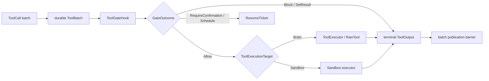

Awaken Agents has one tool-call pipeline. A model-emitted batch is first committed as
`Requested`; each call then passes the permission gate and reaches the resolved
executor only on `Allow`. Results stay behind the batch publication barrier
until every call is terminal.

`ToolExecutionTarget` is a trusted property of an executable `RawTool`, not an
agent-authored execution-mode selector:

```rust
pub enum ToolExecutionTarget {
    Brain,   // default: run beside the model/runtime
    Sandbox, // run through the configured sandbox executor
}
```

The host still owns where a `ToolExecutor` physically runs. The execution core does not
choose a transport, sandbox tier, or fleet topology from model-authored input.

## Static structure



The core contracts live in `awaken_runtime_contract::tool`:

```rust
pub struct ToolOutput {
    pub call_id: String,
    pub content: Vec<ContentBlock>,
    pub is_error: bool,
    pub state: Vec<Command>,
}

#[async_trait]
pub trait ToolExecutor: Send + Sync {
    fn recovery_capability(&self, tool_id: &str) -> ToolRecoveryCapability;
    async fn invoke(&self, call: &ToolCall) -> Result<ToolOutput, ToolError>;
}
```

`ToolOutput::text()` is only a derived plain-text view. Structured content blocks
are the stored and projected result. State commands are staged and validated at
the commit boundary; tools never write committed state directly.

## Dynamic behavior

1. Persist the complete `ToolBatch` and assistant tool-use blocks before entering
   an executor.
2. Process calls in model order. The one optimized exception is a batch made
   entirely of delegation calls whose executor explicitly supports parallel
   completion; all gates must return `Allow` before that parallel branch starts.
3. Resolve the gate outcome:
   - `Allow` validates recovery policy, records `Executing`, and invokes the
     Brain or Sandbox executor.
   - `Block` and `SetResult` produce an immediate terminal result.
   - `RequireConfirmation` and `Schedule` commit an awaiting ticket and park the
     Run.
4. Commit each call's execution outcome independently. Do not publish partial
   batch results to the model transcript.
5. Once every call is `Completed` or `Indeterminate`, validate and finalize the
   batch, then publish ordered result messages and staged state.

Recovery uses the durable call phase plus the pinned `ToolRecoveryPolicy`.
`UnavailableBeforeDispatch` proves the external dispatch boundary was not
crossed; failures after dispatch remain `Execution` and cannot be replayed unless
the executable capability and pinned policy permit it.

## Projection contract

`awaken_agent_contract::event::ToolDisposition` describes a committed tool call
to protocol consumers:

```rust
pub enum ToolDisposition {
    Executed,
    PendingClient,
    PendingBuiltin,
}
```

This is a read projection, not an execution-placement selector. `PendingClient`
means a client-executed tool is awaiting an external result; `PendingBuiltin`
means a built-in tool is awaiting a permission decision.

## Key files

- `crates/runtime/awaken-runtime-contract/src/tool.rs` — tool, output, target, recovery, and executor contracts
- `crates/runtime/awaken-runtime-contract/src/tool_batch.rs` — durable batch state machine and publication barrier
- `crates/runtime/awaken-runtime-contract/src/permission.rs` — gate outcomes
- `crates/runtime/awaken-runtime/src/engine/dispatch.rs` — ordered dispatch and the bounded parallel-delegation branch
- `crates/contract/awaken-agent-contract/src/event/agent.rs` — protocol projection disposition

## Related

- [Tool Trait](/docs/agents/runtime/reference/tool-trait/)
- [Capability and Permissions](/docs/agents/runtime/explanation/capability-and-permissions/)
- [Human-in-the-Loop](/docs/agents/runtime/explanation/human-in-the-loop/)
- [Awaken Agents execution placement](/docs/agents/concepts/brain-and-hand/)
