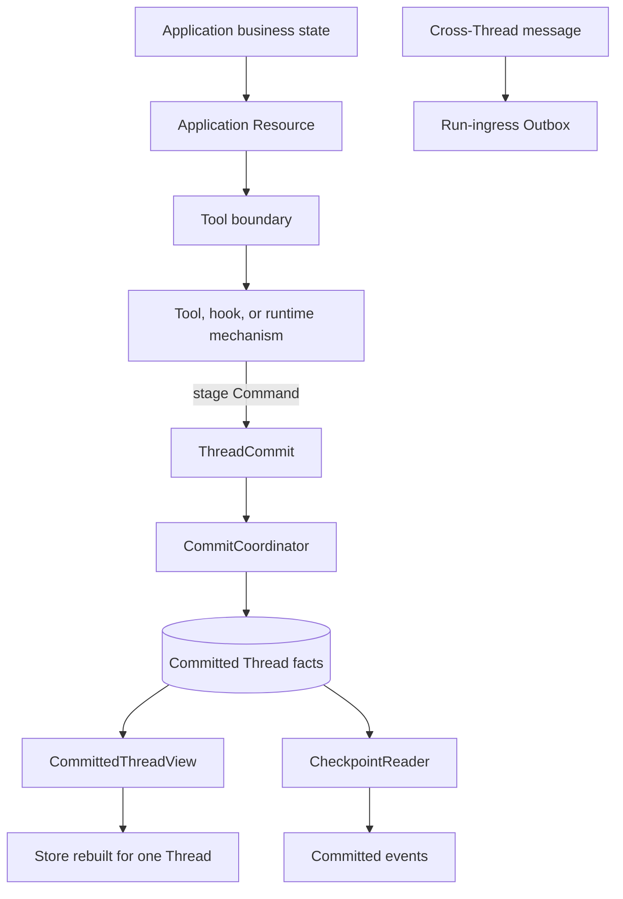
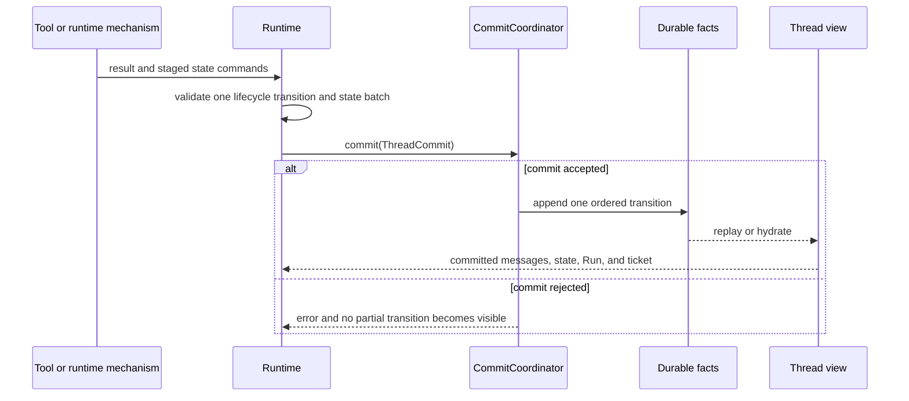

Start with the failure you need to survive. Keep scratch data in memory. Put a
value in Thread state when a later Run on the same Thread needs it. Choose a file
adapter for one process and PostgreSQL when several processes need one durable
commit authority.

| Need | Choose | Boundary to keep |
| --- | --- | --- |
| tests or one process lifetime | in-memory coordinator | restart loses state |
| restart recovery on one host | `FsCommitCoordinator` | one process owns the directory |
| several Runtime processes or database operations | `PostgresCommitCoordinator` | migrations and startup hydration are explicit deployment steps |
| business data shared across Threads | application-owned store exposed through a Resource and Tool | it is not Runtime Thread state |
| durable messages between Threads | run-ingress Outbox | do not copy messages through state keys |

## Keep one authority

`ThreadCommit` is the write boundary for messages, state commands, Run
disposition, waiting-ticket changes, and audit drafts. `CommittedThreadView`
reconstructs the execution view. `CheckpointReader` adds durable event reads.
The live `Store` is a projection, not another writer.

The Awaken Agents execution core does not own tenant records, profiles, customer databases, queues, or
HTTP resources. An embedding application supplies those capabilities and exposes
only the operations an Agent may use through Resources and Tools.

## What one commit does

Live token deltas and progress notifications are best-effort observations. They
do not determine whether a tool ran, state changed, or a Run ended.

## Make the deployment choice

For a file-backed embedding, continue with [Use File Store](/docs/agents/runtime/how-to/use-file-store/).
For PostgreSQL, including a separate migration phase, continue with
[Use Postgres Store](/docs/agents/runtime/how-to/use-postgres-store/). For exact key
interfaces, use [Choose a State Key](/docs/agents/runtime/reference/state-keys/).

Awaken Agents adds deployment-wide queues, leases, public Sessions, recovery
workers, and protocol replay. Those services compose Runtime ports; they do not
replace the committed Thread fact authority described here.
