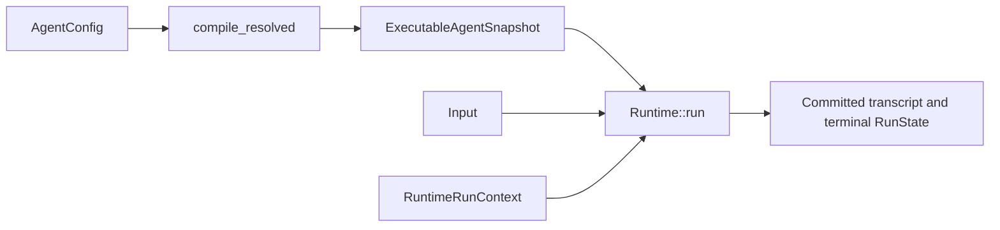

## Goal

Create one local Agent configuration and run its immutable snapshot to
`Ended(NaturalEnd)`. This task changes Agent data, not the Runtime kernel.

Start from `hello_agent.rs`. It is the one maintained minimal example for this
path. Do not copy the longer Runtime and Tool assembly into another tutorial.

## Prerequisites

- an Awaken source checkout at the revision shown in the page banner;
- a Rust toolchain accepted by the workspace;
- a terminal at the repository root.

The example uses `GreeterLlm`, a deterministic local model double. It does not
contact a provider or evaluate prompt quality.

## 1. Run the maintained baseline

```sh
cargo run -p awaken-runtime-examples --example hello_agent
```

Confirm that the output contains both lines:

```text
run finished: Ended(NaturalEnd)
--- committed transcript ---
```

## 2. Make the Agent configuration yours

Open
`crates/devtools/awaken-runtime-examples/examples/hello_agent.rs` and change only
these `AgentConfig` values first:

- `id`: a stable identifier for the Agent;
- `instructions`: the behavior the model should follow;
- `max_steps`: the hard loop ceiling;
- `model_binding`: the logical provider, model, and backend selection.

Also change the user input passed to `runtime.run`. Leave `compile_resolved`,
`RuntimeRunContext`, and the commit coordinator in place. They are shared
execution boundaries, not Agent behavior.

`compile_resolved` turns the authored config into one
`ExecutableAgentSnapshot`. `Runtime::run` consumes that snapshot; it does not
read a second mutable Agent definition while the run is active.

## 3. Verify

```sh
cargo test -p awaken-runtime-examples --test hello_agent
```

The test must pass, and the example must still finish at `NaturalEnd` with an
assistant message in the committed transcript. This confirms the configuration
still compiles into the same executable contract.

If Cargo reports that it cannot find `awaken-runtime-examples`, return to the
Awaken workspace root. If the named test fails after your edit, inspect the
changed config field and its compiler error before adding a provider or Tool.
There is no separate recovery procedure for the deterministic example.

## What stays separate



- `AgentConfig` is authored data.
- `ExecutableAgentSnapshot` is the immutable executable form for one
  publication.
- `Runtime` owns process-wide model and Tool implementations.
- `RuntimeRunContext` owns wiring for one attempt, including persistence and
  streaming.

Keep these owners separate when the example moves into an application. Do not
put credentials, live stores, or request-only handles into the snapshot.

## Next steps

- Run a model-requested Tool: [First Tool](/docs/agents/runtime/tutorials/first-tool/).
- Assemble the boundary in an application: [Build an Agent](/docs/agents/runtime/how-to/build-an-agent/).
- Bind a real provider through resolved configuration: [Agent resolution](/docs/agents/runtime/explanation/agent-resolution/).
