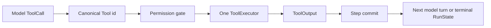

## Goal

Run one model-requested Tool and find its result in the committed transcript.
This page uses the maintained `direct_runtime` example. Implementing a new Tool
belongs to [Add a Tool](/docs/agents/runtime/how-to/add-a-tool/); state commands belong
to [State and snapshot model](/docs/agents/runtime/explanation/state-and-snapshot-model/).

## Prerequisites

- complete [Create your first Agent configuration](/docs/agents/runtime/tutorials/first-agent/);
- use an Awaken source checkout at the revision shown in the page banner;
- open a terminal at the repository root.

The example uses `ScriptedLlm`, so it is offline and deterministic.

## 1. Run the checked Tool path

```sh
cargo run -p awaken-runtime-examples --example direct_runtime
```

The transcript should contain `echoed: hello` and the run should finish at
`Ended(NaturalEnd)`.

## 2. Follow the four matching declarations

Open these two files side by side:

- `crates/devtools/awaken-runtime-examples/examples/direct_runtime.rs`;
- `crates/devtools/awaken-runtime-examples/src/lib.rs`.

Trace the `echo` identifier through four places:

| Boundary | What to find | Owner |
| --- | --- | --- |
| Model request | `ScriptedLlm` emits a call with `tool_id: "echo"` | local model double |
| Model-visible contract | the snapshot contains an `echo` `ToolDescriptor` | Agent publication |
| Executable implementation | `Runtime::with_tool(Arc::new(EchoTool))` | process Runtime |
| Authorization | the permission rules allow `echo` | permission gate |

All four refer to one Tool call. Do not create a second dispatcher or write the
action into prompt text.

## 3. Verify

```sh
cargo test -p awaken-runtime-examples --test direct_runtime
```

The test checks that the run reaches `NaturalEnd` and that the committed
messages contain `echoed: hello`.

If Cargo cannot find the package, return to the workspace root. If the named
test fails after a local change, compare the four declarations above. A Tool
invocation error is converted into a model-visible error result, and a model may
correct its next call; do not add a manual recovery procedure unless the run
ends with an explicit result that requires a configuration or implementation
change.

## What the Runtime does



The Tool never owns the transcript or commit boundary. The Runtime stages the
Tool result with the rest of the step. This keeps replay, permissions, and state
on one execution path.

## Next steps

- Implement a typed Tool without duplicating its schema: [Add a Tool](/docs/agents/runtime/how-to/add-a-tool/).
- Choose state scope and merge policy: [State and snapshot model](/docs/agents/runtime/explanation/state-and-snapshot-model/).
- Add human approval: [Enable Tool permission HITL](/docs/agents/runtime/how-to/enable-tool-permission-hitl/).
