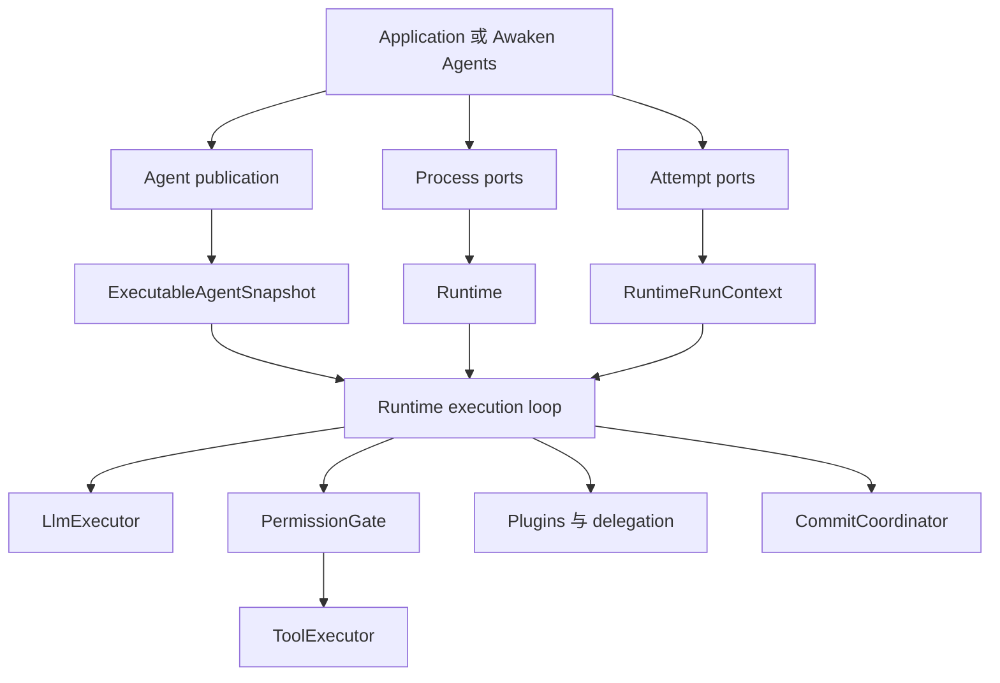

Agent 需要一项必须由 Rust 实现的能力时，使用这条路径。动作、生命周期约束、provider
adapter 与 storage port 放进代码；无需重建进程就应调整的行为放进类型化或托管配置。

## 从要改的内容开始

| 要改什么 | 继续阅读 | 保持唯一所有者 |
| --- | --- | --- |
| Agent instructions、model choice、Tool visibility 或 limits | [配置 Agent 行为](/zh/docs/agents/how-to/configure-agent-behavior/) | Agent publication |
| 在应用中装配 Runtime | [嵌入 Agent](/zh/docs/agents/runtime/how-to/build-an-agent/) | application process |
| 模型请求的动作 | [实现类型化 Tool](/zh/docs/agents/runtime/how-to/add-a-tool/) | Tool implementation 与推导的 descriptor |
| 生命周期 context、filtering 或 policy | [添加 Plugin](/zh/docs/agents/runtime/how-to/add-a-plugin/) | Runtime Plugin path |
| State scope、merge、replay 或 persistence | [状态与存储](/zh/docs/agents/runtime/state-and-storage/) | staged commands 与 commit coordinator |
| 受控的 child result | [从 Tool 调用 sub-Agent](/zh/docs/agents/runtime/how-to/invoke-sub-agent-from-tool/) | Run delegation service |
| 超出当前 turn 的长任务 | [从 Tool 启动后台工作](/zh/docs/agents/runtime/how-to/start-background-work-from-a-tool/) | ordinary durable Run 与 ingress |
| 另一个 Agent 接管对话 | [使用 Agent handoff](/zh/docs/agents/runtime/how-to/use-agent-handoff/) | step boundary 上的 active-Agent transition |
| HTTP、protocols、Workers、Sandboxes 或 managed credentials | [Awaken Agents](/zh/docs/agents/) | service 与 operations planes |

如果表中已有对应所有者，就扩展它。不要增加 frontend dispatcher、prompt-only permission
rule、private state store 或第二套 retry loop。

## 静态结构

Runtime 依赖类型化 port 与不可变数据。HTTP service、tenancy、placement、credential 与
deployment 向内依赖内核；内核不反向依赖它们。

## 动态行为

1. Host 为一次 attempt 解析一份不可变 snapshot 与所需 ports。
2. Runtime 请求模型产生下一步。
3. Tool request 依次经过 canonical id resolution、唯一 permission gate 与唯一 executor。
4. Message、state command、fact 与 disposition 暂存到 step commit 成功。
5. Run 继续、等待 resumable ticket，或返回一个 terminal `RunState`。

Tool error 是模型可见结果。等待通过已提交 ticket 恢复。Inference 在 loop 内做有界重试。
中断 step 之后，上一份 commit 仍是恢复起点。这些是系统行为，不是增加故障排查的理由。

## 编码前先确定的决策

| 决策 | 问题 | 现有所有者 |
| --- | --- | --- |
| 后果 | 动作是否读取、写入、执行、访问网络或使用 credential？ | Tool 与 permission policy |
| 生命周期 | 值属于进程、publication、attempt，还是 committed state？ | Runtime、snapshot、context 或 coordinator |
| 并发 | 两次调用能否写同一个 key？ | commit 处的 `MergePolicy` |
| 恢复 | 外部副作用属于 non-recoverable、replay-safe 还是 idempotent？ | Tool recovery contract |
| 延续 | 工作立即返回、等待、后台运行，还是转移控制权？ | Tool result、awaiting、ordinary Run 或 handoff |

把这些选择写进实现和测试。文档应告诉下一位维护者要修改哪个所有者，以及验证什么可观察结果。

## 完成改动

Runtime capability 完成前：

1. 运行共享该边界的最小受检示例；
2. 为成功、拒绝、等待、重试与终态失败推导 cause/effect table；
3. 把设计写在对应测试旁的注释中；
4. 先运行 focused tests，再运行 owning crate tests；
5. 检查 diff 中是否出现第二个所有者或 compatibility path。

## 建议搭配阅读

- [Runtime 架构](/zh/docs/agents/runtime/explanation/architecture/)用于查看 component ownership 与完整 run sequence。
- 修改内核前阅读[架构不变量](/zh/docs/agents/runtime/explanation/architecture-invariants/)。
- [Runtime reference](/zh/docs/agents/runtime/reference/overview/)用于核对精确契约。
