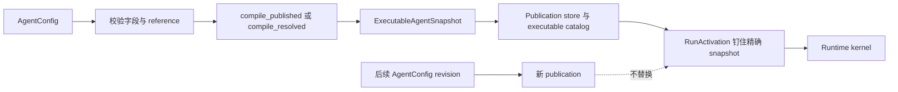
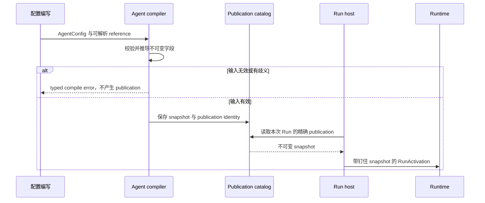

修改“Agent 行为如何变成可执行数据”时阅读本页。配置解析止于不可变的
`ExecutableAgentSnapshot`；它不执行 inference，不选择 Worker，也不委托其他 Agent。

## 分开可编辑数据与可执行数据

| 形态 | 所有者 | 是否可变 | 活跃 Run 是否使用 |
| --- | --- | --- | --- |
| `AgentConfig` | 配置编写 | 可以 | 不使用 |
| publication | 配置 store | 可以增加新版本 | 只通过钉住的 snapshot 使用 |
| `ExecutableAgentSnapshot` | Runtime contract | 不可变 | 使用 |
| provider credential material | 最终执行边界 | 按自身策略轮换 | 不会序列化进 snapshot |

snapshot 保存一次 Run 可以使用的行为，包括指令、模型 candidate、Tool descriptor、Plugin、
context policy、限制与内容 identity。它只保存 reference 和已解析选择，不保存 plaintext
secret 或 service 所有的可变记录。

## 解析序列

`awaken-config-resolver` 是管理面的模型 offering 与 credential 读取、解析入口。它的
`ResolvedInference` 用于 preview 和 probe。生产 publication 产生不含 secret 的模型
candidate；Runtime 不会在 Run 中调用管理面 resolver。

## 失败与变更行为

- reference 缺失、有歧义或不兼容时，在 publication 之前失败。
- 找不到精确 snapshot 时，Run 在执行前被拒绝，不会自动改用最新 Agent 版本。
- 发布新版本只影响后续 Run。正在运行、等待或重试的 Run 保留原行为 identity。
- credential materialization 与 Worker placement 发生在 publication 之后，由执行边界负责。

这些是解析结果，不是故障排查流程。根据明确结果修正 authored reference，或恢复结果中
指明的精确 publication；自动重试不能换用另一份行为。

Delegation 属于独立执行路径。参阅[从 Tool 调用 sub-Agent](/zh/docs/agents/runtime/how-to/invoke-sub-agent-from-tool/)
和[多 Agent 模式](/zh/docs/agents/runtime/explanation/multi-agent-patterns/)。
