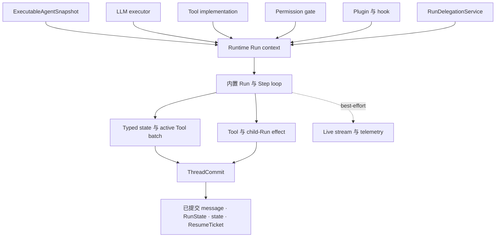
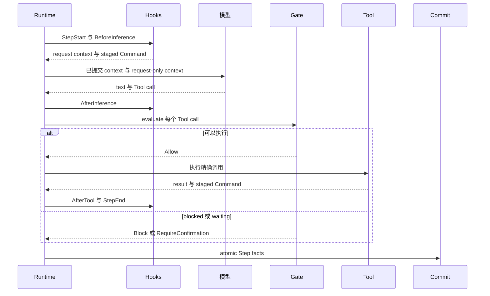

Awaken Agent 是由共享 Runtime loop 执行的不可变行为定义。修改最小的所有者；新增 Tool、
context rule、permission check 或 child Agent 时，不要替换 loop。

## 从要改的内容开始

| 要修改什么 | 所有者 | 前往 |
| --- | --- | --- |
| 指令、模型、可见 Tool、Plugin 或限制 | Agent publication | [解析 Agent publication](/zh/docs/agents/runtime/explanation/agent-resolution/) |
| 一个由模型请求的动作 | typed Tool | [实现 typed Tool](/zh/docs/agents/runtime/how-to/add-a-tool/) |
| 生命周期 context、filter 或 policy | Plugin 与 hook | [Tool 与 Plugin 边界](/zh/docs/agents/runtime/explanation/tool-and-plugin-boundary/) |
| 授权或审批 | permission gate | [Capability 与 permission](/zh/docs/agents/runtime/explanation/capability-and-permissions/) |
| 可恢复的 Run 或 Thread 数据 | typed state 与 `ThreadCommit` | [State 与 snapshot 模型](/zh/docs/agents/runtime/explanation/state-and-snapshot-model/) |
| 由另一个 Agent 完成有界工作 | `RunDelegationService` | [多 Agent 模式](/zh/docs/agents/runtime/explanation/multi-agent-patterns/) |
| HTTP、IAM、调度、Worker 或 Sandbox 行为 | Agents 服务层 | [Agents 架构](/zh/docs/agents/concepts/architecture/) |

## 静态结构

snapshot 标识行为，Runtime port 提供可执行 capability。loop 排列 inference、gate、Tool、
hook、state 与 commit。只有已提交事实是恢复 authority；live stream 只负责交互。

## 一个 Step

详细 phase 与 batch state machine 只由 [Run、Step 与 Tool batch](/zh/docs/agents/runtime/explanation/run-lifecycle-and-phases/)
维护。本页不重复它的 transition table。

## Runtime 自动处理什么

- Tool error 会成为模型可见 result，模型可以修正下一次调用。
- `RequireConfirmation` 与 delegation waiting 会形成带 resume identity 的已提交 `Awaiting`。
- Step facts 只通过一个提交边界；retry 从已接受 frontier 继续，不把 uncommitted stream 当成事实。
- cancellation、limit 与 terminal cause 使用现有 Run lifecycle。

这些都是正常 loop outcome。只有系统暴露配置、注册、executor 或 commit rejection，而且外部
维护者能够修正时，才需要提供处理动作。
