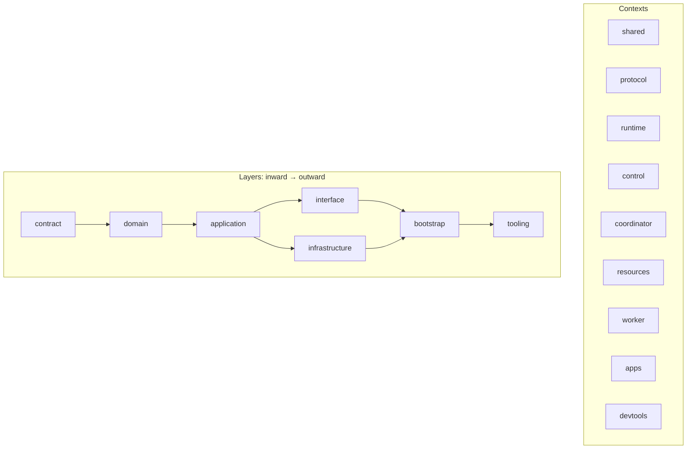
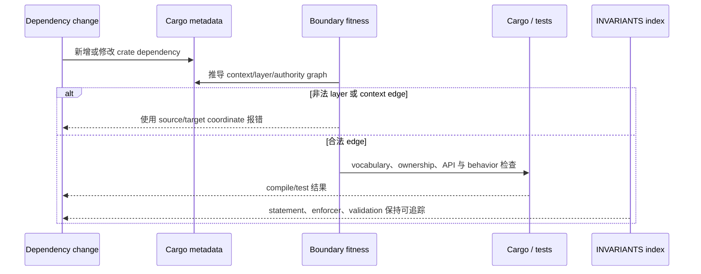
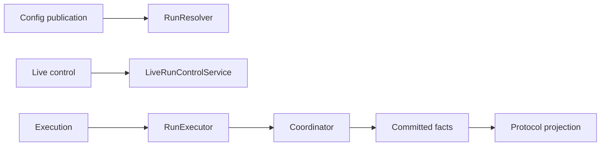

新增 crate dependency、把 type 移过 context，或修改 authority port 之前阅读本页。先在
`docs/INVARIANTS.md` 找到 owning invariant，保留它的 enforcer 与 validation，再运行由
metadata 推导的边界检查。[架构](/zh/docs/agents/runtime/explanation/architecture/)负责 Runtime
分层模型；本页负责维护规则。

## 关键路径：真相只有一个 owner

runtime core 由 `awaken-agent-contract`、`awaken-runtime-contract` 与
`awaken-runtime` 组成。它拥有中立的 Agent 执行概念：Run/Thread 身份、loop、tool 与
plugin port、类型化 state 和 commit 边界。公共协议、Workspace policy、vault、
deployment、Session orchestration 与持久化 adapter 均留在 core 之外。

三条不变量定义关键路径：

1. 持久 Runtime 写入经过唯一 `Coordinator` 边界；公共投影读取已提交事实。
2. 可执行 Run 接收不可变 `ExecutableAgentSnapshot`；config authoring 与 publication
   不进入 loop。
3. permission 是唯一授权路径。discovery、visibility、compatibility、health、plugin
   bound 与 placement 都不能授予 tool 权限。

## 静态结构：context、layer 与 authority

每个 workspace crate 都在自己的 `Cargo.toml` 中声明且只声明一组
`package.metadata.awaken.{context,layer,authority}`。这组 metadata，而不是物理目录名，
也不是 `deny.toml`，才是依赖方向的真相来源。



跨 context contract dependency 是正常集成接缝。`interface` 与 `infrastructure` 是
同级外环。进程 `bootstrap` 挂载 adapter，`apps` 与 `devtools` 是 composition root。
精确 allowed-context 与 allowed-layer 矩阵只在
`scripts/ci/_crate_dependency_fitness.py` 中维护一次。

主要所有权边界如下：

| 关注点 | 权威 owner | 面向 Runtime 的契约 |
|---|---|---|
| Agent 执行真相 | Runtime context | `RunExecutor`、`RunState`、`Coordinator` |
| 不可变可执行 config | Control publication，由 Runtime 消费 | `ExecutableAgentSnapshot`、`RunResolver` |
| 实时控制 | run-ingress application | `LiveRunControl`、`LiveRunControlService` |
| 公共 wire 词汇 | protocol adapter | 中立 activation、resume、event 与 result value |
| 持久存储 | store/resource infrastructure | `Coordinator`、`CheckpointReader`、domain repository |

这些是彼此分离的 owner，不是需要同步的平行实现。

## 动态行为：一次变更如何进入 CI



`scripts/ci/check_crate_boundaries.py` 是可执行入口。它运行 metadata dependency 矩阵，
以及 runtime secret、execution ownership、coordinator authority、resources、Session、
migration 与公共 Managed protocol 边界等专项 fitness check。同一检查在 repository hook
与 CI 中运行。`cargo deny check bans` 仍是 dependency hygiene 工具；它不重复架构矩阵。

从 Awaken 仓库根目录运行：

```console
python3 scripts/ci/check_crate_boundaries.py
```

非法 edge 会报告 source 与 target coordinate。修正 metadata，或把 dependency 移到 owning
contract；不要在第二个 checker 中增加例外。boundary check 成功只说明仓库符合规则，不代表
已经部署或具备生产运行证据。

## 中立词汇与反腐边界

边界检查扫描三个中立 core crate。产品托管词汇如 `managed`、具体 built-in tool id 与
symbol、secret resolution 和退役的 execution-placement abstraction 都不能进入 core。
具体 tool 属于 extension；公共 DTO 名称属于 protocol adapter；secret 与 deployment
policy 在 Runtime 执行前完成解析。

这是 DDD 意义上的反腐边界：adapter 在边缘把公共或部署词汇翻译为中立 value。它并不
表示每个外层概念都应被压进某个万能 core type。

## 分离的 authority 轴

config publication、live control、loop execution、durable commit 与 public projection
保持在独立 port 上：



不存在一个 Runtime API 同时负责 config authoring、active Run steering、loop execution、
truth commit 与 public DTO emission。cancel 或 wake 由 run-ingress application 持久化并
关联；core 只接收中立 control operation。

## 无法表达的非法 lifecycle state

已提交 Run 只有一个 lifecycle 权威：`RunState::Running`、`RunState::Awaiting` 或
`RunState::Ended(EndCause)`。`RunDisposition` 只携带下一次 commit 合法的数据：awaiting
变体拥有自己的 `ResumeTicket`，running 与 ended 变体无法携带 ticket。
`ThreadCommit::validate` 在写 store 前拒绝空身份或跨 Thread 身份。

公共 status、outcome 与 error field 都是派生投影，不是平行存储事实。同样，
`CommittedThreadView::run` 与 `latest_run` 从同一已提交 fact prefix 推导不同查询；
二者都不会建立第二条 persistence path。

## 相关

- [架构](/zh/docs/agents/runtime/explanation/architecture/)
- [设计权衡](/zh/docs/agents/runtime/explanation/design-tradeoffs/)
- [线程模型](/zh/docs/agents/runtime/reference/thread-model/)
- [能力与权限](/zh/docs/agents/runtime/explanation/capability-and-permissions/)
