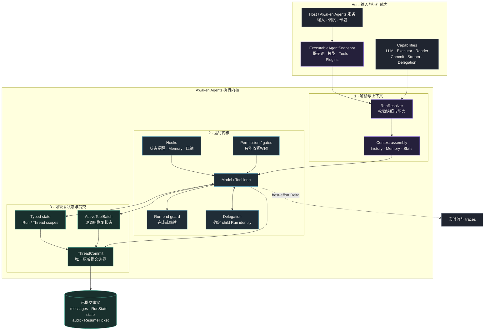
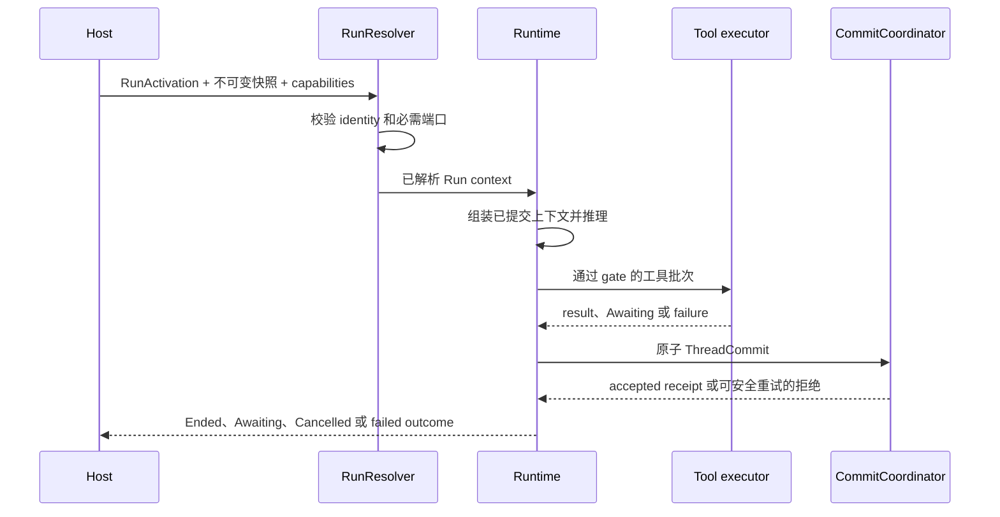
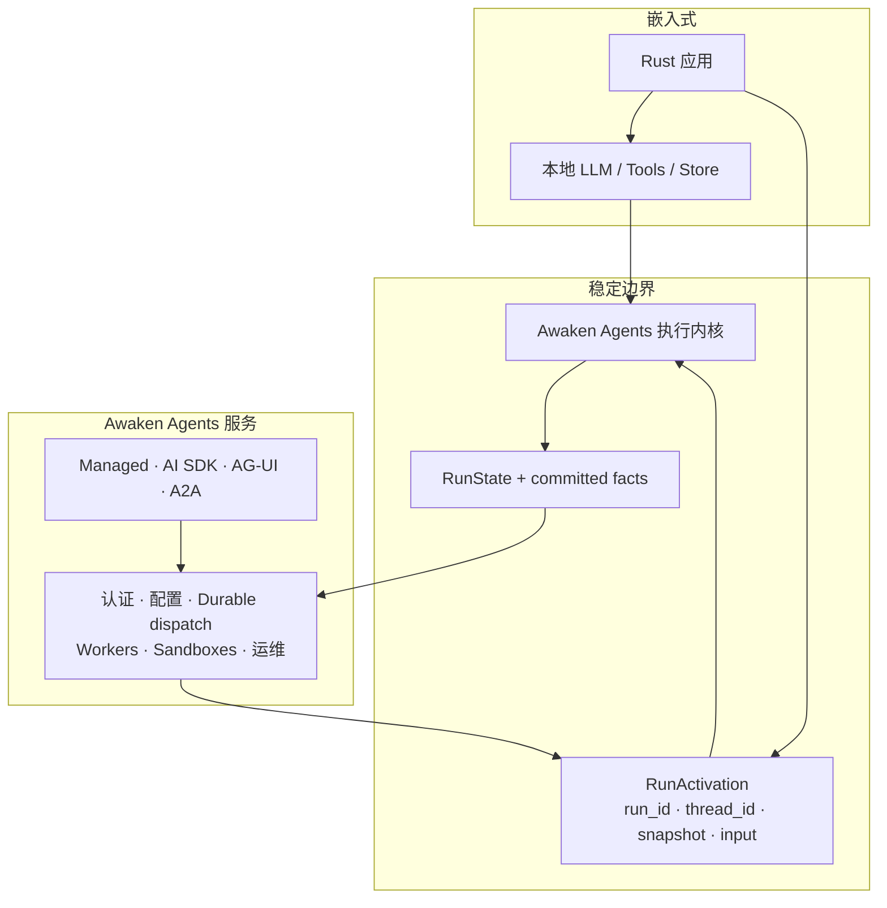

修改 Agent 的运行方式之前，先用本页判断代码应放在哪一层。模型与工具行为、上下文、
权限、typed state、委托和提交处理属于 Runtime；发布、公开协议、IAM、调度、Worker 与
Sandbox 属于 Awaken Agents 服务责任。这样，嵌入式与托管 Agent 仍走同一条执行路径。

## 修改代码前先选择层次

| 你要修改什么 | 所有者 | 应遵守的边界 |
| --- | --- | --- |
| 修改 instructions、模型候选、Tools、Plugins、Memory 或上下文策略 | 已发布行为与 Runtime capabilities | 解析一份 `ExecutableAgentSnapshot`；Run 进行中不读取可变 Agent 配置 |
| 增加权限检查、Approval gate 或状态约束 | Runtime | effect 执行前收紧权限；Plugin 不能扩大 host 已授予的权限 |
| 保存一种新的可恢复事实 | typed state 与 `ThreadCommit` | 在 Step 内暂存，再通过既有原子提交出口写入 |
| 向 UI 推送实时进度 | `StreamSink` 或 telemetry | 实时事件只尽力传递；恢复仍读取已提交事实 |
| 修改 HTTP、IAM、发布、调度、Worker 或 Sandbox | Awaken Agents 服务 | 不改变执行内核，使用服务拥有的 port |

修改 loop 或状态机时，下一步进入
[Run、Step 与工具批次](/zh/docs/agents/runtime/explanation/run-lifecycle-and-phases/)；修改部署或服务边界时，
进入 [Agents 架构](/zh/docs/agents/concepts/architecture/)。

本页余下部分说明静态结构。一次 Run 如何循环、在哪些位置写 checkpoint，见
[Run、Step 与工具批次](/zh/docs/agents/runtime/explanation/run-lifecycle-and-phases/)。

## 静态结构：一份行为定义，一个运行内核，一个提交出口

这张图有三个关键结论：

1. `ExecutableAgentSnapshot` 是一次 Run 的行为身份。运行过程中不会因为后台配置变化而漂移。
2. Tools、hooks 与委托只能暂存结果，不能绕过 `ThreadCommit` 直接改写权威状态。
3. 实时 Delta 服务交互体验；恢复读取的是已提交事实，而不是客户端曾经看到过的片段。

## 组件所有权

| 组件 | 拥有什么 | 不拥有什么 |
|---|---|---|
| `ExecutableAgentSnapshot` | 已解析的模型候选、提示词、工具描述、Plugin、上下文策略与指纹 | 凭据明文、HTTP DTO、Worker lease |
| `Runtime` | Step 循环、hooks、gates、run-end guard、取消与委托入口 | Agent CRUD、租户、公开协议 |
| `ToolExecutor` / `RunDelegationService` | 工具与 child Run 的执行端口 | 权威 Thread store |
| typed state / `ActiveToolBatch` | 可恢复的 Run/Thread 状态和逐工具调用生命周期 | 独立数据库或第二套提交协议 |
| `CommitCoordinator` | 校验并原子提交 `ThreadCommit` | 调度与 Worker 选择 |
| `StreamSink` / telemetry | 尽力而为的实时进度与观测 | 恢复权威 |

## 动态行为：从 activation 到终态

详细状态机的唯一所有者是
[Run、Step 与工具批次](/zh/docs/agents/runtime/explanation/run-lifecycle-and-phases/)。
从全局看，嵌入式和 Awaken Agents 托管执行都经过同一条因果路径：

| 什么地方失败 | 你会看到什么 | 应该怎么做 | 最后可信状态 |
| --- | --- | --- | --- |
| Resolution | activation 因缺少 model、tool、state 或 commit capability 被拒绝 | 修正 capability set，使用同一 snapshot 重新开始 | 没有 Run Fact 被提交 |
| Model 或 tool attempt | Run 等待，或报告失败的 call | 按该 Tool 的 recovery policy 处理，用同一 call identity 恢复 | 最新已提交 batch |
| Commit | Host 收到 version、duplicate 或 stale-authority 拒绝 | 重读已提交 Fact，从已接受 frontier 继续 | 最后一个被接受的 `ThreadCommit` |
| 进程丢失 | 实时进度可能消失 | 从已提交 Fact 和 `ResumeTicket` 恢复 | 最新已提交 `RunState` |

Queue、stream、trace 和 executor-local memory 可以改善时延或诊断，但都不是持久化或一致性边界。

## 嵌入式与托管服务的边界

Awaken Agents 执行内核可以直接嵌入 Rust 应用，也可以由 Awaken Agents 服务承载。两种方式使用同一个执行内核，
差别在于谁提供外围能力。

进入执行内核的是中立、可序列化的 `RunActivation` 和进程内端口；离开执行内核的是
`RunState`、消息、状态命令和中立事件。HTTP、tenant、credential record、lease、
Worker 与 Sandbox 类型属于 Awaken Agents 服务，不能反向进入执行领域。

## 一次 Step 的职责边界

一次 Step 的主路径是：

1. 从已提交 Thread history 与 typed state 组装上下文。
2. 在 `BeforeInference` 读取 Memory、压缩结果或其他 request-only context。
3. 调用模型并规范化 tool id。
4. 在执行前依次应用 permission policy 与 plugin gates。
5. 记录可恢复的工具批次，再进入本地、Sandbox 或 Remote Hand executor。
6. 汇合工具结果，运行 `AfterTool` reactions 和 `StepEnd`。
7. 经 `ThreadCommit` 写入下一次推理能够依赖的事实。

当前普通工具调用按顺序执行；只有声明能够直接到达终态的并行委托批次会并发执行。
无论执行是否并行，模型都只在整批结果完成并越过 publication barrier 后看到按原始顺序
排列的 tool results。

## 对开发者的直接收益

- 配置模型、提示词、工具展示、Memory 和状态约束时，不需要修改循环代码。
- 更换 LLM、Tool executor 或部署位置时，Run/Step/commit 语义保持不变。
- 权限与状态约束在动作发生前执行，不依赖模型“记得遵守”提示词。
- 进程中断后，Host 可以从最后一个已提交 Step、工具批次或 Awaiting ticket 继续。
- 多 Agent 复用普通 Run、权限和提交机制，不引入一套旁路协作内核。

## 非目标

执行内核不拥有公开 HTTP 协议、tenant IAM、credential custody、Worker placement、
Sandbox provisioning 或产品级 Agent authoring，也不承诺未提交 stream 可以重放。
这些外围职责属于 Awaken Agents，并通过与嵌入式 Host 相同的 activation 和 commit 端口进入执行内核。

继续阅读[架构不变量](/zh/docs/agents/runtime/explanation/architecture-invariants/)、
[Run、Step 与工具批次](/zh/docs/agents/runtime/explanation/run-lifecycle-and-phases/)和
[Agents 架构](/zh/docs/agents/concepts/architecture/)。
