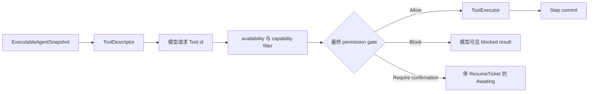
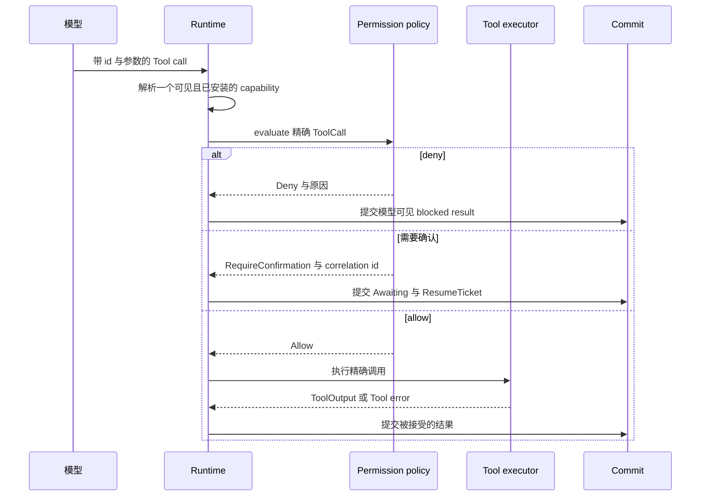

模型可以看到一个 Tool，但没有执行它的 permission。进程也可以安装实现，但不把它展示给
当前 Agent。新增 Tool、policy 或执行 adapter 时，应保持这些事实彼此独立。

## 一个 effect 之前有四项决定

| 决定 | 所有者 | 结果 |
| --- | --- | --- |
| 模型可见性 | 不可变 Agent snapshot | `ToolDescriptor` 可以进入模型请求 |
| 可执行实现是否存在 | Runtime Tool registry 或 executor | 请求 id 只有一个实现 |
| 授权 | `ToolPermissionPolicy` 与最终 gate | allow、block 或 require confirmation |
| effect 与持久结果 | `ToolExecutor` 与提交边界 | 执行一次，再发布被接受的结果 |

对于 typed Tool，使用 `ToolDescriptor::for_tool::<T>()` 推导模型可见 identity 与 schema，
再通过唯一 typed-to-raw adapter 注册同一个 `T::ID`。不要手写第二份 descriptor。

可见性、选择、capability compatibility、placement 与 health 可以移除 candidate，但不能
产生 `Allow`。只有 `ToolPermissionVerdict::Allow` 能投影成可执行 gate outcome。

## Permission 只能保持或收窄 authority

`ToolCapabilityNarrowing` 只有 `Configured` 与 `DenyAll`。合并限制时，只有全部输入都是
`Configured` 才保留它；`DenyAll` 会吸收其他值。因此 Run、Plugin 或 executor 可以移除
已经配置的 Tool authority，但不能增加 host 没有授予的 authority。

`RequireConfirmation` 是可恢复的 Run state。blocked call 与 Tool error 会作为结果返回模型，
loop 可以选择其他动作。这些结果不需要通用故障排查。只有系统返回审批请求，或明确的配置、
注册、executor error 时，外部才需要行动。

## 不要把邻近数据放进 Tool authority

- descriptor 保存模型可见 identity 与 schema，不保存 executable handle 或 permission grant。
- 持久 Agent 与 Session 数据只保存 credential reference，不保存 plaintext；materialization
  属于最终 trust boundary。
- Tool state change 以 `Command` 数据返回并通过同一个 Step commit，不建立第二个 store。
- Skill 与 MCP Tool 使用同一条 descriptor、gate、executor 与 result 路径，没有独立授权通道。

实现这份契约请阅读[实现 typed Tool](/zh/docs/agents/runtime/how-to/add-a-tool/)。配置审批规则请阅读
[启用 Tool permission HITL](/zh/docs/agents/runtime/how-to/enable-tool-permission-hitl/)。执行位置与
credential custody 仍属于 [Awaken Agents 执行边界](/zh/docs/agents/concepts/brain-and-hand/)。
