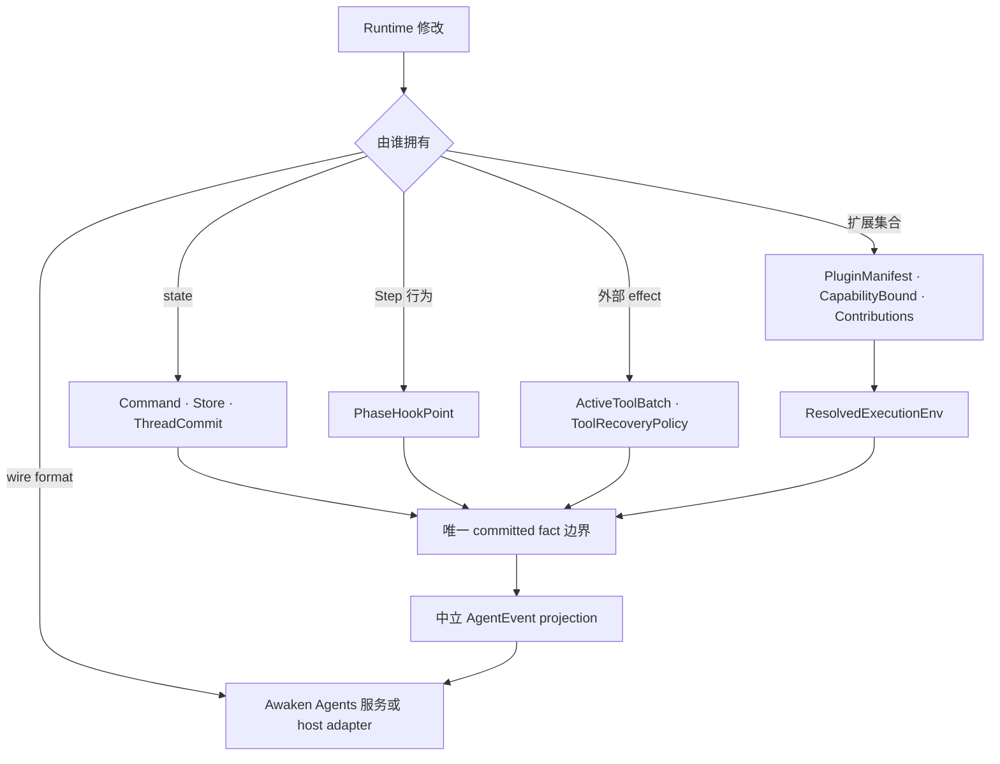
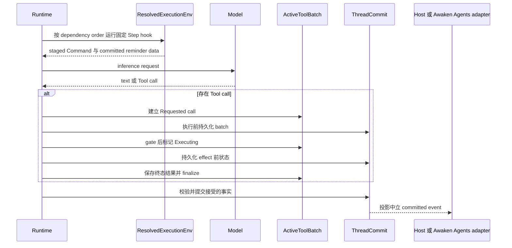

新增 Runtime 扩展或持久化路径前阅读本页。多数修改已有明确边界。先选择边界，执行、恢复与
authority 才会继续只有一个 owner。

## 从要改的内容开始

| 要修改什么 | 保留的设计决定 | 接受的代价 | 所有者页面 |
| --- | --- | --- | --- |
| 可恢复 state | producer 暂存纯数据 `Command`，一次 commit 负责校验与应用 | 多一次 commit 与 replay，不直接修改 | [State 与 snapshot 模型](/zh/docs/agents/runtime/explanation/state-and-snapshot-model/) |
| 一次模型/Tool Step 内的行为 | 使用五个 `PhaseHookPoint` 之一 | 插入点更少，但顺序确定 | [Plugin 内部机制](/zh/docs/agents/runtime/explanation/plugin-internals/) |
| 一组 Runtime contribution | 把一个 `Plugin` 解析成有边界的 `Contributions` | 使用前要检查 manifest、dependency 与冲突 | [添加 Plugin](/zh/docs/agents/runtime/how-to/add-a-plugin/) |
| 外部 Tool effect | 依赖结果前先提交 `Requested` 与 `Executing` | checkpoint 更多，但恢复时不猜执行是否开始 | [Run 生命周期](/zh/docs/agents/runtime/explanation/run-lifecycle-and-phases/) |
| wire protocol 或 service endpoint | 保持 `AgentEvent` 中立，在执行内核外适配 | edge 需要显式 transcoder | [Awaken Agents protocols](/zh/docs/agents/protocols/) |

## 静态所有权

这些 abstraction 不能互换。`CapabilityBound` 限制 Plugin 可以贡献什么，不授予
permission。`MergePolicy` 调和 state command，不排列 Plugin。`AgentEvent` 报告 Runtime
行为，不是 service protocol。

## 这些决定如何在一个 Step 相遇

## 为什么保持分离

### 使用 Command，不共享可变 state

Tool 与 hook 读取 materialized `Store`，返回 `Command` 数据。commit path 统一应用
`MergePolicy`。并行 producer 不会因锁时序或 callback 顺序而静默胜出。代价是显式校验与
state 重建。

### 使用固定 hook，不建立通用 event bus

`StepStart`、`BeforeInference`、`AfterInference`、`AfterTool` 与 `StepEnd` 对应内置
loop，并由 dependency order 决定执行顺序。它不如任意事件订阅灵活，但维护者可以找到一次
Step 中所有影响行为的位置。

### 使用有边界的 Plugin，不用包裹整个 loop 的 middleware

Plugin 声明 identity、dependency 与 `CapabilityBound`，再返回实际 `Contributions`。
`ResolvedExecutionEnv` 拒绝缺失 dependency、cycle、重复 Tool/action id，以及越过 bound
的 contribution。包裹整个 loop 的 middleware 会让每一层接触超出自身职责的内容。

### 使用 Tool checkpoint，不假设 replay 安全

`ToolBatch` 区分已持久化请求与 executor attempt。进入 `Executing` 后，恢复遵循固定的 Tool
policy，不把未知外部 effect 当成从未开始的请求。这不等于任意第三方 effect 天然 exactly
once；下游写入仍需要稳定 operation identity、幂等键或事务支持。

### 使用中立 event，不让 loop 感知协议

执行内核只发出 Runtime vocabulary。host 可以把它映射到本地 API，Awaken Agents 负责维护服务
协议。新增协议只修改 edge adapter，不修改 inference、Tool execution 或 recovery。

## 不要增加平行 owner

- 不要为 Plugin 或 Tool progress 新建 store；使用 typed state 与 `ThreadCommit`。
- 不要在五个 Step hook 和 committed event 之外再建通用 lifecycle bus。
- 不要把 Plugin selection、capability bound、placement 或 health 当作 permission。
- 不要把 HTTP、AG-UI、A2A 或 Managed DTO 放进 Runtime loop。
- 不要把未知外部 effect 当作从未进入 executor 并直接重试。

具体实现留在链接的所有者页面。本页只拥有设计选择，不复制各机制的详细说明。
