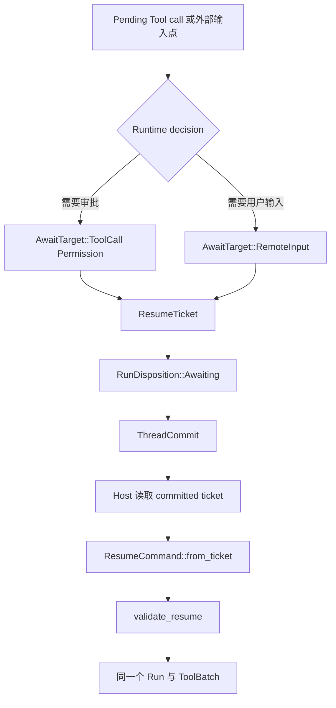
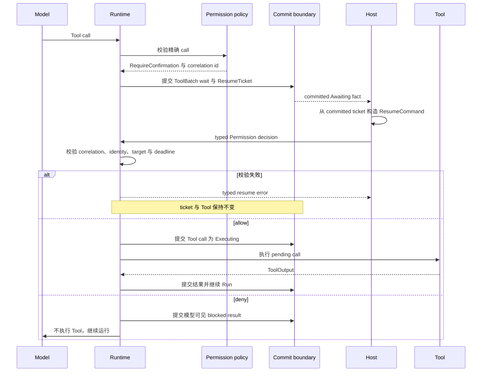

Tool 需要审批，或 Run 需要外部输入时阅读本页。Runtime 等待时不会占住一个进程。它提交
带唯一 `ResumeTicket` 的 `RunState::Awaiting`；host 随后提交与 ticket 精确匹配的 typed
data，恢复同一个 Run。

permission rule 的配置属于[启用 Tool permission
HITL](/zh/docs/agents/runtime/how-to/enable-tool-permission-hitl/)。本页只拥有 park、validate 与
resume 机制。

## 静态结构

`AwaitTarget` 是封闭 enum。Tool wait 必然同时携带 reason、call id 与 pending Tool data；
remote-input wait 携带自己的 call id；pause 不携带二者。caller 无法拼出可选字段互相矛盾的
ticket。

## Host 要做什么

1. 读取当前 committed `ResumeTicket`。不要根据 UI event、URL 或进程内存重建 identity。
2. 使用 ticket data 和应用自己的展示策略，呈现 pending action 或输入请求。
3. 收集 typed answer。permission wait 接受 `PermissionDecision::Allow` 或
   `PermissionDecision::Deny`；user-input wait 接受 input data。
4. 调用 `ResumeCommand::from_ticket(ticket, result, now_ms)`。只提供 answer 与当前时钟，
   不提供替换 identity。
5. 通过 owning resume ingress 提交 command，并继续读取同一个 Run 的 committed facts。

ticket 保存 correlation、Run/Thread identity、executable snapshot、catalog fingerprint、
可选 deadline 与精确 awaiting target。delegated Run 还保留稳定 origin。plaintext credential
与 live executor handle 不属于 ticket。

## 审批序列

allow 不会绕过 Tool lifecycle。Runtime 先把匹配的 `ActiveToolBatch` call 从 permission
wait 移到 `Executing`，并提交 effect 前状态。deny 不会运行 Tool；它向模型提供 blocked
result，让同一个 Run 选择其他动作。

## Validation 是 effect 边界

`validate_resume` 在执行前检查：

| 检查 | 作用 |
| --- | --- |
| correlation id | 把 answer 绑定到一次 wait |
| Run 与 Thread id | 防止跨 Run 或跨 Thread 输入 |
| snapshot id 与 catalog fingerprint | 保证恢复行为与停靠时一致 |
| deadline | 拒绝超过决策窗口的 answer |
| result kind | 防止 free-form input 或外部 Tool result 回答 permission wait |
| 必要时的 Tool call id | 防止一个 call 的结果完成另一个 call |

被拒 command 不会改动 ticket。成功恢复后的第二次 command 找不到 active ticket，会以 not
awaiting 被拒。这是正常的幂等与 stale-input 结果，不是修复流程。

caller 收到 `Expired` 时，应重新读取 committed state，并遵循 owning application 的
cancel 或 replacement policy。不要改时钟、重写 ticket identity，也不要把 answer 转成新
user message。

## 邻近机制留给各自 owner

- `GateOutcome::Schedule` 是系统延迟工作，不是人工审批。参见[定时动作](/zh/docs/agents/runtime/reference/scheduled-actions/)。
- delegation 使用同一 Awaiting vocabulary，但 child continuation 属于持久父子关系。参见
  [多 Agent 协作](/zh/docs/agents/runtime/explanation/multi-agent-patterns/)。
- queue claim、lease、retry 与多节点 delivery 属于 Awaken Agents。参见[生产可靠性](/zh/docs/agents/concepts/production-reliability/)。
- 完整 Run 与 ToolBatch recovery state machine 属于 [Run 生命周期](/zh/docs/agents/runtime/explanation/run-lifecycle-and-phases/)。

自动拒绝、stale-input protection 与 same-Run continuation 不需要通用故障排查。只有等待
approver 回答，或 owning application 必须替换过期 wait 时，外部才需要行动。
