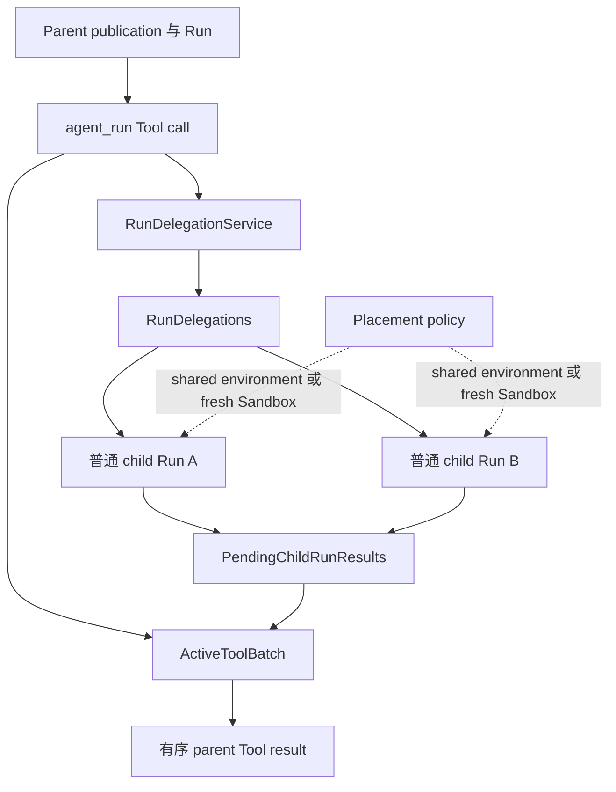
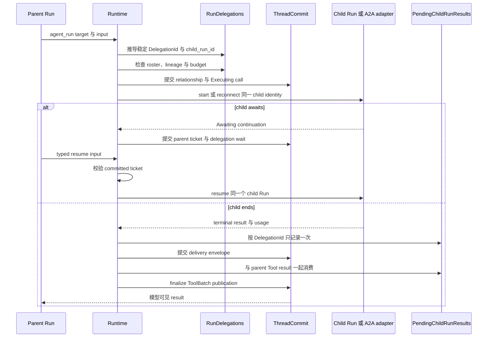
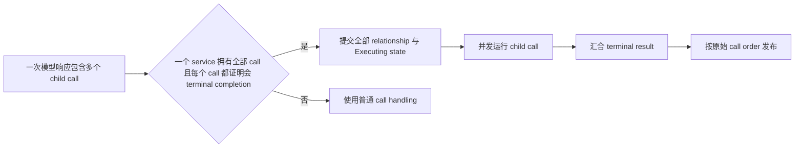

不要先设计 Agent role。先确认工作的生命周期，以及 caller 需要什么结果。Awaken Agents 提供三种
协作边界；它们都复用普通 Run，不建立第二个 execution engine。

## 选择机制

| 要协调的工作 | 使用 | Caller 得到什么 |
| --- | --- | --- |
| 一个有界子任务，结果要进入当前模型回合 | 通过 `RunDelegationService` 执行 `agent_run` | parent Run 的一个 Tool result |
| 可以独立运行、等待或结束的工作 | 由 host、Agents service 或 Workforce 组合多个普通 Run | composer 汇合 committed result |
| 发给另一个 Thread 的异步消息 | 持久 `send_message` 与 outbox delivery | target Thread 下一个安全边界的 input |

如果依赖是一次 Agent execution 之外的业务工作、责任、review 或 acceptance，使用
[Awaken Workforce](/zh/docs/workforce/)。

## 静态所有权

三个持久 state cell 各有不同 owner：

| State | 拥有什么 | 不拥有什么 |
| --- | --- | --- |
| `RunDelegations` | 稳定 relationship identity、lineage、limit 与 cancellation intent | parent Tool result |
| `ActiveToolBatch` | parent call 的 Requested、Executing、Awaiting 与 terminal state | child relationship history |
| `PendingChildRunResults` | child 完成后、parent 消费前的幂等 delivery | 另一套 child store 或 executor |

child 拥有自己的 Agent publication 与 Run identity。placement 决定它共享 Session
environment，还是使用 fresh Sandbox；Sandbox 选择不定义 Agent identity。

## 一次 delegated result

重复 start 或 recovery 必须访问同一个 `DelegationId` 与 child Run，不能创建第二个 child。
parent 结束时，terminal commit 为 open relationship 记录 cancellation intent。commit 后的
delivery 可以重试；late result 不能重开 closed relationship。

## Parallel call 的契约更窄

只有同一个 `RunDelegationService` 拥有模型 batch 中全部 call，并且每个 target 都返回
`supports_parallel_completion` 时，Runtime 才并发执行 delegation。如果本应 terminal-only
的 child 进入 await，batch 会变成 `Indeterminate`；Runtime 不会把多个独立 correlation
压成一个 ticket。

可能独立 await 的长时间 child 应使用独立 Run。composer 拥有 join；执行内核不增加通用
background-work state，也不建立共享 chat buffer。

## 正常恢复行为

- retryable child failure 使用同一个 child identity reconnect。
- terminal delegation error 成为模型可见 Tool error，parent 可以选择其他动作。
- identity 与 result 相同的重复 child delivery 是幂等的；冲突 result 会失败关闭。
- parent terminal 会 seal 未完成 Tool call，late delivery 不能重开它。

这些路径由系统自动处理，不需要通用故障排查。只有选中的 local 或 A2A adapter 在自身 retry
policy 后仍返回明确配置或连接错误时，外部才需要修复。

实现请阅读[使用 `agent_run` 委托](/zh/docs/agents/runtime/how-to/invoke-sub-agent-from-tool/)。完整状态机
位于 [Run 生命周期](/zh/docs/agents/runtime/explanation/run-lifecycle-and-phases/)。
