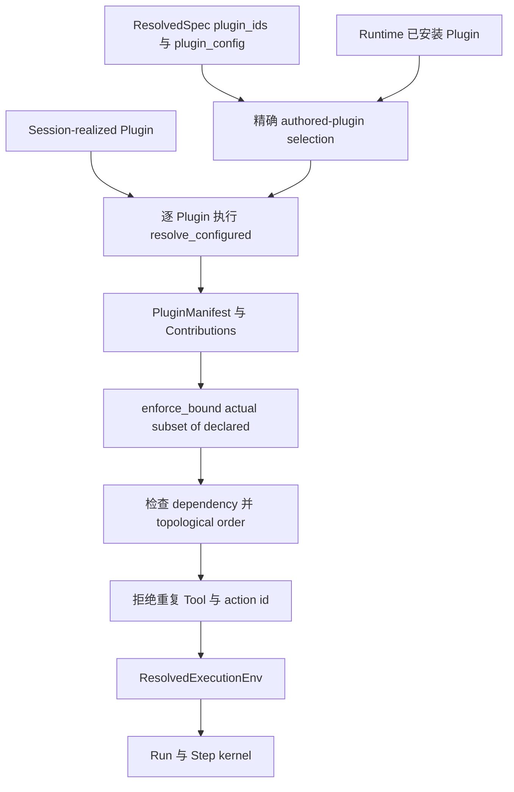
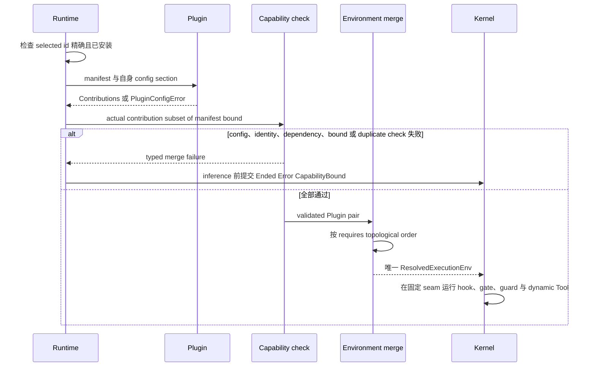

修改 Plugin activation、configuration、contribution merge 或 live Tool discovery 时阅读本页。
Plugin 是 factory。它不把 callback 注册进全局可变 state；它返回一个 `Contributions`
value，由 Runtime 合并进本次 Run 唯一的 `ResolvedExecutionEnv`。

选择 Tool 还是 Plugin，请阅读 [Tool 与 Plugin
边界](/zh/docs/agents/runtime/explanation/tool-and-plugin-boundary/)。实现示例位于[添加
Plugin](/zh/docs/agents/runtime/how-to/add-a-plugin/)。

## 静态结构

authored 与 Session-realized Plugin 是 Plugin instance 的两个来源，不是两套 Plugin system。
二者都经过同一 configured resolution、bound、dependency order、duplicate check 与 execution
environment。

## Plugin 拥有什么

| Type | 拥有什么 | 不拥有什么 |
| --- | --- | --- |
| `PluginManifest` | Plugin id、required Plugin id、config section name 与声明的 `CapabilityBound` | live hook 或 permission grant |
| `Contributions` | 一次 resolution 返回的实际 Tool、state key、hook、action kind、guard、gate 与 dynamic Tool | serialized Agent truth 或全局 registry |
| `ResolvedExecutionEnv` | 一个 Run 使用的已校验、有序 aggregate | configuration publication 或 protocol serving |

`resolve_configured` 只接收该 Plugin 的 config section。malformed data 返回
`PluginConfigError`。publication validation 可以 dry-run 同一方法，Runtime 在实际 execution
path 再调用它。validator 与 applier 因此共用一个实现。

## 声明当前 capability bound

除封闭的 `PhaseHookPoint` enum 外，每个 identity-bearing axis 都使用 `IdBound`：

| `CapabilityBound` field | Shape | 覆盖内容 |
| --- | --- | --- |
| `tools` | `IdBound` | static 与 dynamic Tool id |
| `state_keys` | `IdBound` | Plugin 可以声明的 state key |
| `phase_hooks` | `Vec<PhaseHookPoint>` | 可以观察的固定 Step point |
| `action_kinds` | `IdBound` | scheduled-action kind |
| `run_end_guards` | `IdBound` | natural-end continuation guard |
| `tool_gates` | `IdBound` | 只能收窄的 pre-execution gate |

`IdBound` 可以是 `Any`、`Exact`、`Namespace` 或 `NamespacedExact`。默认值是
`Exact([])`，不允许任何 id。`NamespacedExact` 同时要求 namespace prefix 与显式 discovered
id，因此合法 prefix 下的 stray id 仍会失败关闭。

bound 是结构上限，不是 inventory，也不是 authorization。`enforce_bound` 检查 actual
contribution 是它的 subset。只有 permission path 可以授予 Tool execution。

## 解析序列

初始 resolution 在第一次模型调用前拒绝：

- authored Plugin id 未安装或重复；
- `resolve_configured` 无法解析自身 section；
- active dependency 缺失或形成 cycle；
- 任一 contribution 越过 `CapabilityBound`；
- 两个 active Plugin 贡献相同 Tool id 或 action kind。

Runtime 会把已接受 input 与
`RunState::Ended(EndCause::Error(Failure::CapabilityBound))` 一起提交，不会用 partial
environment 开始运行。

## Hook 与 state 保持自己的 owner

`ResolvedExecutionEnv` 按 `PhaseHookPoint` 暴露 phase hook，按 dependency order 暴露 Tool
gate 与 run-end guard，并让 dynamic Tool descriptor 与 executor 绑定同一 identity。hook 读取
materialized `Store` 并返回 `HookReaction` data。kernel 把这些 `Command` 应用并暂存到普通
commit path。

Tool gate 可以 block、提供 result 或请求 wait，但不能扩大 permission。run-end guard 只在
text-only natural-end boundary 被调用。cross-Run workflow 与 committed-terminal observer
是不同 extension role，不要加入 Plugin aggregate。

## Live refresh 是 best-effort 且不会扩权

实现 `live_version()` 的 Plugin 可以表示 dynamic Tool face 已改变。Runtime 在下一个 Step
boundary 检查 combined version，并重新运行同一 resolution pipeline。有效 refresh 替换 live
environment；失败 refresh 保留上一个已校验 environment，直到 version 再次改变。Run 不会
切换到 partial 或 unbounded Tool set。

该 fallback 由系统自动处理，不需要通用故障排查。如果 dynamic source 必须暴露已修正 Tool
set，应修正 source 并推进 live version；不要修改 `ResolvedExecutionEnv`，也不要注册第二条
executor path。
