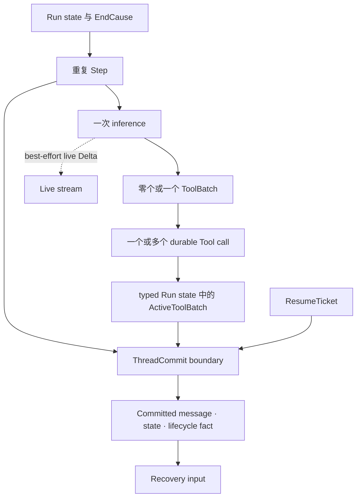
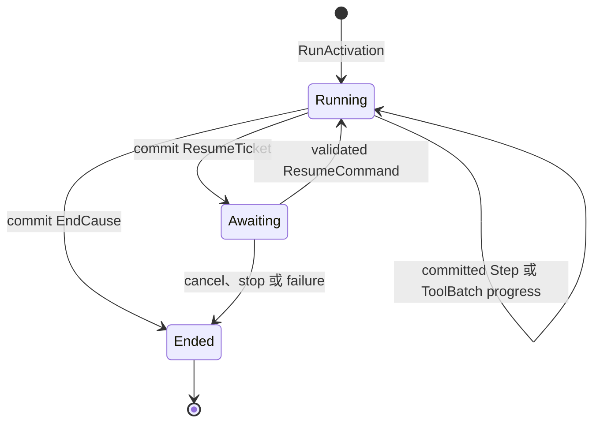
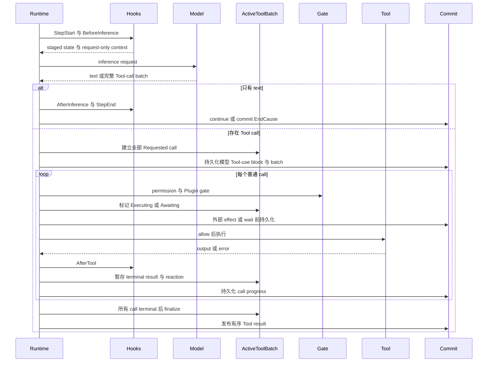
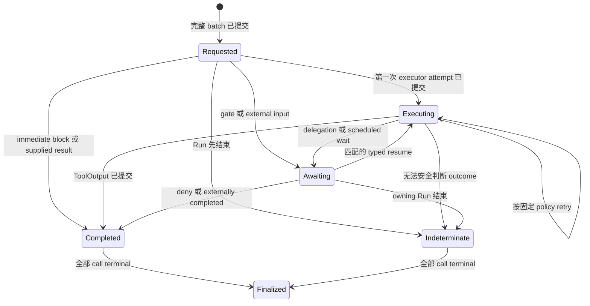

修改 loop order、commit timing、Tool recovery 或 resume behavior 时阅读本页。先读取最新
committed fact。live output 可以早于 commit 到达，不能告诉 recovery 执行停在哪里。

## 从要确认的 state 开始

| 问题 | 读取 | 含义 |
| --- | --- | --- |
| 执行仍在运行、等待，还是已经结束？ | 最新 committed `RunState` | `Running`、`Awaiting` 或 `Ended(EndCause)` |
| 模型是否已经请求 Tool？ | Run-scoped `ActiveToolBatch` | 精确 call、attempt、wait 与 terminal result |
| 什么输入可以恢复 Awaiting Run？ | committed `ResumeTicket` | 一个 typed correlation 与 target |
| 已展示文本是否成为 Thread truth？ | committed message 与 fact | live `Delta` 本身不是 authority |

不要根据 Worker process、stream connection、local future 或 UI status 推导这些答案。

## 静态结构

Run 是可恢复 execution identity。Step 包含一次 inference，以及该响应产生的完整 Tool
batch。`ActiveToolBatch` 是普通 commit log 中的 typed Run-scoped state，不是另一套数据库。

## Run state machine

`RunActivation` 是 input，不是 durable `Created` state。如果执行从未跨过第一次 commit，就
没有 committed Created fact 可以恢复。`Ended` 是吸收态，只携带一个 cause：自然完成、
step limit、cancel、stop、typed failure 或无法判断的 external outcome。

## 一个 Step 及其 commit point

普通 Tool call 当前按顺序执行。terminal-only child delegation 可以在更窄的证明下并发；参见
[多 Agent 协作](/zh/docs/agents/runtime/explanation/multi-agent-patterns/)。无论哪种情况，只有每个
call 都 terminal，下一次 inference 才能看到 batch。

## Tool-call state machine

`Requested` 证明 call 已持久化，且没有记录 executor attempt。`Executing { attempt }` 表示
external effect 可能已经开始。`Awaiting` 拥有 typed wait 与 correlation。`Completed` 和
`Indeterminate` 是 terminal call state。finalization 是 batch publication barrier，不是另一种
Run terminus。

## Recovery 决策表

| Committed frontier | Runtime action | 外部 action |
| --- | --- | --- |
| `Running`，没有 open ToolBatch | 继续下一个 Step | 无 |
| call 位于 `Requested` | 运行 gate，提交 `Executing`，再进入 executor | 无 |
| call 位于 `Executing` | 应用固定 `ToolRecoveryPolicy`：replay、reconnect 或 indeterminate | 只有需要 reconciliation 时才有 |
| call 位于 `Awaiting` | 只接受与 committed ticket 和 wait kind 匹配的 command | 提供请求的 typed approval 或 input |
| 部分 call terminal，batch 仍 open | 恢复剩余 call，保留 terminal call | 无 |
| `Ended` | 返回或重新交付 terminus，不重开 Run | 无 |

recovery 会在再次询问模型前先处理 open `ActiveToolBatch`。它不会静默把 `Executing` 改回
`Requested`，也不会向 inference 暴露半完成 batch。

## Commit 与 stream 边界

`ThreadCommit` 把合法 `RunDisposition`、新 message、typed state 与 event 放进一次 validated
write。Awaiting disposition 包含 ticket；Running 与 Ended disposition 不能携带 ticket。
commit coordinator 在接受前检查 identity 与 expected version。

stream checkpoint 只是 retryable inference interruption 的 best-effort 优化。它可以保存
partial text 或 Tool argument，恢复完成后会删除，而且不是 Thread truth。写入失败会退化为
没有 partial recovery，不会让 Run 失败。

## 何时需要外部 reconciliation

只有 `Indeterminate` 表示 Runtime 无法安全判断 external effect。使用 batch 的稳定 operation
id 查询 downstream system，再通过该系统的幂等或 transaction contract 处理 business effect。
不要仅因本地没有观察到 result 就重新运行 Tool。

系统保证从 committed fact 继续，不保证任意第三方 side effect 天然 exactly once。其余 retry、
resume、batch publication 与 terminal redelivery 都是自动行为，不需要通用故障排查。
