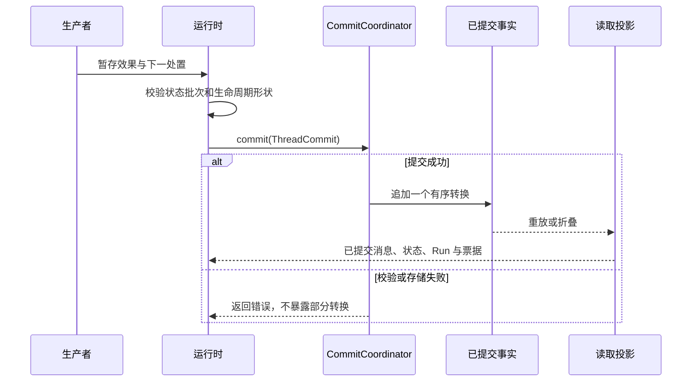

当一个值在进程退出、Worker 被替换或 Run 恢复后仍须保持正确时，应把它放进
Run 的提交中。不要把内存对象、流式增量或缓存记录当作恢复依据。

本页说明事实边界。状态 API 见[状态键](/zh/docs/agents/runtime/reference/state-keys/)；
如何选择键、作用域和合并策略，见[状态管理](/zh/docs/agents/runtime/explanation/state-management/)。

## 先记住这条结构

`ThreadCommit` 是 Thread 事实的唯一写入边界。它把 Run 的处置与本次转换产生
的消息、状态命令和审计草稿放在一起。`CommitCoordinator` 要么接受整个转换，
要么返回错误。当前状态由读取端根据已经接受的事实前缀推导。

内存中的 `Store` 和 `RunRecord` 便于查询，但不能成为独立写入路径。进程重启
后，即使缓存为空，已提交事实仍足以重建读取视图。

## 哪些内容应进入提交

如果后续工作必须分辨“已经发生了什么”，就应提交对应事实。常见内容包括：

- 改变 Thread 对话记录的消息；
- 后续 Step 或 Run 需要读取的状态命令；
- 转为 `Awaiting` 时对应的精确 `ResumeTicket`；
- 终态 `EndCause`；
- 必须与本次转换保持一致的审计草稿。

实时进度不属于这条权威路径。Token 增量、输入提示和其他尽力交付的流数据可以
丢失，再由已提交历史校正。它们不能决定工具是否执行，也不能决定 Run 是否结束。

## 一个边界内发生什么

Run 作用域的状态在组装提交时绑定 Run。`Awaiting` 必须携带属于同一 Run 的票据；
`Running` 和 `Ended` 不能携带票据。非法组合会在写入存储之前被拒绝。

重启后，执行从已提交前缀恢复。已经结束的 Run 仍然结束；等待中的 Run 只有在
恢复命令与票据完全匹配后才能继续；遗留为 Running 的 Run 由宿主重新投递或终态化，
无需另设一份状态来源。

## 快照是稳定视图，不是第二份事实

对话快照固定一个只追加消息前缀的引用，使调用方以后仍可校验并截取同一视图。
它不会把权威从 Thread 中复制出去。可执行 Agent 快照承担另一项职责：固定 Run
本次执行以及恢复时使用的配置。

使用带限定词的名称：

| 名称 | 固定的内容 | 仍然权威的来源 |
| --- | --- | --- |
| 对话快照 | 一个可校验的消息前缀 | 已提交 Thread 事实 |
| 可执行 Agent 快照 | 一份解析完成的执行配置 | 发布物及其固定标识 |
| 流检查点 | 被中断的推理片段 | 下一次成功的 Thread 提交 |

## 设计规则

1. 一个逻辑转换只组装一个 `ThreadCommit`。
2. 从已提交事实重建视图，不同步两份可写事实。
3. 等待外部输入前先提交关联信息。
4. 实时交付只是加速路径，不是恢复记录。
5. 可执行配置标识与对话状态分开管理。

## 相关文档

- [状态管理](/zh/docs/agents/runtime/explanation/state-management/)
- [状态键](/zh/docs/agents/runtime/reference/state-keys/)
- [Thread 模型](/zh/docs/agents/runtime/reference/thread-model/)
- [Run 生命周期与阶段](/zh/docs/agents/runtime/explanation/run-lifecycle-and-phases/)
- [人在回路中](/zh/docs/agents/runtime/explanation/human-in-the-loop/)
