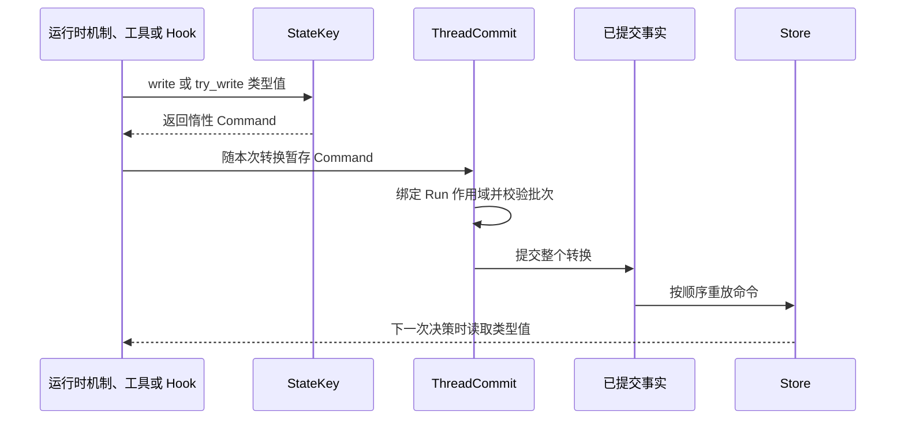

先问一个问题：后续哪个决策需要这个值？如果没有后续运行时决策会读取它，就不要
放进持久状态。如果它要指导后续 Step、恢复或 Run，应为它选择一个稳定键，并通过
现有提交路径暂存命令。

本页帮助你完成这些选择。精确类型和方法见[状态键](/zh/docs/agents/runtime/reference/state-keys/)；
事实日志的设计理由见[状态与快照模型](/zh/docs/agents/runtime/explanation/state-and-snapshot-model/)。

## 写代码前先定义状态键

写清四项事实：

1. **消费者：** 哪个运行时机制、工具 Gate、Hook 或 Guard 会读取它？
2. **生命周期：** 它只属于一个 Run、一个 Thread，还是更宽的边界？
3. **写入者：** 同一次提交中可能有一个还是多个生产者？
4. **数据形状：** 哪个类型必须在重放后仍保持明确含义？

如果两个功能对这四个问题的答案相同，应复用已有键，不要新增一份键再同步数值。

## 选择足够窄的作用域

| 作用域 | 适合使用的情况 | 不适合的情况 |
| --- | --- | --- |
| `Run` | 只属于当前执行及其恢复 | 同一 Thread 的后续 Run 仍须读取 |
| `Thread` | 同一对话中的后续 Run 需要读取 | 无关 Thread 也要共享 |
| `Shared` | 地址需要与同一 Thread 状态中的其他作用域区分 | 另一个 Thread 必须读取该值 |
| `Profile` | 地址在同一 Thread 状态中表达 Profile 形状的数据 | Profile 服务必须在多个 Thread 之间持有一个值 |

相同键字符串位于不同作用域时，是两个独立单元。作用域已经表达所有权，不要在 Run
作用域键中再拼 Run id，也不要在 Thread 作用域键中再拼 Thread id。
`ThreadCommit::assemble` 会在提交组装时绑定 Run 作用域命令。

当前已提交状态读取端按 `ThreadId` 加载命令。`Shared` 和 `Profile` 不会创建跨
Thread Repository。跨 Thread 业务状态应放在应用持有的 Resource 与 Tool 后面；
跨 Thread 消息投递使用 Run ingress Outbox。

## 根据写入关系选择合并策略

| 同一次提交中的写入者 | 策略 | 结果 |
| --- | --- | --- |
| 预期只有一个生产者 | `Disjoint` | 后写值替换先写值 |
| 多个独立对象贡献者 | `Commutative` | 对象浅合并，其他值替换 |
| 必须只有一个声明者 | `Exclusive` | 同作用域同键的第二个 `Set` 拒绝整个批次 |

`Exclusive` 只防止一个批次内出现两个 `Set`，`Remove` 不算第二次设置。
`Commutative` 也不是通用计数器归约器，它只对 JSON 对象做浅合并。如果需要按类型
折叠增量，应使用 `FoldStateKey`。

## 优先使用类型化状态键

```rust
use awaken_agent_contract::agent::state::{MergePolicy, Scope, StateKey};
use serde::{Deserialize, Serialize};

#[derive(Default, Serialize, Deserialize)]
struct ReviewState {
    approved: bool,
}

struct ReviewStateKey;

impl StateKey for ReviewStateKey {
    const KEY: &'static str = "review_state";
    const SCOPE: Scope = Scope::Thread;
    const MERGE: MergePolicy = MergePolicy::Disjoint;
    type Value = ReviewState;
}

let command = ReviewStateKey::try_write(&ReviewState { approved: true })?;
# Ok::<(), awaken_agent_contract::agent::state::StateError>(())
```

正常读取使用 `load`。单元不存在时，它返回类型默认值；单元存在但数据形状不符时，
它会报错。只有在明确接受模式漂移时才使用 `load_or_default`。序列化可能失败时使用
`try_write`。

## 一次变更如何生效



生产者不会原地修改 `Store`。校验或存储失败时，不会暴露部分批次。进程重启后，
按顺序重放已提交命令即可重建相同的物化状态。

## 发布前检查

- 一个键只有一个所有者和一个稳定含义。
- 作用域不宽于实际消费者范围。
- 跨 Thread 数据由应用持有，不依赖 `Shared` 或 `Profile` 标签。
- 合并策略符合真实的并发写入关系。
- 已存在值的数据形状漂移会失败关闭，除非有明确迁移规则。
- 状态与它所解释的消息或生命周期转换通过同一个 `ThreadCommit` 提交。
- 工作流顺序复用已有状态机插件，不另写一套 Gate。见
  [用状态机约束工具顺序](/zh/docs/agents/runtime/how-to/constrain-tool-order-with-a-state-machine/)。

## 相关文档

- [状态键](/zh/docs/agents/runtime/reference/state-keys/)
- [状态与快照模型](/zh/docs/agents/runtime/explanation/state-and-snapshot-model/)
- [Run 生命周期与阶段](/zh/docs/agents/runtime/explanation/run-lifecycle-and-phases/)
- [用状态机约束工具顺序](/zh/docs/agents/runtime/how-to/constrain-tool-order-with-a-state-machine/)
